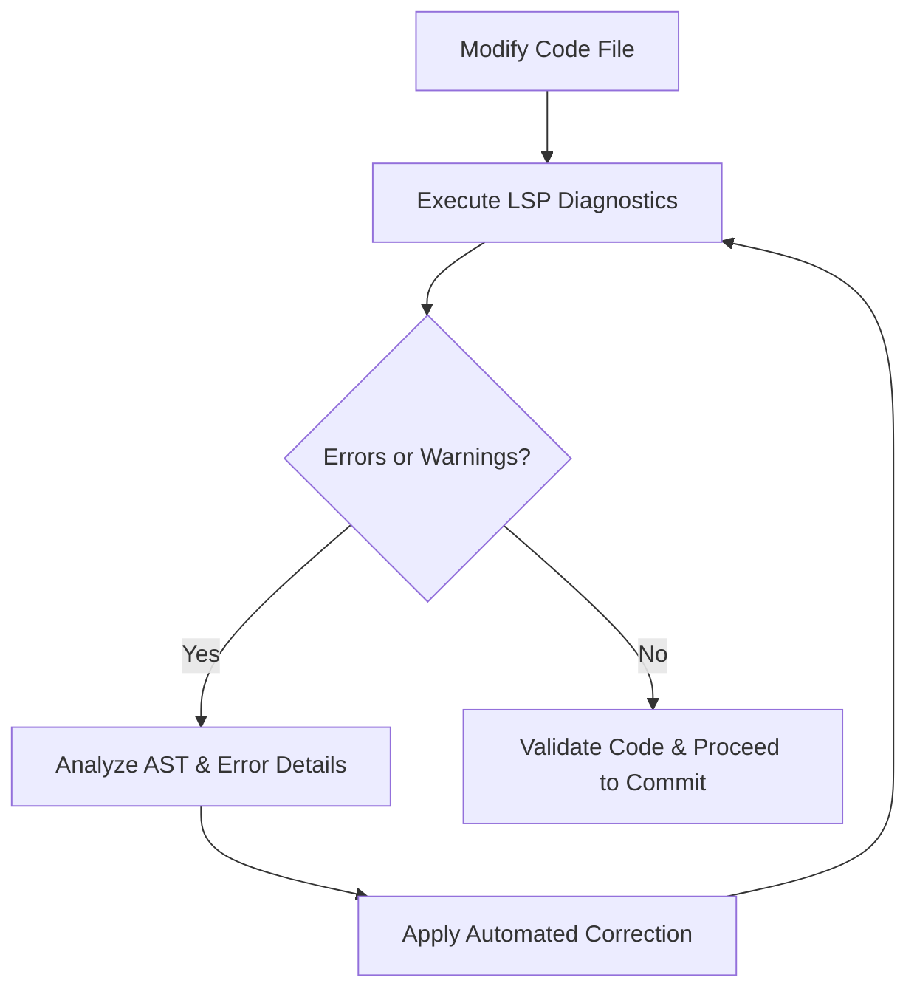

# LSP Project & Self-Healing

## Description & Objectives
The primary objective of this module is to stabilize local Python codebases within the Vigilum Codex ecosystem. By querying a local language server protocol (LSP) daemon (`pyright-lsp`) on the fly, this system checks the semantic correctness and linting status of code files before any commit or validation occurs. This implements an automated self-healing feedback loop that prevents faulty code from entering our production or shared repositories.

## LSP Loop Flowchart
The self-healing diagnostic loop operates as follows:



## Installation guide for `pyright-lsp`
To establish the local LSP infrastructure:
1. Ensure Python 3.8+ and `nodejs` are installed on the system.
2. Install the Pyright language server globally:
   ```bash
   npm install -g pyright
   ```
3. Install the Karellen LSP MCP daemon (or the relevant Python client library):
   ```bash
   pip install karellen-lsp-mcp
   ```

## How to run `test_lsp.py`
The diagnostic client `test_lsp.py` connects to the daemon and queries diagnostics. You can execute it as follows:
```bash
python 01-LSP-Self-Healing/examples/test_lsp.py
```
*Note: Make sure the `karellen-lsp-mcp` daemon is running locally before execution, or that the system has proper environment variables pointing to your project path.*
