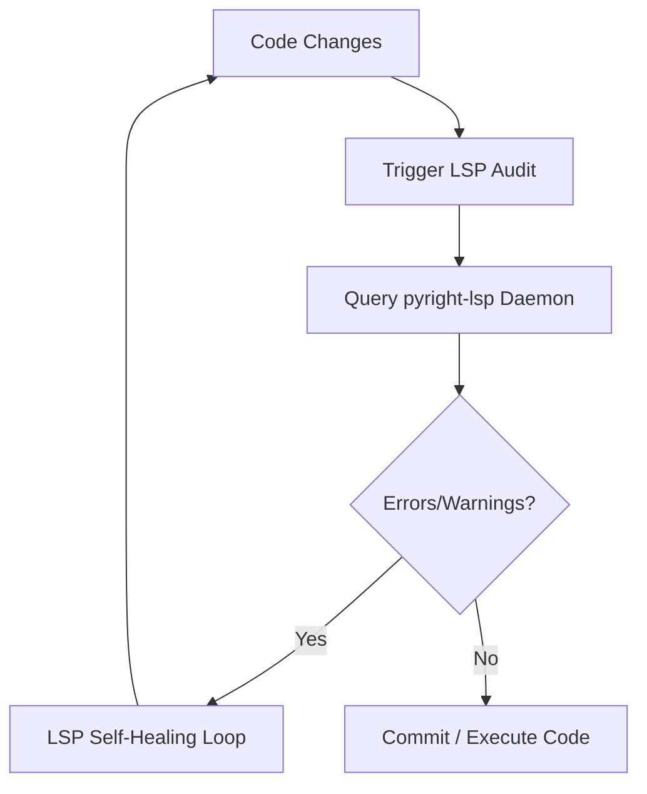

# Ops Consultant — AI Agents, CLI Workflows & Local Governance
*Author:* Lord Mahonheim  
*Status:* Verified Reference (statut/valide)  
*Tagline:* "Syntax is the guardrail of logic; without verification, automation is blind."

## Tested Environment Table
| Parameter | Value |
| :--- | :--- |
| Date | 2026-06-28 |
| Host Machine | MIDGARD |
| Operating System | Linux (Ubuntu/Debian) |
| Workspace Path | `/home/lord-mahonheim/bifrost/tesla` |
| Python Version | 3.10+ |
| Pyright Version | 1.1+ |

## Important Security Notice
This project operates purely in a local, sandboxed environment. All API keys, user-specific paths, and session secrets are excluded from repository tracking. No network calls are made without direct human authorization.

## Table of Contents
1. Executive Summary
2. Problem Statement
3. Product Promise
4. Core Principles Table
5. Architecture Diagram
6. Repository Layout
7. Workflow Sequence
8. Technical Stack
9. Security and Governance Rules
10. Acceptance Criteria
11. Final Verdict & Signature Sentence

## Executive Summary
The LSP Self-Healing system integrates a local `pyright-lsp` client with the Tesla agent execution cycle to ensure all generated or modified Python code meets static typing and syntactic standards before deployment. By executing diagnostics dynamically, it catches errors during pair-programming sessions.
This client communicates with a daemon process, analyzes diagnostics, and forces the execution model into an auto-correction loop if any issues are identified. This process reduces syntax failure rates during autonomous runs.

## Problem Statement
During initial agent sessions on MIDGARD, Python scripts containing missing dependencies, malformed import paths, or syntax errors were run directly. This led to run-time failures (e.g. `ModuleNotFoundError`, typing mismatches) that crashed backgrounds loops. Relying on post-hoc manual stack-trace analysis proved slow and inefficient.

## Product Promise
* **What it does:** Runs pyright diagnostics locally, parses error outputs, and enforces an auto-correction loop until typings and syntax are correct.
* **What it does NOT do:** Fix logical bugs or execution-flow bugs that do not violate static typing.

## Core Principles Table
| Principle | Meaning | Impact |
| :--- | :--- | :--- |
| Static Guard | Verify typing before runtime. | Eliminates module and import crashes. |
| Local Loops | Diagnostics are resolved on MIDGARD. | High privacy and low latency. |
| Autonomy | Agent self-corrects until 0 warnings. | Zero developer disruption. |

## Architecture Diagram


## Repository Layout
```text
01-LSP-Self-Healing/
├── README.md
└── examples/
    └── test_lsp.py
```

## Workflow Sequence
1. The developer or agent modifies a local Python script.
2. The agent calls the LSP client to register the project workspace path.
3. The client queries the daemon (`karellen-lsp-mcp` or `pyright`).
4. The client returns any JSON diagnostics representing typing/syntax errors.
5. If errors are present, the agent updates the code and repeats the cycle.

## Technical Stack
* **Runtime:** Python 3.10+
* **Engine:** `pyright-lsp` daemon client
* **Libraries:** `asyncio`, `json`, `os`, `sys`

## Security and Governance Rules
* The LSP client only scans local workspace paths.
* Execution limits: Maximum 5 self-healing iterations before halting to prevent infinite loops.
* No telemetry or external source verification is permitted.

## Acceptance Criteria
* The script `test_lsp.py` must run and connect to the local daemon successfully.
* The output must display clean, structured JSON diagnostic data.

## Final Verdict & Signature Sentence
**VERDICT: OPERATIONAL SYSTEM STABILIZED**  
*"Precision in the syntax guarantees stability in the system."*
