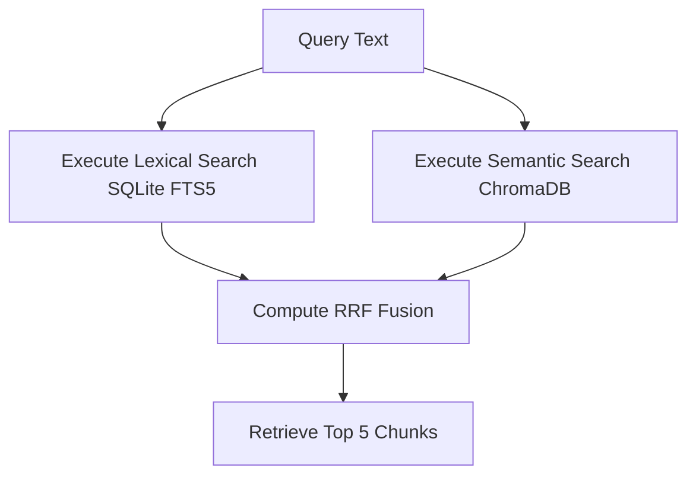

# Ops Consultant — AI Agents, CLI Workflows & Local Governance
*Author:* Lord Mahonheim  
*Status:* Verified Reference (statut/valide)  
*Tagline:* "Knowledge without indexing is noise; Alexandria structures truth."

## Tested Environment Table
| Parameter | Value |
| :--- | :--- |
| Date | 2026-06-28 |
| Host Machine | MIDGARD |
| Operating System | Linux (Ubuntu/Debian) |
| Workspace Path | `/home/lord-mahonheim/bifrost/tesla` |
| Python Version | 3.10+ |
| SQLite Version | 3.37+ (FTS5 Enabled) |

## Important Security Notice
This project indexes markdown notes and files locally. No physical database files (`*.db`), journaling logs (`*-journal`), or vector storage caches (`.chroma_vectors/`) are allowed to be tracked by Git.

## Table of Contents
1. Executive Summary
2. Problem Statement
3. Product Promise
4. Core Principles Table
5. Architecture Diagram
6. Repository Layout
7. Workflow Sequence
8. Technical Stack
9. Security and Governance Rules
10. Acceptance Criteria
11. Final Verdict & Signature Sentence

## Executive Summary
Alexandria is a local hybrid repository indexer combining lexical (SQLite FTS5) and semantic (ChromaDB) search routing. It enables the agent to search through large text documents rapidly, bypassing context window limitations.
Instead of scanning large directories linearly, the agent queries FTS5 tables and vector spaces, combining results via Reciprocal Rank Fusion (RRF).

## Problem Statement
In previous iterations, the agent searched files by reading directories linearly. This strategy saturated the LLM context window with irrelevant data, resulting in timeouts and high token costs. Furthermore, concurrent file writes without lock controls led to database write contentions.

## Product Promise
* **What it does:** Provides instant, structured retrieval of local knowledge using FTS5 match queries and sentence embeddings.
* **What it does NOT do:** Connect to external cloud vector databases or index files outside specified directories.

## Core Principles Table
| Principle | Meaning | Impact |
| :--- | :--- | :--- |
| Lexical Efficiency | Use SQLite FTS5 for exact keyword matching. | Drastically reduces token ingestion latency. |
| Semantic Context | ChromaDB and Sentence-Transformers capture meaning. | Returns relevant sections even with synonymous terms. |
| Hybrid Fusion | RRF merges scores of both methods. | Combines the precision of keywords and the depth of meaning. |

## Architecture Diagram


## Repository Layout
```text
02-Alexandria-Database/
├── README.md
├── indexer_hybrid.py
└── search_router.py
```

## Workflow Sequence
1. The developer runs `indexer_hybrid.py` to check for modified files in the Vault.
2. Modified files are parsed, split into overlaps, and saved to SQLite FTS5 and ChromaDB.
3. Obsolete entries from deleted files are automatically purged.
4. The search client uses `search_router.py` to query both databases and retrieve context.

## Technical Stack
* **Database:** SQLite 3.37+ (FTS5 module)
* **Vector Store:** ChromaDB (local persistence)
* **Model:** Sentence-Transformers (`all-MiniLM-L6-v2`)
* **Core:** Python 3.10+

## Security and Governance Rules
* The database path must be kept under `.gitignore`.
* ChromaDB client must be configured with a local persistent folder.
* Maximum vector chunk sizes are strictly capped to 500 characters to optimize search efficiency.

## Acceptance Criteria
* Running `indexer_hybrid.py` executes a full scan and registers documents.
* Running `search_router.py 'query'` retrieves matching context blocks.

## Final Verdict & Signature Sentence
**VERDICT: OPERATIONAL SYSTEM STABILIZED**  
*"Order in indexing leads to speed in retrieval."*
