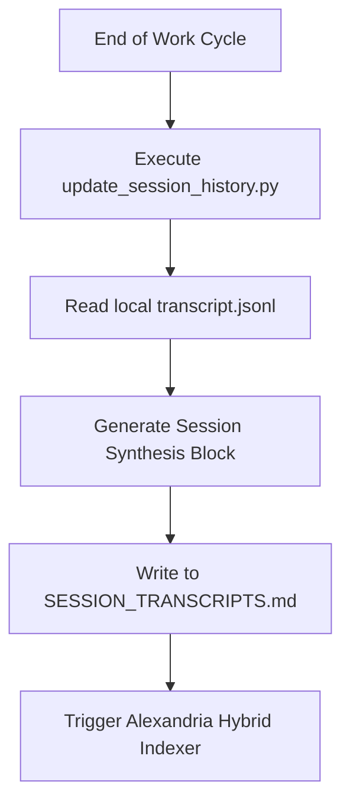

# Ops Consultant — AI Agents, CLI Workflows & Local Governance
*Author:* Lord Mahonheim  
*Status:* Verified Reference (statut/valide)  
*Tagline:* "An agent without memory is a machine without history; persistence builds intelligence."

## Tested Environment Table
| Parameter | Value |
| :--- | :--- |
| Date | 2026-06-28 |
| Host Machine | MIDGARD |
| Operating System | Linux (Ubuntu/Debian) |
| Workspace Path | `/home/lord-mahonheim/bifrost/tesla` |
| Python Version | 3.10+ |

## Important Security Notice
This project parses CLI log transcripts (`transcript.jsonl`) generated locally by the agent runtime. The transcripts file and history details containing potential API keys or private system files are strictly kept in the local cache and excluded from version control.

## Table of Contents
1. Executive Summary
2. Problem Statement
3. Product Promise
4. Core Principles Table
5. Architecture Diagram
6. Repository Layout
7. Workflow Sequence
8. Technical Stack
9. Security and Governance Rules
10. Acceptance Criteria
11. Final Verdict & Signature Sentence

## Executive Summary
The Long-Term Memory (MLT) module extracts session transcript logs from the local Antigravity runtime, summarizes key interactions using a structured format, and updates a centralized history file `SESSION_TRANSCRIPTS.md`.
This script triggers semantic indexing automatically, consolidating new knowledge chunks for Alexandria immediately after execution.

## Problem Statement
In early development phases, restarting the Antigravity CLI cleared the agent's active memory. The agent forgot previous debug steps, warnings, and configurations, forcing the developer to repeat instructions. Manual logs were unstructured, and raw JSONL records grew too large to parse during prompt injection.

## Product Promise
* **What it does:** Automates the extraction, structuring, and summary indexing of session interactions into a single, structured markdown log file.
* **What it does NOT do:** Sync memory data over the network or leak host credentials.

## Core Principles Table
| Principle | Meaning | Impact |
| :--- | :--- | :--- |
| Idempotence | Session updates can be run multiple times safely. | Prevents duplicates in history. |
| Cognitive Synthesis | Summarizes details using Diagnostic/Action blocks. | Keeps transcripts readable and concise. |
| Automatic Indexing | Links directly into the Alexandria index. | Instantly indexes session notes. |

## Architecture Diagram


## Repository Layout
```text
03-Memory-MLT/
├── README.md
└── update_session_history.py
```

## Workflow Sequence
1. The script retrieves the active session ID from `ANTIGRAVITY_CONVERSATION_ID`.
2. It parses the JSONL log records under the local `.system_generated/logs/` path.
3. It filters user prompts and model responses, separating diagnostic analyses.
4. It formats the summary block and inserts it under the global summary table.
5. It invokes the local Alexandria indexer script to parse the updated history file.

## Technical Stack
* **Runtime:** Python 3.10+
* **Libraries:** `json`, `os`, `re`, `sys`, `subprocess`
* **Format:** Markdown + HTML Details tag wrapper

## Security and Governance Rules
* Hardcoded system paths are resolved dynamically using environment fallbacks.
* Session text transcripts are excluded via `.gitignore` to prevent secret leaks.

## Acceptance Criteria
* Running `update_session_history.py` completes without exceptions.
* The script successfully locates and parses `transcript.jsonl` files and updates the target markdown archive.

## Final Verdict & Signature Sentence
**VERDICT: OPERATIONAL SYSTEM STABILIZED**  
*"Memory is the foundation of local agent alignment."*
