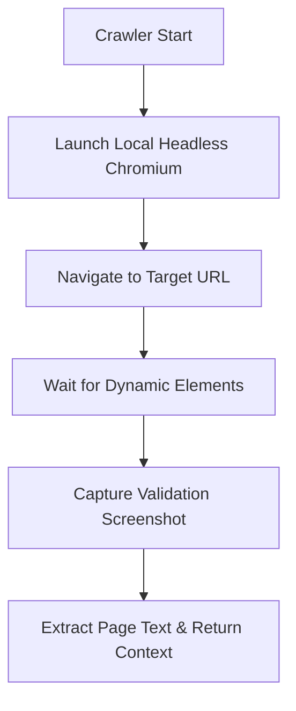

# Ops Consultant — AI Agents, CLI Workflows & Local Governance
*Author:* Lord Mahonheim  
*Status:* Verified Reference (statut/valide)  
*Tagline:* "The web is the map, local code is the vehicle; navigate sovereignly."

## Tested Environment Table
| Parameter | Value |
| :--- | :--- |
| Date | 2026-06-28 |
| Host Machine | MIDGARD |
| Operating System | Linux (Ubuntu/Debian) |
| Workspace Path | `/home/lord-mahonheim/bifrost/tesla` |
| Python Version | 3.10+ |
| Playwright Version | 1.20+ |

## Important Security Notice
This project executes autonomous browser crawls locally on MIDGARD. No API keys (e.g. OpenAI, Anthropic, or custom proxy services) are loaded. Screenshots and scraping logs are stored in temporary scratch directories.

## Table of Contents
1. Executive Summary
2. Problem Statement
3. Product Promise
4. Core Principles Table
5. Architecture Diagram
6. Repository Layout
7. Workflow Sequence
8. Technical Stack
9. Security and Governance Rules
10. Acceptance Criteria
11. Final Verdict & Signature Sentence

## Executive Summary
The Autonomous Web Raider Doctrine establishes a sovereign model for crawling and extracting information. Rather than routing queries through third-party web scrapers or cloud APIs, it leverages Playwright to orchestrate a headless browser directly on the host machine.
Visual verification is performed using local multimodal evaluation of screenshots, ensuring high accuracy and zero third-party dependency.

## Problem Statement
Traditional web crawlers fail due to dynamic content rendering (SPAs) and strict antibot mitigations. When using simple request libraries (like `urllib` or `requests`), pages frequently fail to load or get stuck at authentication challenges. Moreover, using online AI scraping services leaks private endpoints and introduces recurring token subscription fees.

## Product Promise
* **What it does:** Runs local, headless browser instances, navigates dynamic pages, extracts plain text, and captures visual confirmation screenshots.
* **What it does NOT do:** Solve external recaptchas automatically, bypass corporate proxy logins, or run with root permissions.

## Core Principles Table
| Principle | Meaning | Impact |
| :--- | :--- | :--- |
| Independence | No external scraping keys or services. | Zero key rotation or vendor lock-in. |
| Visual Loop | Multi-modal confirmation via screenshots. | Verifies layout integrity before parsing. |
| Sandboxed Actions | Browser processes run under local user scope. | Secures host from malicious JS scripts. |

## Architecture Diagram


## Repository Layout
```text
04-Web-Raider/
├── README.md
├── SKILL.md
└── examples/
    └── scrape_demo.py
```

## Workflow Sequence
1. The script initializes the asynchronous Playwright engine.
2. It launches a headless Chromium instance.
3. It navigates to the target page and awaits page load selectors.
4. It extracts structured text contents and saves a verification screenshot.
5. It terminates the browser instance and returns plain text.

## Technical Stack
* **Runtime:** Python 3.10+
* **Engine:** Playwright (Asynchronous API)
* **Browser:** Headless Chromium
* **Libraries:** `asyncio`, `os`, `sys`

## Security and Governance Rules
* The crawler must only browse public web domains or local test instances.
* Headless browser execution limits: 30 seconds page timeout.
* Downloads are disabled by default to protect the host filesystem.
* The master specification file [SKILL.md](SKILL.md) governs the full cognitive architecture, Webwright execution engine, progressive navigation token economy, OWASP Agentic Top 10 security rules, and subagent orchestration of the Web-Raider agent.

## Acceptance Criteria
* Running `scrape_demo.py` loads the target test website successfully.
* The script prints the page text and saves a verification image to disk.

## Final Verdict & Signature Sentence
**VERDICT: OPERATIONAL SYSTEM STABILIZED**  
*"Sovereignty in web navigation begins with local browser control."*
