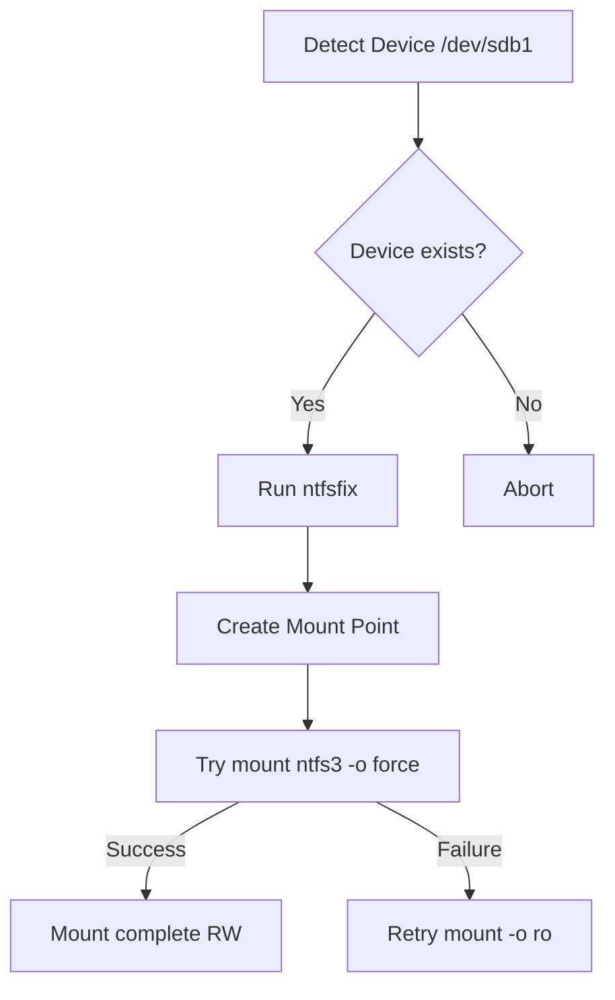

# Ops Consultant — AI Agents, CLI Workflows & Local Governance
*Author:* Lord Mahonheim  
*Status:* Verified Reference (statut/valide)  
*Tagline:* "Hardware is fragile, drivers are strict; build local resilience."

## Tested Environment Table
| Parameter | Value |
| :--- | :--- |
| Date | 2026-06-28 |
| Host Machine | MIDGARD |
| Operating System | Linux (Ubuntu/Debian) |
| Workspace Path | `/home/lord-mahonheim/bifrost/tesla` |
| NTFS Driver | `ntfs3` (Kernel native) |
| Device Node | `/dev/sdb1` |

## Important Security Notice
This project executes low-level partition operations on connected USB storage devices. These scripts require `sudo` privileges. Sudo authorization configuration and local system identifiers are kept private and excluded from version control.

## Table of Contents
1. Executive Summary
2. Problem Statement
3. Product Promise
4. Core Principles Table
5. Architecture Diagram
6. Repository Layout
7. Workflow Sequence
8. Technical Stack
9. Security and Governance Rules
10. Acceptance Criteria
11. Final Verdict & Signature Sentence

## Executive Summary
The USB Resilience project establishes a local script pipeline to diagnose and fix NTFS volume mounting issues on Linux systems. When external drives are unplugged unsafely, a "dirty bit" is flag-marked on the MFT, preventing auto-mounting.
This script checks block device availability, runs `ntfsfix` to clear basic metadata anomalies, and mounts the partition using the modern `ntfs3` kernel driver with write validation flags.

## Problem Statement
On MIDGARD, the GNOME desktop environment rejected mounting the NTFS external storage partition `/dev/sdb1`. Systems logs printed the error: `wrong fs type, bad option, bad superblock...` and kernel messages reported: `volume is dirty and "force" flag is not set!`. This halted automated file storage operations and required manual shell mounting.

## Product Promise
* **What it does:** Automates the verification of the partition, runs `ntfsfix` to clear the dirty bit, and mounts the volume using `ntfs3` with optional force or read-only fallbacks.
* **What it does NOT do:** Perform deep partition data recovery or modify non-NTFS systems.

## Core Principles Table
| Principle | Meaning | Impact |
| :--- | :--- | :--- |
| Dirty Bit Clearing | Uses ntfsfix to clear MFT flags. | Resolves GNOME auto-mount blocks. |
| Modern Driver | Mounts using kernel-native ntfs3. | Delivers faster read-write performance. |
| Fail-safe Fallback | Retries read-only if force mount fails. | Prevents data loss during driver crashes. |

## Architecture Diagram


## Repository Layout
```text
05-USB-Resilience/
├── README.md
└── examples/
    └── repair_mount_usb.sh
```

## Workflow Sequence
1. The script verifies that `/dev/sdb1` is a valid block device.
2. It invokes `ntfsfix` to reset basic partition flags.
3. It creates the designated target mount path directory.
4. It attempts mounting the device using the modern `ntfs3` driver with the `force` option.
5. If the forced mount fails, it attempts a read-only mount to keep files accessible.

## Technical Stack
* **Shell:** Bash 5.0+
* **Drivers:** Kernel-native `ntfs3`
* **Utilities:** `ntfsfix`, `mount`, `mkdir`

## Security and Governance Rules
* The script only targets partitions explicitly declared via command-line arguments.
* `NOPASSWD` rules must not be assigned to external drives due to device index switching risk.
* All mount paths must reside under `/media/$USER/` or `/mnt/` to prevent root directory clutter.

## Acceptance Criteria
* Running `repair_mount_usb.sh` identifies the target block device.
* The device mounts successfully, and its contents are writable or readable under the mount point.

## Final Verdict & Signature Sentence
**VERDICT: OPERATIONAL SYSTEM STABILIZED**  
*"Hardware issues must be met with programmatic resilience."*
