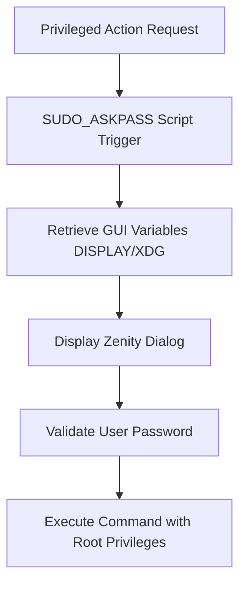

# Ops Consultant — AI Agents, CLI Workflows & Local Governance
*Author:* Abdellah MOUHTAJ (Mahonheim)  
*Status:* Verified Reference (statut/valide)  
*Tagline:* "Security is not a delay, it is a process; authorize consciously."

## Tested Environment Table
| Parameter | Value |
| :--- | :--- |
| Date | 2026-06-28 |
| Host Machine | MIDGARD |
| Operating System | Linux (Ubuntu/Debian) |
| Workspace Path | `/home/lord-mahonheim/bifrost/tesla` |
| Sudo version | 1.9+ |
| Zenity version | 3.40+ |

## Important Security Notice
This project deploys authentication wrapper scripts. Sudoers configuration fragments (`99-tesla-security`) and local account passwords are strictly confidential and must never be committed.

## Table of Contents
1. Executive Summary
2. Problem Statement
3. Product Promise
4. Core Principles Table
5. Architecture Diagram
6. Repository Layout
7. Workflow Sequence
8. Technical Stack
9. Security and Governance Rules
10. Acceptance Criteria
11. Final Verdict & Signature Sentence

## Executive Summary
The Secure Graphical Sudo Authentication module provides a secure, graphical password entry interface for background agent commands requiring `sudo` privileges. Rather than running tasks with wildcard `NOPASSWD` rules (which compromises local security), it sets up a Zenity-based graphical dialog wrapper.
By combining a custom `SUDO_ASKPASS` script with a dedicated `sudogui` wrapper and configuring `passwd_timeout=0` in sudoers, the operator is prompted safely without password exposure in shell history or log databases.

## Problem Statement
During local runs on MIDGARD, background tasks executing `sudo` commands froze indefinitely because there was no active TTY to accept passwords. Setting up broad `NOPASSWD: ALL` rules in `/etc/sudoers` exposed the machine to unauthorized script executions. Additionally, default sudo timeouts (e.g. 5 minutes) caused scripts to crash if the developer stepped away.

## Product Promise
* **What it does:** Renders a secure Zenity input prompt for root actions, keeps the password out of logs and process maps, and prevents timeout expiration issues.
* **What it does NOT do:** Bypass authorization validation or auto-approve privilege requests without operator input.

## Core Principles Table
| Principle | Meaning | Impact |
| :--- | :--- | :--- |
| Graphical Isolation | Passwords are input in a native GUI dialog. | Zero shell history or process log leakage. |
| Explicit Consent | Every privilege escalation requires verification. | Protects MIDGARD from silent modifications. |
| Persistent Await | Sudoers `passwd_timeout=0` prevents timeout freezes. | Allows the developer to input credentials without rush. |

## Architecture Diagram


## Repository Layout
```text
06-Sudo-Askpass/
├── README.md
└── scripts/
    ├── sudo-askpass-zenity
    └── sudogui
```

## Workflow Sequence
1. The developer or script executes `sudogui command`.
2. The wrapper sets `SUDO_ASKPASS` to `sudo-askpass-zenity`.
3. It exports the required system environment variables `$DISPLAY` and `$XDG_RUNTIME_DIR`.
4. It calls `sudo -A command` to prompt the operator with the graphical Zenity dialog.
5. Sudo validates the password and executes the targeted action.

## Technical Stack
* **Shell:** POSIX Shell (sh/bash)
* **GUI Engine:** Zenity (GTK)
* **Configuration:** `/etc/sudoers.d/99-tesla-security` (`passwd_timeout=0`)

## Security and Governance Rules
* The password dialog executable must have strict file permissions (`chmod 700`).
* Wildcard `NOPASSWD` is strictly forbidden for removable media drives.
* Always validate sudoers file syntax using `visudo` before applying updates.

## Acceptance Criteria
* Running `sudogui whoami` displays a graphical prompt.
* Entering the correct password prints `root` to stdout without leaks.

## Final Verdict & Signature Sentence
**VERDICT: OPERATIONAL SYSTEM STABILIZED**  
*"Privilege elevation requires physical authorization."*
