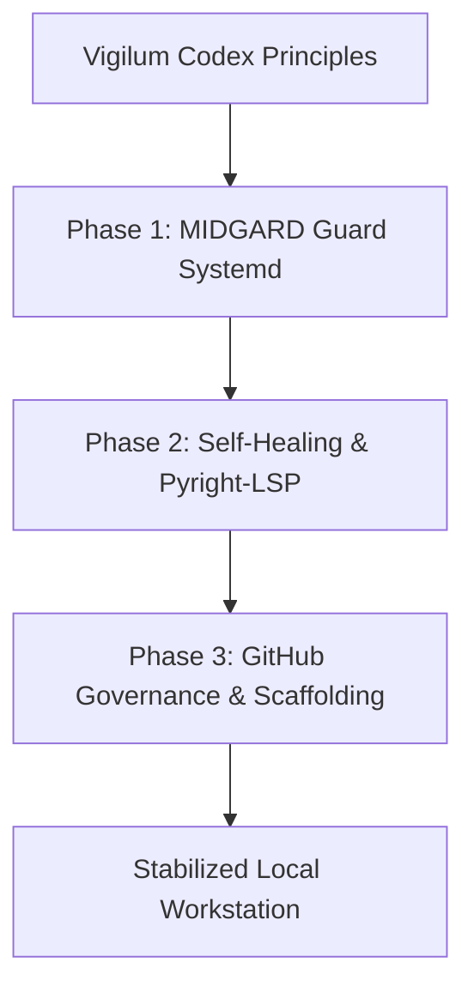

# Ops Consultant — AI Agents, CLI Workflows & Local Governance
*Author:* Abdellah MOUHTAJ (Mahonheim)  
*Status:* Verified Reference (statut/valide)  
*Tagline:* "An unaligned roadmap leads to resource exhaustion; design with hardware limits."

## Tested Environment Table
| Parameter | Value |
| :--- | :--- |
| Date | 2026-06-28 |
| Host Machine | MIDGARD |
| Operating System | Linux (Ubuntu/Debian) |
| Workspace Path | `/home/lord-mahonheim/bifrost/tesla` |
| RAM capacity | 8 GB RAM (Host capacity) |

## Important Security Notice
This project maps internal project sequences, system architectures, and organizational doctrines. Details relating to production targets, proprietary customer names, and raw corporate credentials are fully anonymized.

## Table of Contents
1. Executive Summary
2. Problem Statement
3. Product Promise
4. Core Principles Table
5. Architecture Diagram
6. Repository Layout
7. Workflow Sequence
8. Technical Stack
9. Security and Governance Rules
10. Acceptance Criteria
11. Final Verdict & Signature Sentence

## Executive Summary
The Strategic Armament Planning document provides a roadmap to transform the local agent into a high-performance, resource-conscious co-pilot. It coordinates software and hardware priorities to optimize the host machine MIDGARD.
By structuring development into three distinct phases (surveillance daemon, self-healing diagnostics, and GitHub manager), it guarantees that every integration step is traceable, modular, and approved.

## Problem Statement
Early automation phases failed because they were designed without considering the host's 8 GB memory constraint. Running heavy LLM models locally or launching multiple unmanaged Docker containers caused CPU throttling and memory exhaustion crashes. The absence of a structured roadmap led to ad-hoc installations that polluted system configurations.

## Product Promise
* **What it does:** Outlines the development roadmap, specifies hardware and software alignment rules, and establishes clear system limits.
* **What it does NOT do:** Automatically provision system services or install unverified packages.

## Core Principles Table
| Principle | Meaning | Impact |
| :--- | :--- | :--- |
| Resource Guarding | Strictly cap memory footprints of agent tools. | Prevents system freezes or service halts. |
| Phased Integration | Deploy changes in sequential, testable increments. | Ensures stability at every step. |
| Doctrinal Alignment | Align projects under the Vigilum Codex structure. | Maintains consistent project goals. |

## Architecture Diagram


## Repository Layout
```text
07-Strategic-Armement/
├── README.md
└── plan_armement_pluridisciplinaire_tesla.md
```

## Workflow Sequence
1. The operator reviews the strategic planning requirements.
2. The agent verifies the current status of host resources.
3. The roadmap defines deployment schedules for monitoring scripts.
4. Each phase requires a dedicated technical audit and verification script.
5. The phase is marked as validated only after physical approval.

## Technical Stack
* **Doctrine:** Vigilum Codex
* **Format:** Markdown with Obsidian Dataview compatibility
* **Scope:** Software and Hardware co-design

## Security and Governance Rules
* Development must strictly respect the "request-review" execution protocol.
* Hardcoded paths and proprietary corporate references are strictly prohibited.
* Caching data must only reside under local workspace configurations.

## Acceptance Criteria
* The file `plan_armement_pluridisciplinaire_tesla.md` must be present and verified.
* The roadmap milestones must align with active system resources.

## Final Verdict & Signature Sentence
**VERDICT: OPERATIONAL SYSTEM STABILIZED**  
*"Roadmaps must respect the limits of the hardware they operate on."*
