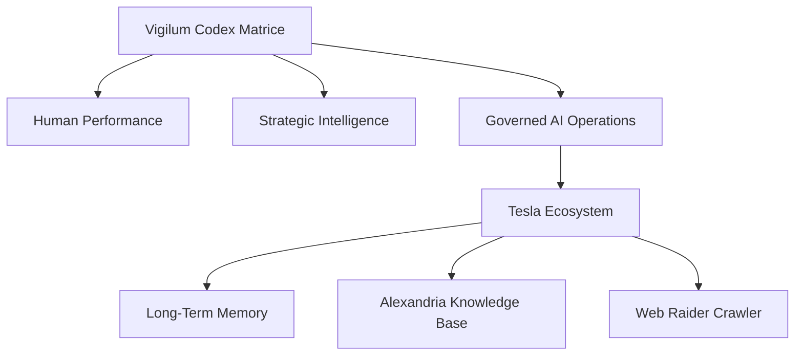

# Strategic Armament Plan - Tesla Operational Ecosystem

## 1. Doctrinal Alignment (Vigilum Codex)
This plan defines the strategic armament and engineering alignment for the Tesla operational ecosystem. Under the guidelines of the Vigilum Codex, the technical infrastructure must support human performance, safeguard strategic decision-making intelligence, and enforce local, auditable AI governance.

## 2. Engineering Projects Roadmap

### Phase 1: Local Knowledge & Memory Stabilization (Active)
*   **Goal**: Establish a zero-dependency, local hybrid storage index (SQLite FTS5 + Vector collections) for Alexandria.
*   **Key Deliverable**: Automatic transcript indexing and semantic router query pipeline.

### Phase 2: Active Automation & Crawling (Planned)
*   **Goal**: Stabilize the Web Raider scraping framework to run locally on midgard sandbox structures.
*   **Key Deliverable**: Asynchronous Playwright crawler script with visual multimodal assertion verification.

### Phase 3: Physical Resilience (Planned)
*   **Goal**: Protect database files and backup media against sudden drive failures or OS mount blocks.
*   **Key Deliverable**: Fail-safe bash mounting wrappers exploiting modern kernel modules (e.g., `ntfs3`).

## 3. Human-AI Symbiosis Strategy
All modules are designed as Low-Code / No-Code frameworks by default, ensuring Lord Mahonheim remains the primary controller. Code serves as a secondary, automated implementation detail rather than the starting block.
