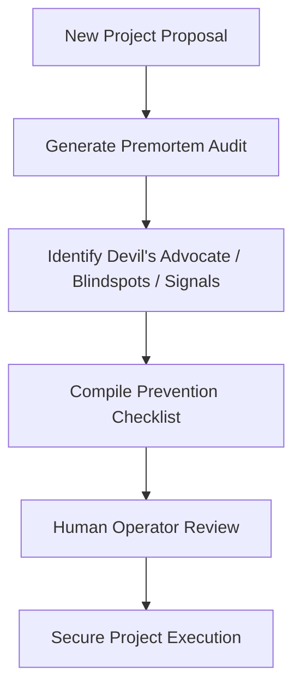

# Ops Consultant — AI Agents, CLI Workflows & Local Governance
*Author:* Lord Mahonheim  
*Status:* Verified Reference (statut/valide)  
*Tagline:* "Fail before deployment in simulation, so you do not fail in reality."

## Tested Environment Table
| Parameter | Value |
| :--- | :--- |
| Date | 2026-06-28 |
| Host Machine | MIDGARD |
| Operating System | Linux (Ubuntu/Debian) |
| Workspace Path | `/home/lord-mahonheim/bifrost/tesla` |

## Important Security Notice
This project defines templates and processes for project risk audits. All private environment configs, sensitive credentials, and personal server hostnames are strictly anonymized in target audit files.

## Table of Contents
1. Executive Summary
2. Problem Statement
3. Product Promise
4. Core Principles Table
5. Architecture Diagram
6. Repository Layout
7. Workflow Sequence
8. Technical Stack
9. Security and Governance Rules
10. Acceptance Criteria
11. Final Verdict & Signature Sentence

## Executive Summary
The Premortem Diagnostic project integrates Gary Klein's prospective hindsight method to perform predictive failure analyses. Before deploying new structures or systems, the agent assumes the project has failed critically and constructs a backward narrative of the failure.
This analysis identifies technical bottlenecks, unverified assumptions, and weak signals, translating them into a concrete prevention checklist.

## Problem Statement
In previous deployment pipelines, agents executed tasks (such as push attempts or database updates) without analyzing potential risks. This resulted in failures: SSH access keys rejected by GitHub, base database files committed to git history, and local paths hardcoded in portable scripts.

## Product Promise
* **What it does:** Provides a structured template and method to stress-test project plans, identify vulnerabilities, and document mitigation steps.
* **What it does NOT do:** Automatically resolve issues or monitor runtime bugs.

## Core Principles Table
| Principle | Meaning | Impact |
| :--- | :--- | :--- |
| Hindsight Bias | Assume failure has occurred and look back. | Bypasses standard optimism bias. |
| Weak Signal Hunting | Document subtle warning indicators. | Catches silent drift before system crashes. |
| Actionable Mitigation | Translate identified risks into checklists. | Verifies all constraints before execution. |

## Architecture Diagram


## Repository Layout
```text
08-Premortem-Diagnostic/
├── README.md
└── templates/
    └── premortem_template.md
```

## Workflow Sequence
1. The developer decides to launch a new deployment task.
2. The agent copies `premortem_template.md` and generates a custom report.
3. The report lists Devil's Advocate causes, blindspots, and early warning signs.
4. The agent creates a mitigation grid matching threshold triggers to preventative steps.
5. The operator reviews and signs off on the checklist.

## Technical Stack
* **Methodology:** Gary Klein's Prospective Hindsight
* **Format:** Markdown / Template file

## Security and Governance Rules
* Premortem templates must remain generic and customizable.
* Completed reports are kept under local workspace directories and sync-locked.

## Acceptance Criteria
* The file `premortem_template.md` must match the required template structure.
* Generated reports must include all tripartite risk sections.

## Final Verdict & Signature Sentence
**VERDICT: OPERATIONAL SYSTEM STABILIZED**  
*"A plan that cannot withstand a premortem is not ready for deployment."*
