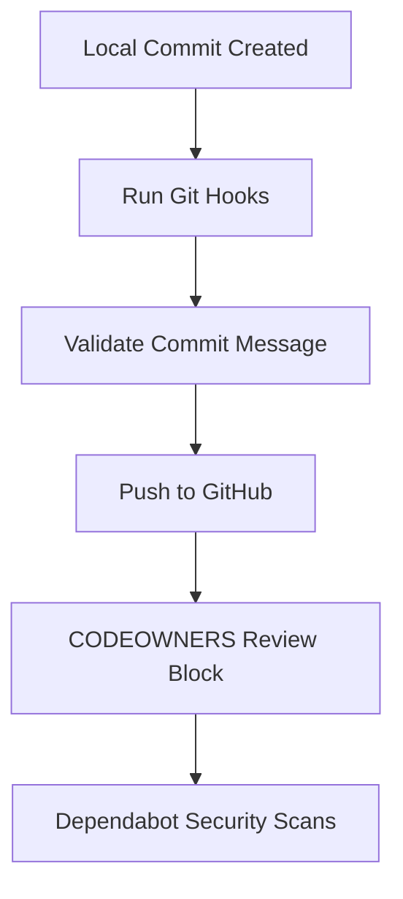

# Ops Consultant — AI Agents, CLI Workflows & Local Governance
*Author:* Abdellah MOUHTAJ (Mahonheim)  
*Status:* Verified Reference (statut/valide)  
*Tagline:* "Governance is not about restricting progress; it is about guaranteeing integrity."

## Tested Environment Table
| Parameter | Value |
| :--- | :--- |
| Date | 2026-06-28 |
| Host Machine | MIDGARD |
| Operating System | Linux (Ubuntu/Debian) |
| Workspace Path | `/home/lord-mahonheim/bifrost/tesla` |
| Git version | 2.34+ |

## Important Security Notice
This project dictates repository governance policies. Secret credentials, personal access tokens (PATs), and deploy keys must never be committed.

## Table of Contents
1. Executive Summary
2. Problem Statement
3. Product Promise
4. Core Principles Table
5. Architecture Diagram
6. Repository Layout
7. Workflow Sequence
8. Technical Stack
9. Security and Governance Rules
10. Acceptance Criteria
11. Final Verdict & Signature Sentence

## Executive Summary
The Repository Governance project defines the standards, rules, and configuration templates to maintain the integrity of our public MVP repository. It establishes CODEOWNERS restrictions to enforce merge approvals, and sets up Dependabot tracking to keep dependencies free from security vulnerabilities.
This module also locks the branch commit guidelines using Conventional Commits to maintain a clean git history graph.

## Problem Statement
Initial pushes to the remote repository failed because the SSH connection returned `Permission denied (publickey)` as the deploy key was not bound. Sudo configurations (`mcp_config.json`) contained clear-text access tokens, risking severe exposure if pushed without validation. Lack of repository controls allowed branch drift and unreviewed commits.

## Product Promise
* **What it does:** Enforces commit structure, configures automatic dependency updates, and defines file-level ownership to secure the codebase.
* **What it does NOT do:** Automatically add remote URLs or push code to remote branches without explicit command approvals.

## Core Principles Table
| Principle | Meaning | Impact |
| :--- | :--- | :--- |
| Zero Secret Exposure | Restrict configuration files via gitignore. | Prevents credential leaks on public GitHub. |
| Automatic Auditing | dependabot tracks vulnerabilities. | Neutralizes supply chain attacks. |
| Strict Ownership | CODEOWNERS restricts write rights. | Prevents unauthorized branch overrides. |

## Architecture Diagram


## Repository Layout
```text
09-Github-Governance/
├── README.md
└── .github/
    ├── CODEOWNERS
    └── dependabot.yml
```

## Workflow Sequence
1. The developer prepares a commit conforming to Conventional Commit guidelines.
2. The agent verifies the git status block to make sure no database or log file is tracked.
3. The CODEOWNERS rules define approval restrictions for main branches.
4. Dependabot monitors version manifests weekly and issues pull requests for upgrades.

## Technical Stack
* **Version Control:** Git 2.34+
* **Ecosystem:** GitHub configuration schemas
* **Format:** YAML / Plain text

## Security and Governance Rules
* The target branch must be protected under repository settings.
* Direct forced pushes (`git push -f`) are strictly banned to preserve project history.
* The main branch must require at least one approved review from codeowners.

## Acceptance Criteria
* The file `.github/dependabot.yml` exists and conforms to YAML syntax.
* The file `.github/CODEOWNERS` correctly lists target maintainer handles.

## Final Verdict & Signature Sentence
**VERDICT: OPERATIONAL SYSTEM STABILIZED**  
*"A repository without governance is a vulnerability waiting to be exploited."*
