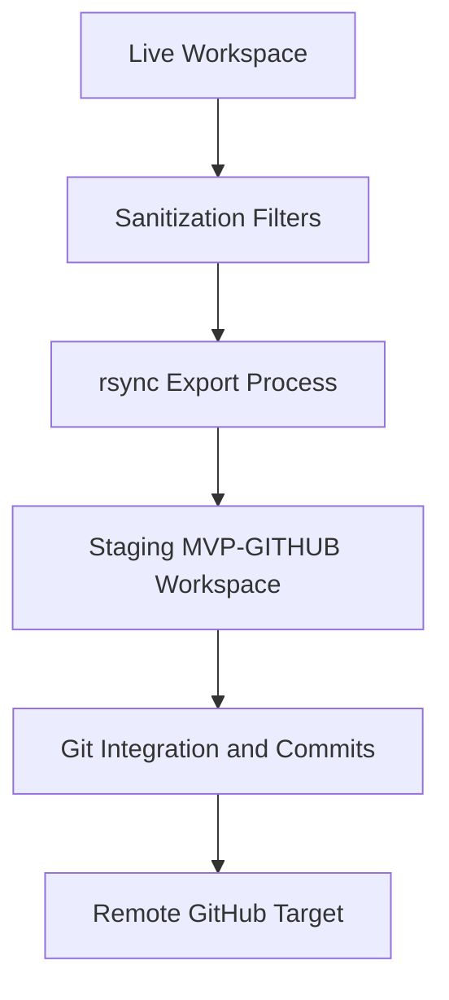

# Ops Consultant — AI Agents, CLI Workflows & Local Governance
*Author:* Lord Mahonheim  
*Status:* Verified Reference (statut/valide)  
*Tagline:* "Anonymization protects context; clean scaffolding guarantees trust."

## Tested Environment Table
| Parameter | Value |
| :--- | :--- |
| Date | 2026-07-03 |
| Host Machine | MIDGARD |
| Operating System | Linux (Ubuntu/Debian) |
| Workspace Path | `/home/lord-mahonheim/bifrost/tesla` |
| Sandbox Path | `/home/lord-mahonheim/bifrost/tesla/MVP-GITHUB` |

## Important Security Notice
This project automates the sanitization and replication of local working environments into public repositories. It excludes private credentials, GPG configurations, SSH keys, databases, and local sandbox cache directories to ensure compliance with security and privacy requirements.

## Table of Contents
1. Executive Summary
2. Problem Statement
3. Product Promise
4. Core Principles Table
5. Architecture Diagram
6. Repository Layout
7. Workflow Sequence
8. Technical Stack
9. Security and Governance Rules
10. Acceptance Criteria
11. Final Verdict & Signature Sentence

## Executive Summary
The Scaffolding and Deployment system prepares the clean local MVP working directory (`MVP-GITHUB/`) by stripping out sensitive directories, logs, and private caches. It maps the project structure to a public-facing layout, runs verification tests, and publishes changes to public targets on GitHub without disclosing the internal development context of the MIDGARD host.

## Problem Statement
During direct workspace development, configuration directories (e.g. `.gemini/`, `.antigravity/`), raw databases (e.g. `DataBase/`), and developer logs/credentials often get mixed in. Pushing the raw workspace to a public repository creates a high risk of leaking private data, credentials, and local environment quirks.

## Product Promise
* **What it does:** Scans, sanitizes, and replicates local workspace directories into a dedicated staging folder while systematically purging non-public files.
* **What it does NOT do:** Manage personal SSH identities or bypass external Git authentication controls.

## Core Principles Table
| Principle | Meaning | Impact |
| :--- | :--- | :--- |
| Zero Leakage | Systematic exclusion of sensitive folders. | Total privacy for private directories. |
| Staging Mirror | Staging layout is isolated from the live workspace. | Prevents accidental commits of active work. |
| Automation | Automated sync scripts prevent human lapses. | Standardized repo cleanliness. |

## Architecture Diagram


## Repository Layout
```text
10-Github-MVP-Scaffolding/
├── README.md
└── scripts/
    ├── export-workspace-sanitized.sh
    └── git_backup.sh
```

## Workflow Sequence
1. The developer triggers `export-workspace-sanitized.sh` to replicate the clean source files to the target staging path.
2. The export script filters out files defined in the exclusion list (e.g. `.git/`, `.env`, `DataBase/`).
3. The staging directory (`MVP-GITHUB/`) is reviewed.
4. Changes are validated, committed with Conventional Commits, and pushed.

## Technical Stack
* **Runtime:** Bash 4.0+
* **Utilities:** `rsync`, `git`

## Security and Governance Rules
* The export script must never copy directories matching private namespaces (`.env`, `DataBase/`, `.ssh/`).
* Dry-run review is recommended before pushing modifications to remote origins.

## Acceptance Criteria
* Running `export-workspace-sanitized.sh` successfully replicates non-excluded folders to `/sandboxes/workspace-sanitized`.
* `git_backup.sh` automatically commits changes in `/Avalon/` if modifications are detected.

## Final Verdict & Signature Sentence
**VERDICT: OPERATIONAL SCALABILITY VERIFIED**  
*"Isolation is the prerequisite of secure sharing."*
