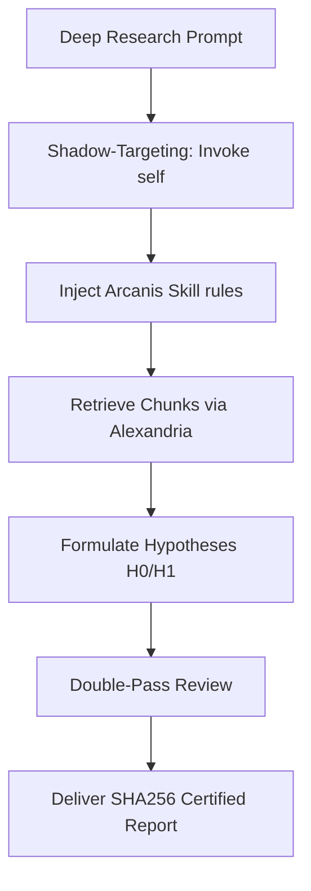

# Ops Consultant — AI Agents, CLI Workflows & Local Governance
*Author:* Lord Mahonheim  
*Status:* Verified Reference (statut/valide)  
*Tagline:* "Rigorous cross-referencing and deep analysis form the shield of security."

## Tested Environment Table
| Parameter | Value |
| :--- | :--- |
| Date | 2026-07-03 |
| Host Machine | MIDGARD |
| Operating System | Linux (Ubuntu/Debian) |
| Workspace Path | `/home/lord-mahonheim/bifrost/tesla` |
| Skill Path | `.agents/skills/tesla-arcanis` |

## Important Security Notice
Tesla Arcanis operates under strict token economy constraints. It utilizes precise local lookup tools (ripgrep, jq, FTS5) to prevent context bloating and memory leaks. No private files or credentials are ever read or indexed in bulk.

## Table of Contents
1. Executive Summary
2. Problem Statement
3. Product Promise
4. Core Principles Table
5. Architecture Diagram
6. Repository Layout
7. Workflow Sequence
8. Technical Stack
9. Security and Governance Rules
10. Acceptance Criteria
11. Final Verdict & Signature Sentence

## Executive Summary
Tesla Arcanis is a specialized elite agent profile designed for deep research, document analysis, and comprehensive security auditing under the Vigilum Codex. By implementing the Shadow-Targeting pattern, it overrides the platform limits of Antigravity CLI to execute advanced static code analysis and structural checks on complex configurations.

## Problem Statement
When reviewing large documentation directories, raw system logs, or complex configuration sheets, generic LLMs easily bloat their context windows, causing latency, memory leaks, and high hallucination rates. Furthermore, default Antigravity CLI controls block the deployment of custom dynamic subagents.

## Product Promise
* **What it does:** Executes deep document audits, cross-references sources via Alexandria RAG, tests conflicting hypotheses, and applies Obsidian Avalon formatting rules.
* **What it does NOT do:** Execute destructive commands or modify configs without direct developer confirmation.

## Core Principles Table
| Principle | Meaning | Impact |
| :--- | :--- | :--- |
| Shadow-Targeting | Invoke native `self` with injected skills. | Bypasses subagent creation limits safely. |
| Strict Anti-Bloat | Never load files > 500 KB into prompt context. | Protects MIDGARD RAM from memory limits. |
| Verified Seal | Every delivered report is certified with a SHA256 hash. | Guarantees document authenticity. |

## Architecture Diagram


## Repository Layout
```text
11-Tesla-Arcanis-Skill/
├── README.md
├── arcanis_prompt.md
└── arcanis_skill.md
```

## Workflow Sequence
1. The operator launches the research task.
2. The orchestrator calls the subagent `self` and applies the Arcanis skill profile.
3. Arcanis queries Alexandria using `search_router.py` to retrieve document chunks.
4. Arcanis formulates and stress-tests hypotheses (H0 vs H1).
5. The report is compiled and certified using a SHA256 cryptographic seal.

## Technical Stack
* **Language:** Markdown, Python (for RAG query routing)
* **Libraries:** `hashlib` (for SHA256 seals), `json`

## Security and Governance Rules
* Files larger than 500 KB must be parsed incrementally via structured query boundaries.
* Verification of SSH configurations, raw environments, or unauthorized keys is strictly prohibited.

## Acceptance Criteria
* The Arcanis prompt (`arcanis_prompt.md`) must clearly define the 5-step methodology (Plan, Collect, Hypotheses, Review, Synthesize).
* Delivered reports must contain the YAML metadata block and the SHA256 seal.

## Final Verdict & Signature Sentence
**VERDICT: OPERATIONAL SECURITY CERTIFIED**  
*"Verified hypotheses prevent automated failures."*
