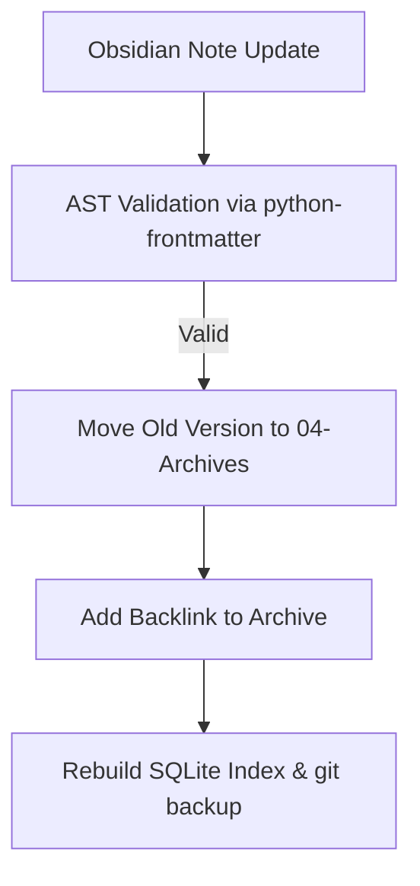

# Ops Consultant — AI Agents, CLI Workflows & Local Governance
*Author:* Lord Mahonheim  
*Status:* Verified Reference (statut/valide)  
*Tagline:* "An unified brain guarantees cognitive consistency across interfaces."

## Tested Environment Table
| Parameter | Value |
| :--- | :--- |
| Date | 2026-07-03 |
| Host Machine | MIDGARD |
| Operating System | Linux (Ubuntu/Debian) |
| Workspace Path | `/home/lord-mahonheim/bifrost/tesla` |
| Vault Path | `/home/lord-mahonheim/bifrost/tesla/Avalon` |
| Database Path | `Avalon/03-Resources/alexandria_brain.db` |

## Important Security Notice
This project unifies the SQLite FTS5 database used by the RAG backend directly with the Obsidian vault's resources folder. It enforces AST frontmatter syntax checks on local files without external cloud uploads.

## Table of Contents
1. Executive Summary
2. Problem Statement
3. Product Promise
4. Core Principles Table
5. Architecture Diagram
6. Repository Layout
7. Workflow Sequence
8. Technical Stack
9. Security and Governance Rules
10. Acceptance Criteria
11. Final Verdict & Signature Sentence

## Executive Summary
The Alexandria RAG Unification project unifies the local search and indexing pipeline with the Obsidian Avalon vault directory. It introduces automated AST frontmatter validators (`validate_note.py`) and historical revision managers (`archive_note.py`) that create link-based version tables in Obsidian while updating SQLite indices.

## Problem Statement
Previously, the Alexandria indexing system kept its SQLite database separate from the actual Obsidian vault resources directory. This led to a split-brain condition where search queries from the CLI did not scan the live changes made in Obsidian, and documentation modifications lacked automated schema checks.

## Product Promise
* **What it does:** Indexes live Obsidian notes, performs schema checking on YAML metadata, and maintains a version-controlled `/04-Archives` structure with git backups.
* **What it does NOT do:** Parse non-standard notes or sync files without valid YAML frontmatter blocks.

## Core Principles Table
| Principle | Meaning | Impact |
| :--- | :--- | :--- |
| Database Union | Index database sits inside the Obsidian resources folder. | Matches the CLI search target with live notes. |
| AST Validation | Frontmatter structure is validated programmatically. | Ensures Dataview plugin queries work consistently. |
| Bidirectional Tracking | Automatic backlinks to prior archived versions. | Preserves clear history paths. |

## Architecture Diagram


## Repository Layout
```text
12-Alexandria-RAG-Unification/
├── README.md
└── scripts/
    ├── archive_note.py
    └── validate_note.py
```

## Workflow Sequence
1. The developer or agent modifies a markdown file.
2. `archive_note.py` parses the metadata schema and replicates the prior version in `/04-Archives` with the tag `#statut/archive`.
3. The new version's frontmatter is validated via `validate_note.py` against core tags and schemas.
4. The database unifier executes a re-index cycle (`sync_brain.py`) and updates `alexandria_brain.db`.

## Technical Stack
* **Runtime:** Python 3.10+
* **Libraries:** `python-frontmatter`, `sqlite3`, `pathlib`

## Security and Governance Rules
* Note validations must run locally on MIDGARD; no network calls for syntax checks.
* Archiving notes must preserve original tags and add backlinks for history.

## Acceptance Criteria
* Running `validate_note.py` on a file with invalid tags returns an exit code of 1 and lists errors.
* `archive_note.py` successfully archives files, links the version, and triggers `git_backup.sh`.

## Final Verdict & Signature Sentence
**VERDICT: OPERATIONAL UNIFICATION STABILIZED**  
*"Cognitive order is maintained through strict schema validation."*
