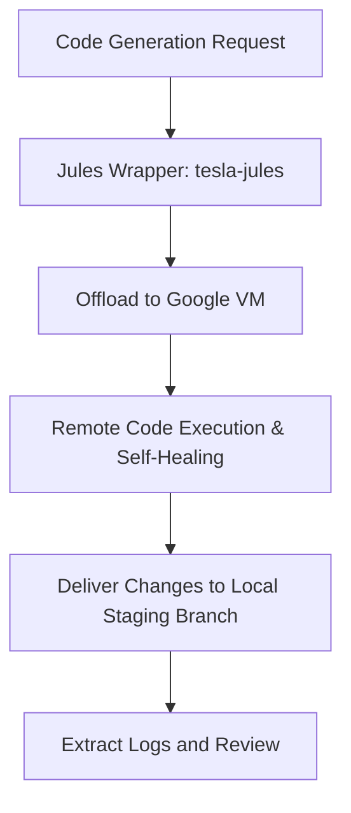

# Ops Consultant — AI Agents, CLI Workflows & Local Governance
*Author:* Lord Mahonheim  
*Status:* Verified Reference (statut/valide)  
*Tagline:* "Offloading computations to secure clouds protects local execution."

## Tested Environment Table
| Parameter | Value |
| :--- | :--- |
| Date | 2026-07-03 |
| Host Machine | MIDGARD |
| Operating System | Linux (Ubuntu/Debian) |
| Workspace Path | `/home/lord-mahonheim/bifrost/tesla` |
| Wrapper Script | `tools/tesla-jules` |

## Important Security Notice
This integration interacts asynchronously with Google Jules Cloud services. No local SSH keys, environment secrets, or private databases are sent to the cloud. All actions are isolated to staging directories.

## Table of Contents
1. Executive Summary
2. Problem Statement
3. Product Promise
4. Core Principles Table
5. Architecture Diagram
6. Repository Layout
7. Workflow Sequence
8. Technical Stack
9. Security and Governance Rules
10. Acceptance Criteria
11. Final Verdict & Signature Sentence

## Executive Summary
The Jules Cloud Integration system establishes a secure wrapper (`tesla-jules`) to interact with Google's cloud-native agent (Jules). It enables offloading resource-heavy computations, code creation, and compilation audits to Google VM instances, mitigating memory limits and CPU spikes on the local MIDGARD development machine.

## Problem Statement
Developing and compiling large HTML/CSS components and verifying layout structures locally causes context bloat and memory exhaustion on MIDGARD (8 GB RAM). Running multiple local compiler/analyzer processes simultaneously leads to performance lag and GUI display freeze (e.g. repaint storms).

## Product Promise
* **What it does:** Connects to the remote Jules daemon, delegates large-scale code updates, extracts progress logs, and reports status details.
* **What it does NOT do:** Sync local database files or bypass manual pull request code checks.

## Core Principles Table
| Principle | Meaning | Impact |
| :--- | :--- | :--- |
| Cloud Delegation | Heavy calculations run on remote Google VMs. | Prevents CPU throttling on MIDGARD. |
| Staging Bounds | Operations target specific workspace staging directories. | Prevents main branch pollution. |
| Integrity Reviews | Local wrappers extract cloud logs before merges. | Maintains accountability. |

## Architecture Diagram


## Repository Layout
```text
13-Jules-Cloud-Integration/
├── README.md
└── jules_wrapper.py
```

## Workflow Sequence
1. The developer triggers the wrapper command `tesla-jules sessions` to view active remote pipelines.
2. The local wrapper routes specific commands to the remote Google Labs CLI (`jules`).
3. Remote VMs compile, lint, and edit the designated staging files.
4. The wrapper fetches the commit and prints the execution summary (`JULES_RESPONSE_TO_TESLA`).

## Technical Stack
* **Runtime:** Python 3.10+
* **Utilities:** Google Jules CLI (`~/.npm-global/bin/jules`), Git

## Security and Governance Rules
* The wrapper must verify that the local repository is clean before calling remote sessions.
* No raw system directories (`.ssh/`, `.codex/`) may be scanned or uploaded.

## Acceptance Criteria
* The Python script `jules_wrapper.py` successfully parses command options and reports remote sessions.
* The output extracts and displays jules' execution logs safely.

## Final Verdict & Signature Sentence
**VERDICT: OPERATIONAL DELEGATION STABILIZED**  
*"Asynchronous cloud delegation secures host machine performance."*
