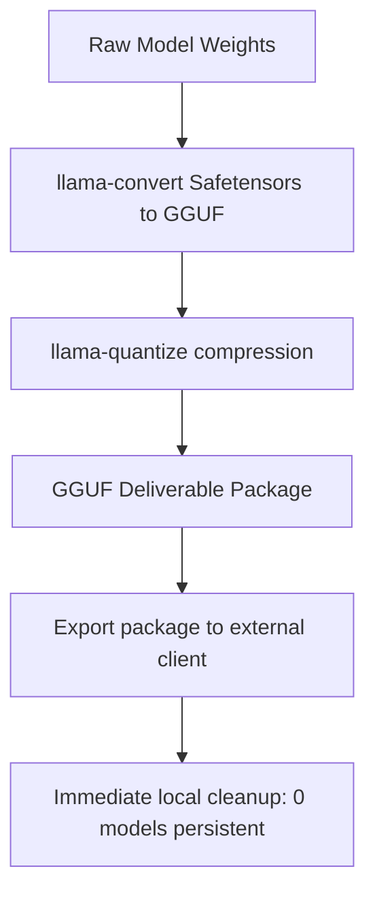

# Ops Consultant — AI Agents, CLI Workflows & Local Governance
*Author:* Lord Mahonheim  
*Status:* Verified Reference (statut/valide)  
*Tagline:* "Understanding compilation tools without local residency guarantees system purity."

## Tested Environment Table
| Parameter | Value |
| :--- | :--- |
| Date | 2026-07-03 |
| Host Machine | MIDGARD |
| Operating System | Linux (Ubuntu/Debian) |
| Workspace Path | `/home/lord-mahonheim/bifrost/tesla` |
| Evaluation File | `docs/analyse_utilite_llama_cpp_v2.md` |

## Important Security Notice
This evaluation strictly respects the zero-local-model policy. No large language models (LLMs) or neural network parameters are stored, loaded, or executed locally on MIDGARD. All vector operations use cloud embeddings.

## Table of Contents
1. Executive Summary
2. Problem Statement
3. Product Promise
4. Core Principles Table
5. Architecture Diagram
6. Repository Layout
7. Workflow Sequence
8. Technical Stack
9. Security and Governance Rules
10. Acceptance Criteria
11. Final Verdict & Signature Sentence

## Executive Summary
The Llama.cpp Evaluation project conducts a rigorous feasibility study of utilizing the `llama.cpp` tool suite on host environments while adhering to the constraint of zero local AI model residency. It details how the framework can serve as an export pipeline (quantization, packaging, format splits) for external deliverables.

## Problem Statement
Standard RAG architectures assume local model installation (e.g. running sentence transformers or local Llama instances via Ollama), which consumes local RAM/CPU and conflicts with the policy of zero local AI models. We need a way to leverage optimization tools without local AI persistence.

## Product Promise
* **What it does:** Outlines the architecture of `llama.cpp`, evaluates quantization types (GGUF), and defines integration vectors.
* **What it does NOT do:** Install local weights, run local inference daemons, or compile GPU compilers on MIDGARD.

## Core Principles Table
| Principle | Meaning | Impact |
| :--- | :--- | :--- |
| Zero Local Residency | No AI model weights remain stored locally. | Keeps storage clean and CPU/RAM free of model loads. |
| Cloud Embeddings | Delegate vector math to Gemini Cloud APIs. | Zero local footprint for Alexandria search. |
| Packager Role | llama.cpp is only used to prepare external client assets. | Limits tool scope to build-time quantization. |

## Architecture Diagram


## Repository Layout
```text
14-Llama-cpp-Evaluation/
├── README.md
└── docs/
    └── analyse_utilite_llama_cpp_v2.md
```

## Workflow Sequence
1. The consultant reviews the technical utility checklist of `llama.cpp` (OpenAI compatibility, quantization).
2. The zero-residency policy is enforced (RAG vector math delegated to Gemini Cloud).
3. The packaging workflow is defined (quantization via `llama-quantize` for external exports only).
4. Raw files are immediately purged after deliverable compilation.

## Technical Stack
* **Framework:** `llama.cpp`
* **Formats:** GGUF (supported quantization formats Q4_K_M to Q8_0)

## Security and Governance Rules
* Models used for external exports must be immediately deleted from local cache post-quantization.
* Local CPU/GPU compilers (CUDA/Metal/oneAPI) must not be configured for permanent local inferece servers.

## Acceptance Criteria
* The documentation `analyse_utilite_llama_cpp_v2.md` must clearly evaluate the 7 utilities and 4 limits.
* The file must describe the hybrid RAG architecture (local FTS5 index, cloud embeddings).

## Final Verdict & Signature Sentence
**VERDICT: OPERATIONAL BOUNDARIES STABILIZED**  
*"Quantization is an export skill; local indexers use cloud embeddings."*
