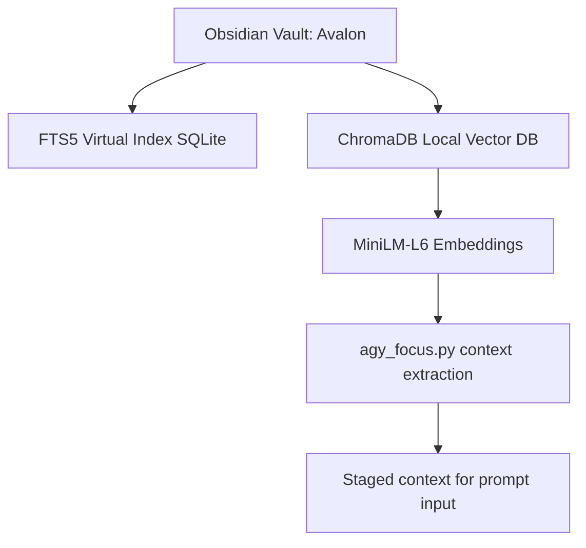

# Project 15 — Obsidian Database (Alexandria / FTS5 / Local RAG)
*Author:* Lord Mahonheim  
*Status:* Verified Reference (statut/valide)  
*Tagline:* "A living knowledge vault must have rapid retrieval and high precision sémantique."

## Executive Summary
This project outlines the initialization and local indexing mechanisms for **Alexandria** (our Obsidian vault-based brain). It contains the layout-initialization script `init_alexandria.sh` and two local RAG (Retrieval-Augmented Generation) utility scripts: `agy_indexer.py` (which builds a persistent vector representation of the vault using a lightweight local model) and `agy_focus.py` (which isolates relevant file context on demand).

## Problem Statement
Without structured knowledge indexing, large markdown vaults suffer from search latency and context window overflow. Traditional grep commands do not capture semantic proximity, while large vector models consume too much RAM on local hosts. We need a dual approach: high-speed keyword search via SQLite FTS5 and lightweight local semantic retrieval via ChromaDB.

## Product Promise
* **What it does:** Sets up standard vault directories, indexes files into virtual FTS5 databases, and caches local vector fragments in ChromaDB.
* **What it does NOT do:** Sync local database files to remote locations or send sensitive text to external servers.

## Core Principles Table
| Principle | Meaning | Impact |
| :--- | :--- | :--- |
| SQLite FTS5 | Virtual keyword index table inside the vault resources. | Instant search over text. |
| MiniLM Vectors | Lightweight ChromaDB index running on CPU. | High semantic alignment. |
| Context Isolation | Exporting focused files to temporary locations. | Keeps prompts minimal. |

## Architecture Diagram


## Target Files and Layout
```text
15-Obsidian-Database/
├── README.md
├── init_alexandria.sh
└── rag_local/
    ├── agy_focus.py
    └── agy_indexer.py
```

## Usage Scripts
1. **Vault Initialization (`init_alexandria.sh`):**
   Scaffolds the target directories (`00-Inbox`, `01-Library`, etc.) and creates the virtual SQLite tables.
   ```bash
   bash init_alexandria.sh
   ```
2. **Semantic Indexing (`rag_local/agy_indexer.py`):**
   Walks the directory, chunks markdown files, and generates vector indices.
   ```bash
   python3 rag_local/agy_indexer.py <path_to_vault>
   ```
3. **Context Focus (`rag_local/agy_focus.py`):**
   Searches the cache and extracts files matching the query parameters.
   ```bash
   python3 rag_local/agy_focus.py "query string" <path_to_vault>
   ```

## Security and Governance Rules
* The index database `alexandria_brain.db` and the `.agy_cache` directory must be added to `.gitignore` to prevent secret/binary commits.
* No private notes, personal journals, or database records may be synced outside the host MIDGARD.
