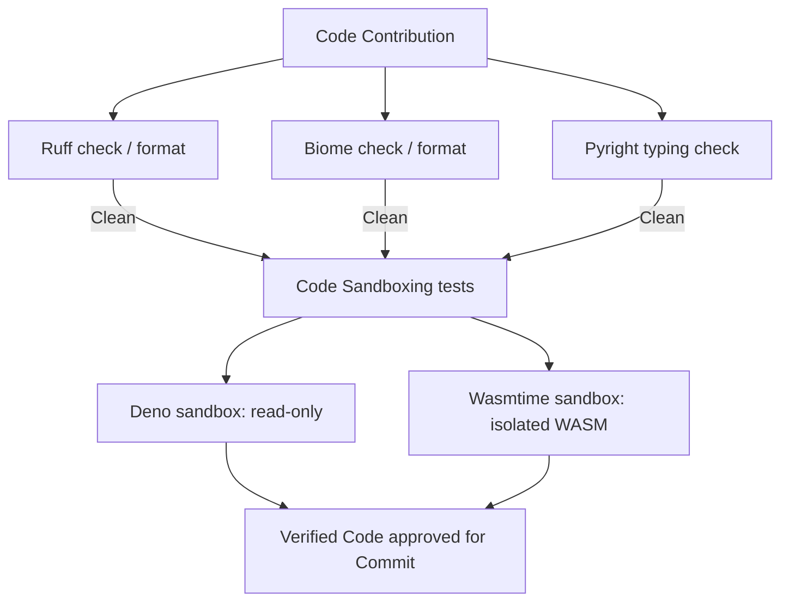

# Project 16 — Tesla Master Code (Lints, Verifications and Sandboxes)
*Author:* Lord Mahonheim  
*Status:* Verified Reference (statut/valide)  
*Tagline:* "A validated codebase is a trustworthy shield against system degradation."

## Executive Summary
This project organizes the syntax check, typing validation, formatting, and sandboxed runtimes under the Vigilum Codex. It includes configuration templates for **Pyright**, **Ruff**, and **Biome**, as well as a master orchestration linter script `lint_all.sh` to run syntax verifications on local modifications before git check-ins.

## Problem Statement
Developing code without standardized static analysis rules leads to formatting drift, syntax errors, and missing typings. Running unverified code can trigger background daemon exceptions. Additionally, running client JS or WebAssembly modules directly poses a security threat. We need strict pre-flight checks and isolated execution sandboxes.

## Product Promise
* **What it does:** Validates Python types (Pyright), verifies syntax/formatting (Ruff & Biome), and defines isolated sandboxes (Deno & Wasmtime) for untrusted executions.
* **What it does NOT do:** Automatically correct logical flows without testing or run unchecked packages on host systems.

## Core Principles Table
| Principle | Meaning | Impact |
| :--- | :--- | :--- |
| Zero Errors | Pyright must return 0 typing errors before push. | Avoids import/module crashes. |
| Strict Formatting | Automated linting checks via Ruff and Biome. | Standardizes spacing and styles. |
| Sandboxed Runtime | Isolated execution via Deno and Wasmtime. | Shields host filesystem/network. |

## Architecture Diagram


## Target Files and Layout
```text
16-Tesla-Master-Code/
├── README.md
├── biome.json
├── lint_all.sh
├── pyrightconfig.json
└── ruff.toml
```

## Verification & Sandboxing Specifications
1. **Pyright configuration (`pyrightconfig.json`):**
   Points to the local workspace Python virtual environment for syntax inspection:
   ```json
   {
     "venvPath": ".",
     "venv": ".venv"
   }
   ```
2. **Web files configuration (`biome.json`):**
   Limits checks to local working paths, enforcing standard JavaScript/TypeScript and JSON formatting rules.
3. **Python Linter (`ruff.toml`):**
   Defines checking rules (E, F, W, I) and target Python version compatibility.
4. **Master verification tool (`lint_all.sh`):**
   Wraps all commands into a single executable diagnostic:
   ```bash
   bash lint_all.sh
   ```

## Security and Governance Rules
* The linter configuration must exclude virtual env directories (`.venv`, `node_modules`).
* Execution of scripts via Deno must run with flags `--allow-net=none` to prevent unsolicited outbound calls.
