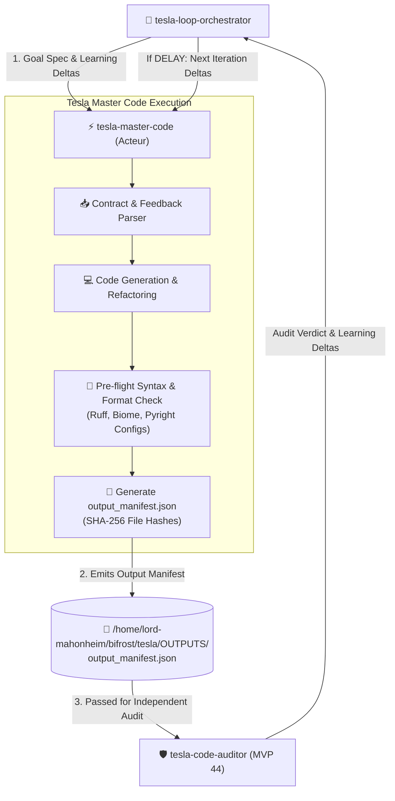

# ⚡ MVP 16 — Tesla Master Code

   

> **Tesla Antigravity CLI · @lordmahonheim-bot**  
> **Authoritative Documentation — Exclusive Code Generation & Artifact Actuator Engine**

---

## 🎯 Executive Summary & Architectural Role

**Tesla Master Code** (MVP 16) is the core code generation, syntax implementation, and artifact writer component of the **Tesla Antigravity CLI** ecosystem. Under the **Loop Engineering (MVP 28)** architecture, `tesla-master-code` operates **exclusively as the Acteur / Writer**.

### 🔒 Separation of Powers Doctrine (Vigilum Codex)
In accordance with the **Vigilum Codex**, `tesla-master-code` is strictly decoupled from auditing and certification responsibilities:
- **Exclusive Acteur Responsibility**: `tesla-master-code` receives natural language contract goals and structured learning deltas (`learning_deltas`), modifies target source code files, and emits an authoritative execution manifest (`output_manifest.json`).
- **No Self-Auditing**: `tesla-master-code` is strictly **forbidden from self-certifying** or issuing `PASS`/`BLOCK` audit verdicts. Self-auditing creates critical cognitive bias and security risks.
- **Independent Verification**: All generated artifacts and manifests are submitted directly to `tesla-code-auditor` (MVP 44) for independent 4-level validation.

---

## 🏗️ Architecture & Interaction Flow

In the Loop Engineering framework (`ACT` phase), `tesla-master-code` functions as the execution engine for code synthesis and refinement:


```mermaid
flowchart TD
    TLO["🔄 tesla-loop-orchestrator"] -->|1. Goal Spec & Learning Deltas| TMC["⚡ tesla-master-code (Acteur)"]
    
    subgraph Acteur Engine ["Tesla Master Code Execution"]
        TMC --> TaskParser["📥 Contract & Feedback Parser"]
        TaskParser --> CodeGen["💻 Code Generation & Refactoring"]
        CodeGen --> FormatCheck["🧹 Pre-flight Syntax & Format Check\n(Ruff, Biome, Pyright Configs)"]
        FormatCheck --> ManifestGen["📄 Generate output_manifest.json\n(SHA-256 File Hashes)"]
    end

    ManifestGen -->|2. Emits Output Manifest| OUTPUT[("📁 /home/lord-mahonheim/bifrost/tesla/OUTPUTS/\noutput_manifest.json")]
    OUTPUT -->|3. Passed for Independent Audit| TCA["🛡️ tesla-code-auditor (MVP 44)"]
    
    TCA -->|Audit Verdict & Learning Deltas| TLO
    TLO -->|If DELAY: Next Iteration Deltas| TMC
```

---

## ⚙️ Core Capabilities & Pre-Flight Tooling

In addition to acting as the primary Acteur in the iterative loop, `tesla-master-code` provides standardized pre-flight linter configurations and runtime sandboxes for host protection:

| Tool / Capability | Purpose | Configuration File |
|---|---|---|
| **Pyright** | Static Python typing enforcement | `pyrightconfig.json` |
| **Ruff** | Python fast linting & style enforcement | `ruff.toml` |
| **Biome** | Fast JavaScript/TypeScript/JSON formatting | `biome.json` |
| **Master Linter** | Orchestrated pre-flight verification script | `lint_all.sh` |
| **Manifest Generator** | Produces cryptographic `output_manifest.json` | `master_code.py` |

---

## 📄 Manifest & CLI Specification

When invoked by `tesla-loop-orchestrator` during the `ACT` phase, `tesla-master-code` processes task goals and feedback, then outputs `output_manifest.json`.

### Command Line Interface (`master_code.py`)
```bash
python3 /home/lord-mahonheim/bifrost/tesla/MVP-GITHUB/16-Tesla-Master-Code/master_code.py \
  --contract /path/to/loop_contract.yaml \
  --feedback "Pyright: TYPE_MISMATCH in src/main.py line 42"
```

### Generated Manifest Format (`output_manifest.json`)
```json
{
  "files_modified": [
    "src/main.py",
    "tests/test_main.py"
  ],
  "hashes": {
    "src/main.py": "a665a45920422f9d417e4867efdc4fb8a04a1f3fff1fa07e998e86f7f7a27ae3",
    "tests/test_main.py": "b785a45920422f9d417e4867efdc4fb8a04a1f3fff1fa07e998e86f7f7a27ae4"
  },
  "timestamp": "2026-08-09T06:00:00Z"
}
```

---

## 📁 Target Directory Structure

```text
16-Tesla-Master-Code/
├── README.md               # Authoritative documentation (Acteur role in Loop Engineering)
├── SKILL.md                # Skill specification and coding standards
├── biome.json              # Biome Linter configuration
├── lint_all.sh             # Master pre-flight verification script
├── master_code.py          # Acteur script & output_manifest.json generator
├── pyrightconfig.json      # Pyright typing configuration
└── ruff.toml               # Ruff Python linter configuration
```

---

## 🏛️ Governance & Vigilum Codex Compliance

1. **Strict Separation of Powers**: `tesla-master-code` generates code; `tesla-code-auditor` evaluates it. Neither component may invade the other's operational domain.
2. **Zero-Bypass Manifest**: All modified files must be explicitly declared in `output_manifest.json` with accurate cryptographic SHA-256 hashes.
3. **Iterative Refinement**: Upon receiving a `DELAY` verdict with `learning_deltas`, `tesla-master-code` applies surgical modifications targeting only the reported error locations without regressions.

---

## 📋 MVP 16 Metadata

| Parameter | Value |
|---|---|
| **MVP ID** | MVP 16 |
| **Component** | Tesla Master Code |
| **Role** | Exclusive Acteur / Writer (Loop Engineering) |
| **Author** | `@lordmahonheim-bot` |
| **Status** | ✅ `MVP COMPLETE` |
| **Ecosystem** | Tesla Antigravity CLI |
| **Dependencies** | MVP 28 (`28-Loop-Engineering`), MVP 44 (`44-Tesla-Code-Auditor`) |

---

*Part of the [Tesla Antigravity CLI](https://github.com/lordmahonheim-bot/Tesla-Antigravity-CLI) ecosystem — Vigilum Codex doctrine.*
