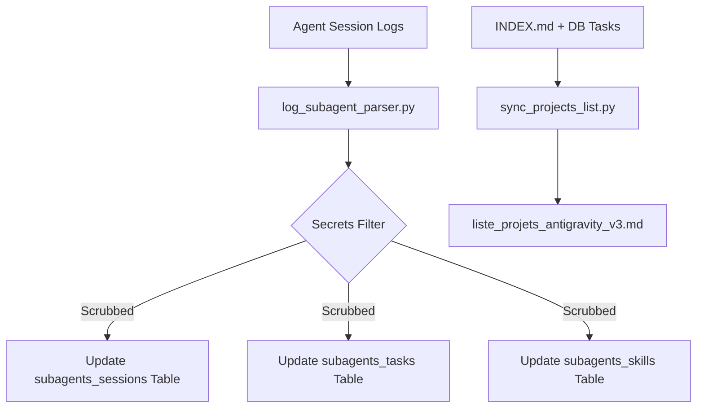

# Project 17 — DB Subagents Skills (Session Memory & Shadow-Targeting Auditor)
*Author:* Lord Mahonheim  
*Status:* Verified Reference (statut/valide)  
*Tagline:* "System audit logs are the black box of autonomous agents."

## Executive Summary
This project manages the background database synchronization and transcription audit pipeline for subagent sessions. It reads raw JSONL logs from agent execution paths, sanitizes any detected credentials (secrets scrubbing), extracts task statuses, parses shadow-targeted skill injections, and commits the records to the SQLite memory store. It also hosts the project list sync tool.

## Problem Statement
When multiple subagents operate concurrently, their execution details can be scattered, making it hard to track API token costs, task completions, and custom skills used (shadow-targeting). Furthermore, transcript logs contain sensitive API keys or SSH details that could be committed to git history if not scrubbed dynamically.

## Product Promise
* **What it does:** Initializes the subagent session tables, parses JSONL logs to scrub secrets, records task status tables, and syncs project lists.
* **What it does NOT do:** Transmit private logs to external servers or store active API tokens in the SQLite database.

## Core Principles Table
| Principle | Meaning | Impact |
| :--- | :--- | :--- |
| Dynamic Scrubbing | Regex-based scrubbing of AWS, GitHub, and JWT keys. | Guarantees zero credential leakage. |
| Schema Versioning | Auto-migrations via `schema_version` verification. | Keeps the database upgradeable. |
| Shadow Audit | Detects unauthorized skill loads or custom tools. | Validates execution bounds. |

## Architecture Diagram


## Target Files and Layout
```text
17-DB-Subagents-Skills/
├── README.md
├── db_init.py
├── log_subagent_parser.py
├── sync_projects_list.py
└── update_session_history.py
```

## Setup & Execution Scripts
1. **Initialize Session Tables (`db_init.py`):**
   Initializes connection parameters (WAL journal, busy timeouts) and tables:
   ```bash
   python3 db_init.py
   ```
2. **Auditing logs (`log_subagent_parser.py`):**
   Reads transcripts and updates session records under `/brain/`:
   ```bash
   python3 log_subagent_parser.py
   ```
3. **Consolidate Project List (`sync_projects_list.py`):**
   Gathers all project objectives and SQLite completed tasks to compile the master history.
   ```bash
   python3 sync_projects_list.py
   ```
4. **Update Session History (`update_session_history.py`):**
   Parses transcripts and appends a markdown details section to long-term memory.
   ```bash
   python3 update_session_history.py
   ```

## Security and Governance Rules
* Hardcoded home directories (e.g. `/home/lord-mahonheim/`) are replaced with environment queries (`os.environ`) or relative lookups.
* The scrubbing regexes must cover AWS keys, GitHub tokens, Slack URLs, JWT payloads, and SSH private keys.
