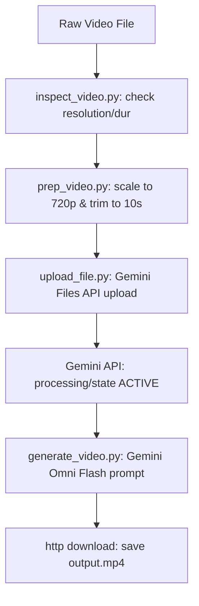

# Project 18 — Tesla Video Director (Local Preppers, Transcribers and Generative Video)
*Author:* Lord Mahonheim  
*Status:* Verified Reference (statut/valide)  
*Tagline:* "Local pre-processing ensures fast upload; Gemini cloud APIs handle deep inference."

## Executive Summary
This project outlines the media ingestion, compression, and generative editing pipeline of the Tesla subagent ecosystem. Adhering to the zero-local-model policy, it performs all transcription and sémantic video parsing via the **Google Gemini API** (using the `google-genai` SDK), while using local **FFmpeg** commands to normalize, slice, and strip audio files before uploading.

## Problem Statement
Uploading raw, high-definition, or long-duration video files directly to cloud endpoints frequently causes Out-Of-Memory (OOM) errors, high latency, and network connection drops. Furthermore, running local models (like Whisper or YOLO) violates the local residency rules. We need a fast local pre-processing utility combined with clean Google Files/Interactions API integrations.

## Product Promise
* **What it does:** Trims videos, scales resolution (480p/720p), strips audio streams, uploads assets safely, and generates new videos using text/image reference prompts.
* **What it does NOT do:** Run local neural network inferences or require third-party paid video API services.

## Core Principles Table
| Principle | Meaning | Impact |
| :--- | :--- | :--- |
| Zero Local Models | All audio/video transcriptions run on Gemini Cloud. | Zero CPU/RAM bloat on host MIDGARD. |
| FFmpeg Optimization | Resize and trim inputs to exactly 10s before upload. | Fast, OOM-safe data transfers. |
| Alt=Media Downloads | Memory-safe chunked video retrieval via HTTP. | Secure file saving on local drives. |

## Architecture Diagram


## Target Files and Layout
```text
18-Tesla-Video-Director/
├── README.md
├── upload_file.py
└── video/
    ├── generate_video.py
    ├── inspect_video.py
    ├── prep_video.py
    └── transcribe.py
```

## Usage and Pipeline Sequences
1. **Metadata Audit (`video/inspect_video.py`):**
   Checks container information:
   ```bash
   python3 video/inspect_video.py path/to/video.mp4 --json
   ```
2. **Trim and Scale (`video/prep_video.py`):**
   Compresses video and limits duration to 10s:
   ```bash
   python3 video/prep_video.py path/to/video.mp4 --duration 10 --resolution 1280x720 --output media/prepped.mp4
   ```
3. **Upload to Cloud Files (`upload_file.py`):**
   Uploads the file and polls status until it becomes `ACTIVE`:
   ```bash
   python3 upload_file.py media/prepped.mp4
   ```
4. **Cloud Transcription (`video/transcribe.py`):**
   Uploads sound files and generates diarized transcripts:
   ```bash
   python3 video/transcribe.py media/voice.mp3 -o output.txt
   ```
5. **Video Generation (`video/generate_video.py`):**
   Generates a new video based on prompts:
   ```bash
   python3 video/generate_video.py "A futuristic city in the style of Vigilum Codex" --aspect-ratio 16:9 --output output.mp4
   ```

## Security and Governance Rules
* The API key must be parsed from `os.environ.get("GEMINI_API_KEY")`; never hardcode keys in files.
* Clean up all intermediate clips in `media/` and temporary workspace paths post-execution.
