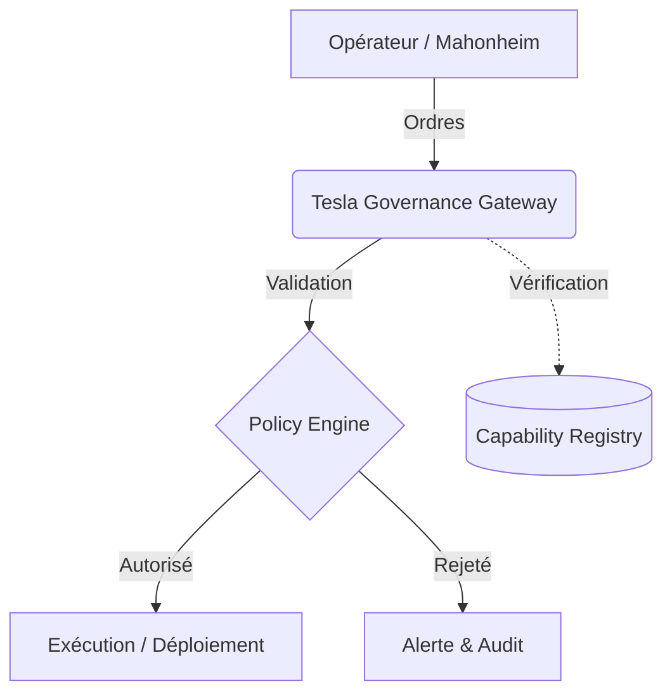

# 🛡️ Tesla Governance Gateway (TGG) v1.0

## 1. Diagnostic (Pourquoi ?)
L'écosystème `@lordmahonheim-bot` requiert une infrastructure robuste pour l'orchestration, la validation et la gouvernance de ses opérations. La Tesla Governance Gateway (TGG) assure la conformité, l'auditabilité et le contrôle des flux d'exécution et de déploiement selon les directives du Vigilum Codex.

## 2. Architecture & Fonctionnalités (Quoi ?)
Ce dépôt contient la version initiale (MVP 27) des outils de gouvernance :
- **Moteur de Politiques (`policy_engine.sh`)** : Validation des règles de sécurité et de déploiement.
- **Registre des Capacités (`capability_registry.json`)** : Définition formelle des droits des agents et sous-systèmes.
- **Hooks de Sécurité (`pre-commit`)** : Contrôle de qualité automatisé.
- **Orchestration d'Agents (`agents/`)** : Modules de gestion de flotte autonome.

## 3. Conformité
Opérant sous confinement strict, aucun push distant n'est autorisé sans l'approbation explicite de l'Architecte.

---
*Généré par `tesla-github-manager` sous la doctrine du Vigilum Codex.*
