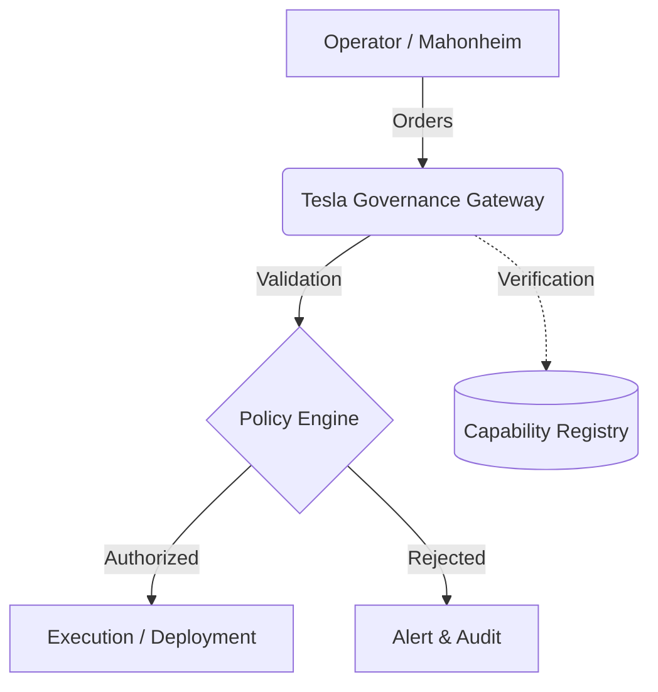

# 🛡️ Tesla Governance Gateway (TGG) v1.0

   

## 1. Diagnostic (Why?)
The `@lordmahonheim-bot` ecosystem requires a robust infrastructure for the orchestration, validation, and governance of its operations. The Tesla Governance Gateway (TGG) ensures compliance, auditability, and control of execution and deployment flows according to the directives of the Vigilum Codex.

## 2. Architecture & Features (What?)
This repository contains the initial version (MVP 27) of the governance tools:
- **Policy Engine (`policy_engine.sh`)**: Validation of security and deployment rules.
- **Capability Registry (`capability_registry.json`)**: Formal definition of agent and subsystem rights.
- **Security Hooks (`pre-commit`)**: Automated quality control.
- **Agent Orchestration (`agents/`)**: Autonomous fleet management modules.

```mermaid
graph TD
    A[Operator / Mahonheim] -->|Orders| B(Tesla Governance Gateway)
    B -->|Validation| C{Policy Engine}
    C -->|Authorized| D[Execution / Deployment]
    C -->|Rejected| E[Alert & Audit]
    B -.->|Verification| F[(Capability Registry)]
```

## 3. Compliance
Operating under strict confinement, no remote push is allowed without the explicit approval of the Architect.

---
*Generated by `tesla-github-manager` under the Vigilum Codex doctrine.*
