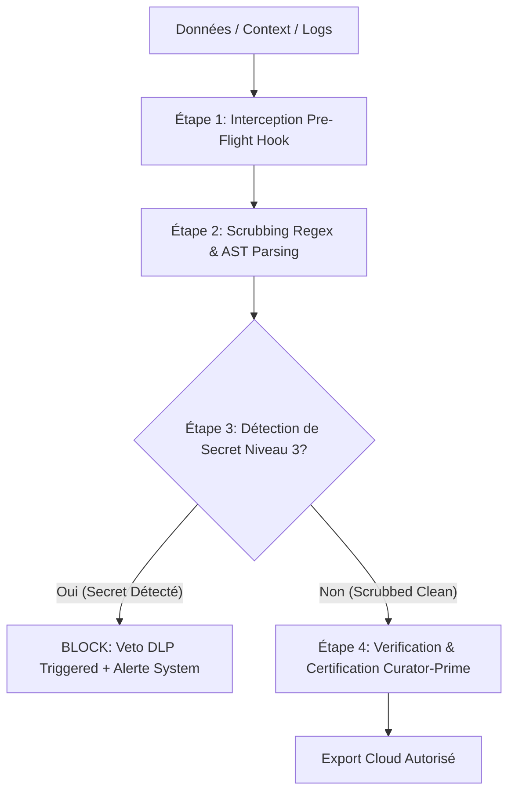

# POLITIQUE STRICTE DE DATA SCRUBBING ET PREVENTIONS DES FUITES CLOUD (DLP)

   

---

## 1. Gouvernance et Contexte

- **Autorité d'Archivage** : `tesla-curator-prime` (Guardian of Canonical Memory & DLP Gatekeeper)
- **Doctrine de Référence** : Vigilum Codex (Act-Verify-Learn-Repeat)
- **Champ d'Application** : Tout export de contexte, code, logs, prompts ou artefacts destinés à des API ou services Cloud (ex: Google Cloud, Jules, Gemini Cloud, OpenAI, dépôts Git distants).
- **Principe Cardinal** : Zero Sensitive Leakage / Privacy-by-Design. Aucune donnée sensible ne doit franchir la frontière locale de l'environnement MIDGARD sans assainissement préalable certifié.

---

## 2. Taxonomie et Classification des Données (Grille DLP)

| Niveau de Sécurité | Désignation | Exemples de Contenu | Action Requise |
| :--- | :--- | :--- | :--- |
| **Niveau 0** | **Public** | Documentation open-source, README publics, licences. | Autorisé sans modification. |
| **Niveau 1** | **Interne** | Spécifications d'architecture, logs de déroulement non sensibles. | Ingestion autorisée sous contrôle d'intégrité. |
| **Niveau 2** | **PII (Données Personnelles)** | Adresses email, identifiants utilisateur local, adresses IP privées, chemins système Linux absolus. | **Assainissement obligatoire** (Scrubbing / Anonymisation). |
| **Niveau 3** | **Secrets Critiques** | Clés d'API (AWS, GitHub, Slack, Anthropic, OpenAI), jetons JWT, clés privées SSH/PGP, passwords DB. | **Veto Immédiat & Censure Absolue** (Blocage d'export). |

---

## 3. Mécanismes Techniques de Scrubbing (Catalogue des Expressions Régulières)

Le moteur de scrubbing s'appuie sur le composant Python `log_subagent_parser.py` (situé dans `/memory/log_subagent_parser.py`) et la chaîne de contrôle `tesla-curator-prime`.

### 3.1. Tableau des Règles Regex Certifiées

```python
# Catalogue des motifs de masquage déterministe (SCRUB_PATTERNS)
import re

SCRUB_PATTERNS = [
    # 1. AWS Access Keys
    (re.compile(r"(?:AKIA|ASCA|A3T[A-Z0-9])[A-Z0-9]{16}"), "[SCRUBBED_AWS_KEY]"),
    
    # 2. AWS Secret Access Keys
    (re.compile(r"(?<![A-Za-z0-9/+=])[A-Za-z0-9/+=]{40}(?![A-Za-z0-9/+=])"), "[SCRUBBED_AWS_SECRET]"),
    
    # 3. GitHub Personal Access Tokens (Classic & Fine-Grained)
    (re.compile(r"ghp_[A-Za-z0-9_]{36,255}"), "[SCRUBBED_GITHUB_TOKEN]"),
    (re.compile(r"github_pat_[A-Za-z0-9_]{22}_[A-Za-z0-9_]{59}"), "[SCRUBBED_GITHUB_TOKEN]"),
    
    # 4. Slack Bot & User Tokens
    (re.compile(r"xox[baprs]-[0-9a-zA-Z]{10,48}"), "[SCRUBBED_SLACK_TOKEN]"),
    
    # 5. JSON Web Tokens (JWT)
    (re.compile(r"eyJ[A-Za-z0-9-_=]+\.eyJ[A-Za-z0-9-_=]+\.[A-Za-z0-9-_+/=]+"), "[SCRUBBED_JWT]"),
    
    # 6. Clés Privées SSH / OpenSSH / RSA / PGP
    (re.compile(r"-----BEGIN [A-Z ]+ PRIVATE KEY-----\n[\s\S]+?\n-----END [A-Z ]+ PRIVATE KEY-----"), "[SCRUBBED_SSH_KEY]"),
    (re.compile(r"-----BEGIN [A-Z ]+ PRIVATE KEY-----[A-Za-z0-9+/=\s\n]+-----END [A-Z ]+ PRIVATE KEY-----"), "[SCRUBBED_SSH_KEY]"),
    
    # 7. Clés API OpenAI & Anthropic
    (re.compile(r"sk-[a-zA-Z0-9]{32,64}"), "[SCRUBBED_OPENAI_KEY]"),
    (re.compile(r"sk-proj-[a-zA-Z0-9_-]{40,}"), "[SCRUBBED_OPENAI_KEY]"),
    (re.compile(r"sk-ant-[a-zA-Z0-9_-]{32,}"), "[SCRUBBED_ANTHROPIC_KEY]"),
    
    # 8. Mots de passe et jetons d'authentification génériques
    (re.compile(r"(?i)(api[_-]?key|secret|password|passwd|auth[_-]?token)\s*[:=]\s*['\"]?([a-zA-Z0-9_\-]{16,})['\"]?"), r"\1=[SCRUBBED_SECRET]"),
    
    # 9. PII - Adresses E-mail
    (re.compile(r"[a-zA-Z0-9_.+-]+@[a-zA-Z0-9-]+\.[a-zA-Z0-9-.]+"), "[SCRUBBED_EMAIL]"),
    
    # 10. Adresses IP Privées (IPv4)
    (re.compile(r"\b(?:10|172\.(?:1[6-9]|2[0-9]|3[01])|192\.168)\.\d{1,3}\.\d{1,3}\b"), "[SCRUBBED_IP]")
]
```

---

## 4. Pipeline d'Exécution Pre-Cloud (Guardrails DLP)

Toute tentative d'exportation de données vers le Cloud suit obligatoirement un pipeline d'interception à 4 étapes :



### 4.1. Étapes Détallées

1. **Étape 1 — Interception Pre-Flight Hook** :
   Chaque payload envoyé vers l'extérieur (API externes, Jules Delegate, Cloud LLM) est capturé par la passerelle de gouvernance (Vigilum Gateway V2.1 / TGG).

2. **Étape 2 — Scrubbing Regex & AST Parsing** :
   Exécution synchrone du parseur `scrub_text()`. Tous les tokens correspondant aux motifs Niveau 2 (PII) et Niveau 3 (Secrets) sont remplacés par des balises immuables (ex: `[SCRUBBED_AWS_KEY]`).

3. **Étape 3 — Contrôle de Veto DLP** :
   Si un secret de Niveau 3 non masqué est détecté après la passe de nettoyage, le pipeline interrompt immédiatement le flux d'export. La réponse renvoyée au moteur est un statut d'échec bloquant : `DLP_VETO_TRIGGERED`.

4. **Étape 4 — Certification par Tesla-Curator-Prime** :
   `tesla-curator-prime` valide l'intégrité du payload assaini avant de donner son accord pour l'émission vers le réseau cloud.

---

## 5. Règle d'Isolation Transactionnelle et Journaux

- **Stockage des Journaux** : Les métadonnées d'assainissement sont enregistrées dans la base SQLite locale `/home/lord-mahonheim/bifrost/tesla/Avalon/03-Resources/alexandria_brain.db` avec le mode `WAL` activé (`PRAGMA journal_mode=WAL;`).
- **Gestion des Conflits** : Toute écriture dans la base SQLite utilise un gestionnaire de contexte avec tentatives multiples (retry backoff) et isolation transactionnelle (`with conn:`).
- **Interdiction de Journalisation des Secrets Bruts** : Aucun secret brut ne doit être consigné dans les fichiers de session (`SESSION_LOG.md`, `SESSION_TRANSCRIPTS.md`) ou dans la base SQLite.

---

## 6. Protocole de Non-Régression et Recette

Avant la publication de toute mise à jour du moteur d'assainissement :
1. Exécuter le jeu de tests unitaires sur les regex de scrubbing.
2. S'assurer qu'aucun faux positif ne bloque le code valide non sensible.
3. Vérifier que tous les secrets de test (dummy keys) sont censurés à 100%.

---

**Certifié sous la doctrine Vigilum Codex par `tesla-curator-prime`.**
