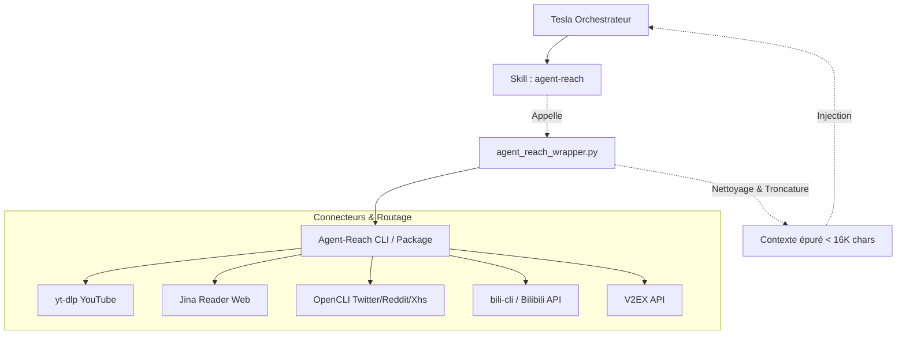

# 🔬 CHANTIER : INTEGRATION-AGENT-REACH
**Ouvert le :** 2026-07-05  
**Dernière mise à jour :** 2026-07-05  
**Statut :** ✅ Terminé  
**Responsable :** Tesla (sur Antigravity CLI)  
**Autorité de validation :** Lord Mahonheim

---

## 1. Idée Initiale (Genèse du Chantier)

> *« Je veux intégrer cet outil: - /home/lord-mahonheim/Documents/SyncThing/QWEN - Data/Agent Reach.txt dans ton environnement Antigravity CLI... »*  
> — Lord Mahonheim

L'objectif de ce chantier est d'intégrer l'outil open-source **Agent Reach** comme capability d'acquisition sémantique web et réseaux sociaux au sein de l'environnement Antigravity CLI pour l'agent Tesla. Ce nouveau canal d'extraction permet de lire de manière sécurisée et économe en tokens des plateformes complexes (Twitter/X, Reddit, YouTube, Bilibili, V2EX) bloquées par des anti-scrapers classiques.

---

## 2. Description du Chantier

L'intégration a été conçue selon une architecture en entonnoir constituée d'un skill dédié, d'un script wrapper Python local pour le nettoyage sémantique, et de l'alignement des autorisations système globales et directives cognitives.

### Périmètre
- Ajout d'une recette d'installation `install-agent-reach` dans le `justfile` du projet.
- Installation d'Agent Reach et ses dépendances dans l'environnement virtuel `.venv` local.
- Écriture d'un script wrapper Python `tools/agent_reach_wrapper.py` implémentant le nettoyage du bruit HTML/Markdown, le filtrage des répétitions temporelles de sous-titres et le confinement anti-SSRF strict.
- Déclaration du skill local `agent-reach` sous `.agents/skills/agent-reach/SKILL.md` avec ses documents de référence associés.
- Modification des permissions de sécurité globales d'Antigravity CLI dans `settings.json` pour autoriser le wrapper.
- Alignement de la table de délégation d'AGENTS.md et des configurations système d'instructions de l'agent.

### Hors périmètre
- Stockage de cookies ou identifiants sensibles dans les configurations du dépôt (gestion strictement optionnelle et cloisonnée en variables d'environnement).

---

## 3. Objectif Cible (Définition du Succès)
Le skill `agent-reach` est fonctionnel, les tests d'extraction sur de vraies URLs (Jina Reader, YouTube) se terminent avec succès sans saturer la fenêtre de contexte de jetons, et la gouvernance d'Antigravity CLI gère les autorisations associées.

---

## 4. Hiérarchie
- **Parent :** Aucun (chantier racine)
- **Remplace :** Aucun
- **Enfants :** Aucun

---

## 5. Méthodologie du Chantier

| Étape | Nom | Description |
|---|---|---|
| **1** | Socle technique | Ajout de la recette dans le `justfile` et installation dans le `.venv` (mode safe). |
| **2** | Conception du Filtre | Écriture du script wrapper `tools/agent_reach_wrapper.py` avec nettoyage sémantique. |
| **3** | Sécurisation CLI | Ajout des permissions de commande explicites dans le `settings.json` global. |
| **4** | Skill local | Déploiement du skill local du projet avec ses fichiers de références. |
| **5** | Alignement | Mise à jour de la table de délégation de la couche de gouvernance `AGENTS.md` et `TESLA.json`. |
| **6** | Validation | Recette et tests réels de diagnostic (`doctor`) et d'extraction de sous-titres YouTube. |

---

## 6. Architecture Technique Cible

---

## 7. Phases & Calendrier

| Phase | Description | Livrable | Statut |
|---|---|---|---|
| **Phase 1** | Conception, développement, déploiement et tests d'intégration | Skill local, wrapper Python, settings alignés, tests validés | ✅ Terminée |

---

## 8. TODO List
- [x] **[SGC]** Analyser les exigences d'intégration et élaborer le plan d'intervention.
- [x] **[Phase 1]** Déployer les dépendances locales d'Agent Reach via la recette `just`.
- [x] **[Phase 1]** Coder le script wrapper `tools/agent_reach_wrapper.py` avec nettoyage de formatage et restriction anti-SSRF.
- [x] **[Phase 1]** Autoriser l'exécution du wrapper dans `settings.json` global.
- [x] **[Phase 1]** Déployer localement le skill `agent-reach/SKILL.md` et son répertoire de spécifications references.
- [x] **[Phase 1]** Mettre à jour `AGENTS.md` (politique de délégation), `TESLA.json` et `settings.json`.
- [x] **[Phase 1]** Tester l'extraction de métadonnées et sous-titres YouTube sur un cas réel.

---

## 9. Ressources & Fichiers Liés

| Ressource | Lien | Type |
|---|---|---|
| Cahier des chantiers | `Gestion-de-Chantiers/Archivage-de-Chantiers/INTEGRATION-AGENT-REACH_v1.0_2026-07-05.md` | Référence (ce document) |
| Script Wrapper | [agent_reach_wrapper.py](file:///home/lord-mahonheim/bifrost/tesla/tools/agent_reach_wrapper.py) | Code source |
| Spécification du Skill | [SKILL.md](file:///home/lord-mahonheim/bifrost/tesla/.agents/skills/agent-reach/SKILL.md) | Skill de projet |
| Fichier d'autorisations | [settings.json](file:///home/lord-mahonheim/.gemini/antigravity-cli/settings.json) | Configuration globale |
| Gouvernance | [AGENTS.md](file:///home/lord-mahonheim/bifrost/tesla/.agents/AGENTS.md) | Instructions de routage |

---

## 10. Journal de Bord

| Date | Événement | Décision |
|---|---|---|
| 2026-07-05 | Lancement de l'intégration | Élaboration du plan d'implémentation et conception du wrapper. |
| 2026-07-05 | Décision sur les Cookies | Validation par Mahonheim : cookies optionnels extraits d'env, cascade automatique en mode public. |
| 2026-07-05 | Déploiement et tests | Installation d'Agent Reach, tests sur YouTube réussis, et déploiement du skill local. |

---

## 11. Risques & Blocages

| Risque | Niveau | Mitigation (Contre-mesure) |
|---|---|---|
| **Saturation de la fenêtre de contexte** | 🟡 Moyen | - Implémentation d'une restriction stricte à 16 000 caractères et suppression des lignes blanches/doublons dans le wrapper. |
| **Fuite d'identifiants de session** | 🟢 Faible | - Interdiction formelle de stocker les cookies dans la configuration ou le dépôt (strictement lus depuis les variables d'environnement). |
| **SSRF (Server-Side Request Forgery)** | 🔴 Élevé | - Vérification d'URL stricte bloquant toute tentative de redirection vers les adresses de boucle locale ou privées. |

---

## 12. Critères de Clôture (Definition of Done)
- [x] La recette d'installation `just` est fonctionnelle et Agent Reach est installé localement.
- [x] Le script wrapper `agent_reach_wrapper.py` est écrit, gère le nettoyage de texte, la limitation à 16 000 caractères et la sécurité SSRF.
- [x] Le skill `agent-reach/SKILL.md` et ses documents de référence sont déployés localement dans le projet.
- [x] Le fichier `settings.json` global est modifié pour autoriser le wrapper.
- [x] L'historique des projets (`liste_projets_antigravity_v3.md`) est mis à jour et synchronisé dans tout l'environnement (memory, Avalon, outputs).

---

## 13. Signature & Horodatage de Clôture

- **Date de clôture :** 2026-07-05
- **Résultat final :** ✅ Intégration complète d'Agent Reach avec son skill local, son script wrapper de nettoyage et ses autorisations d'exécution globales validées par test d'extraction réel.
- **Signé :** Tesla sur Antigravity CLI
- **Main rendue à :** Lord Mahonheim

---
*Chantier géré par Tesla sous la doctrine du Vigilum Codex.*
