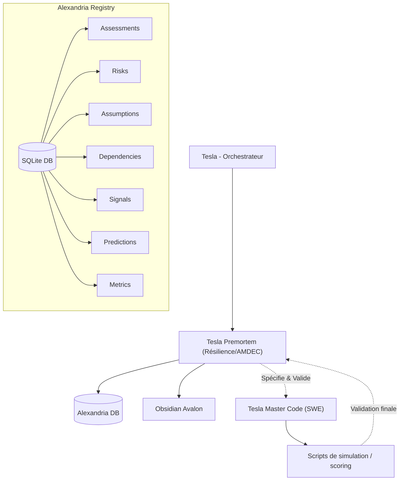

# 🔬 CHANTIER : PROMOTION-PREMORTEM-MASTER
**Ouvert le :** 2026-07-05  
**Dernière mise à jour :** 2026-07-05  
**Statut :** ✅ Terminé  
**Responsable :** Tesla (sur Antigravity CLI)  
**Autorité de validation :** Lord Mahonheim

---

## 1. Idée Initiale (Genèse du Chantier)

> *« J'ouvre le chantier: Promotion de l'Agent PREMORTEM. »*  
> — Lord Mahonheim

L'objectif de ce chantier est de promouvoir l'agent historique `premortem` vers sa version d'élite **`premortem` (version 2.0 / Master)**. Cet agent d'élite servira d'autorité de résilience et de stress-test stratégique au sein de l'écosystème Tesla. Il sera le garant de l'AMDEC/FMEA, de la prédiction des défaillances et de la calibration continue de la résilience, en s'appuyant sur des bases de données relationnelles SQLite intégrées à Alexandria.

---

## 2. Description du Chantier

Ce chantier consiste à restructurer le Skill `premortem` pour déployer le fichier `SKILL.md` de version 2.0.

### Périmètre
- Remplacement du fichier de spécification actuel `SKILL.md` sous [premortem/](file:///home/lord-mahonheim/bifrost/tesla/.agents/skills/premortem).
- Suppression de l'ancienne version temporaire `SKILL-Premortem-Master.md`.
- Rédaction de la spécification réglementaire [SKILL.md](file:///home/lord-mahonheim/bifrost/tesla/.agents/skills/premortem/SKILL.md) intégrant la division stricte des responsabilités (délégation du code à `tesla-master-code`).
- Spécification de la persistance SQLite relationnelle (7 tables cibles : assessments, risks, assumptions, dependencies, signals, predictions, metrics) pour historiser et calibrer les stress-tests.
- Documentation du concept de *Risk Knowledge Graph*.

### Hors périmètre
- Développement des scripts d'analyse de risques ou d'AMDEC automatique (délégué à **`tesla-master-code`**).

---

## 3. Objectif Cible (Définition du Succès)
Le fichier [SKILL.md](file:///home/lord-mahonheim/bifrost/tesla/.agents/skills/premortem/SKILL.md) de version 2.0 est rédigé, validé pour conformité aux normes d'ingénierie documentaires, et indexé dans Alexandria. La gouvernance et l'architecture de données de Premortem y sont formellement consignées.

---

## 4. Hiérarchie
- **Parent :** Aucun (chantier racine)
- **Remplace :** `premortem` (v1.0)
- **Enfants :** À définir selon les phases.

---

## 5. Méthodologie du Chantier

| Étape | Nom | Description |
|---|---|---|
| **1** | Cadrage SGC | Validation des options de stockage relationnel et de division des responsabilités. |
| **2** | Nettoyage | Suppression de la version source temporaire après transposition. |
| **3** | Conception du Skill | Rédaction du fichier réglementaire `SKILL.md` de Premortem 2.0. |
| **4** | Indexation & Clôture | Enregistrement dans Alexandria, INDEX.md et l'ancre cognitive de session. |

---

## 6. Architecture Technique Cible
`Tesla Premortem` spécifie, structure et valide la résilience, tandis que la mémoire analytique est historisée en SQLite sous Alexandria :

---

## 7. Phases & Calendrier

| Phase | Description | Livrable | Statut |
|---|---|---|---|
| **Phase 1** | Rédaction du fichier de spécification `SKILL.md` de `premortem` v2.0 | `SKILL.md` formaté et validé | ✅ Terminée |

---

## 8. TODO List
- [x] **[SGC]** Poser les questions de cadrage et intégrer les contraintes de Lord Mahonheim.
- [x] **[SGC]** Créer le cahier des charges de chantier et initialiser l'index.
- [x] **[Phase 1]** Supprimer l'ancienne version temporaire `SKILL-Premortem-Master.md`.
- [x] **[Phase 1]** Rédiger le fichier de spécification final `SKILL.md` sous `.agents/skills/premortem/` avec la structure SQLite et la charte de hub de résilience.
- [x] **[Phase 1]** Mettre à jour l'index des chantiers et l'ancre cognitive en validation.

---

## 9. Ressources & Fichiers Liés

| Ressource | Lien | Type |
|---|---|---|
| Cahier des charges | `Gestion-de-Chantiers/PROMOTION-PREMORTEM-MASTER_v1.0_2026-07-05.md` | Référence (ce document) |
| Spécification temporaire source | [SKILL-Premortem-Master.md](file:///home/lord-mahonheim/bifrost/tesla/.agents/skills/premortem/SKILL-Premortem-Master.md) | Source |
| Spécification finale cible | [SKILL.md](file:///home/lord-mahonheim/bifrost/tesla/.agents/skills/premortem/SKILL.md) | Cible physique |

---

## 10. Journal de Bord

| Date | Événement | Décision |
|---|---|---|
| 2026-07-05 | Mahonheim ouvre le chantier `Promotion de l'Agent PREMORTEM` | Questionnaire de cadrage soumis. |
| 2026-07-05 | Cadrage technique validé | Écrasement de la v1, structure SQLite en 7 tables validée, Risk Knowledge Graph intégré, et délégation de code à `tesla-master-code`. |
| 2026-07-05 | Initialisation physique | Création de la fiche de chantier et enregistrement. |

---

## 11. Risques & Blocages

| Risque | Niveau | Mitigation (Contre-mesure) |
|---|---|---|
| **Dispersion des données de risques** | 🟡 Moyen | - Centraliser toutes les tables analytiques AMDEC sous la base d'Alexandria (`alexandria_brain.db`). |
| **Complexité algorithmique de calibration** | 🟡 Moyen | - Spécifier précisément les formules FMEA et la structure des tables `predictions` et `metrics` dans le `SKILL.md`. |

---

## 12. Critères de Clôture (Definition of Done)
- [x] Le fichier `SKILL.md` v2.0 est créé sous `.agents/skills/premortem/` et respecte la norme GitBook.
- [x] L'ancien fichier source temporaire `SKILL-Premortem-Master.md` est supprimé.
- [x] L'index des chantiers et le checkpoint de session sont synchronisés.

---

## 13. Signature & Horodatage de Clôture
*(Section complétée lors de l'archivage)*

- **Date de clôture :** 2026-07-05
- **Résultat final :** ✅ Remplacement de l'ancien agent par la forme d'élite `premortem` v2.0 / Master. Spécification de la persistance SQLite (7 tables) pour la mémoire analytique et le Risk Knowledge Graph consignée dans `SKILL.md`.
- **Signé :** Tesla sur Antigravity CLI
- **Main rendue à :** Lord Mahonheim

---
*Chantier géré par Tesla sous la doctrine du Vigilum Codex.*
