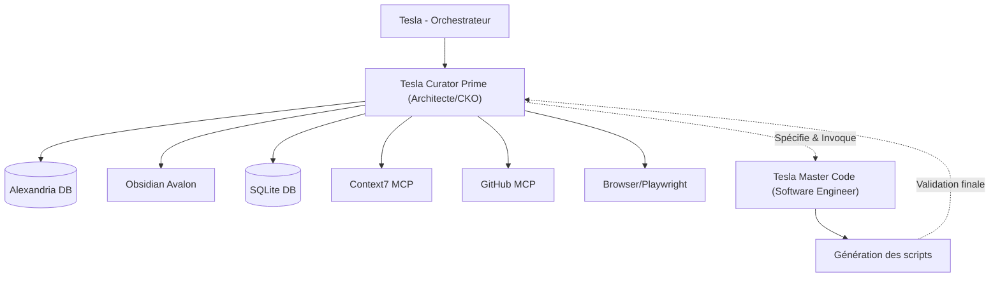

# 🔬 CHANTIER : PROMOTION-TESLA-CURATOR-PRIME
**Ouvert le :** 2026-07-05  
**Dernière mise à jour :** 2026-07-05  
**Statut :** ✅ Terminé  
**Responsable :** Tesla (sur Antigravity CLI)  
**Autorité de validation :** Lord Mahonheim

---

## 1. Idée Initiale (Genèse du Chantier)

> *« J'ouvre le chantier de "Promotion de l'Agent document-analyst". »*  
> — Lord Mahonheim

L'objectif est d'élever les capacités d'analyse documentaire et de gestion des connaissances de l'écosystème Tesla. L'agent historique `document-analyst` est promu en un agent d'élite nommé **`tesla-curator-prime`**. Cet agent servira de Chief Knowledge Officer (CKO) et d'architecte documentaire de la Squad. Il sera le garant de l'intégrité, de la certification et du fact-checking des connaissances avant leur indexation dans Alexandria et Obsidian Avalon.

---

## 2. Description du Chantier

Ce chantier consiste à concevoir le fichier de spécification `SKILL.md` de l'agent d'élite `tesla-curator-prime` en remplacement de l'ancien dossier `document-analyst`.

### Périmètre
- Suppression physique de l'ancien répertoire [document-analyst/](file:///home/lord-mahonheim/bifrost/tesla/.agents/skills/document-analyst).
- Création du nouveau répertoire de Skill [tesla-curator-prime/](file:///home/lord-mahonheim/bifrost/tesla/.agents/skills/tesla-curator-prime).
- Rédaction du fichier réglementaire [SKILL.md](file:///home/lord-mahonheim/bifrost/tesla/.agents/skills/tesla-curator-prime/SKILL.md) (en anglais strict, respectant la charte GitBook).
- Spécification détaillée des **10 outils documentaires** indispensables (Document Parser, Citation Extractor, Evidence Builder, Contradiction Detector, Knowledge Graph Builder, Timeline Builder, Confidence Scorer, Source Classifier, Duplicate Detector, Reference Checker).
- Définition de l'interfaçage en tant que **hub documentaire** avec nos MCP (Alexandria, Obsidian Avalon, SQLite, Context7, GitHub, Obsidian MCP, Filesystem, Browser/Playwright, Web Search).

### Hors périmètre
- Développement logiciel des scripts spécifiés (délégué à **`tesla-master-code`**).
- Connexion avec des outils non documentaires (Slack, Discord, Gmail, Calendar, Notion).

---

## 3. Objectif Cible (Définition du Succès)
Le fichier [SKILL.md](file:///home/lord-mahonheim/bifrost/tesla/.agents/skills/tesla-curator-prime/SKILL.md) is rédigé, validé pour conformité aux normes d'ingénierie et de structure (progressive disclosure, progressive explanations, strict frontmatter). L'ancien répertoire de `document-analyst` est proprement purgé et remplacé.

---

## 4. Hiérarchie
- **Parent :** Aucun (chantier racine)
- **Remplace :** `document-analyst`
- **Enfants :** À définir selon les phases.

---

## 5. Méthodologie du Chantier

| Étape | Nom | Description |
|---|---|---|
| **1** | Cadrage SGC | Validation des arbitrages d'architecture et de division des rôles. |
| **2** | Nettoyage de l'existant | Suppression physique de l'ancien agent `document-analyst`. |
| **3** | Conception du Skill | Rédaction du fichier de spécification `SKILL.md` de `tesla-curator-prime`. |
| **4** | Indexation & Intégration | Mise à jour d'Alexandria, d'Avalon, d'INDEX.md et du checkpoint de session. |

---

## 6. Architecture Technique Cible
`Tesla Curator Prime` est l'architecte documentaire qui spécifie et valide, tandis que `Tesla Master Code` implémente les scripts :

---

## 7. Phases & Calendrier

| Phase | Description | Livrable | Statut |
|---|---|---|---|
| **Phase 1** | Rédaction du fichier de spécification `SKILL.md` de `tesla-curator-prime` | `SKILL.md` formaté et validé | ✅ Terminée |

---

## 8. TODO List
- [x] **[SGC]** Poser les questions de cadrage et intégrer les contraintes de Lord Mahonheim.
- [x] **[SGC]** Créer le cahier des charges de chantier et initialiser l'index.
- [x] **[SGC]** Supprimer l'ancien répertoire `.agents/skills/document-analyst/`.
- [x] **[Phase 1]** Créer le répertoire `.agents/skills/tesla-curator-prime/`.
- [x] **[Phase 1]** Transposer `SKILL_tesla-curator-prime.md` vers le fichier de production `SKILL.md` avec toutes les spécifications d'outils et de dépendances.
- [x] **[Phase 1]** Mettre à jour l'index des chantiers et l'ancre cognitive en validation.

---

## 9. Ressources & Fichiers Liés

| Ressource | Lien | Type |
|---|---|---|
| Cahier des charges | `Gestion-de-Chantiers/PROMOTION-TESLA-CURATOR-PRIME_v1.0_2026-07-05.md` | Référence (ce document) |
| Fiche de spécification source | [SKILL_tesla-curator-prime.md](file:///home/lord-mahonheim/bifrost/tesla/.agents/skills/document-analyst/SKILL_tesla-curator-prime.md) | Source |
| Nouvelle fiche cible | [SKILL.md](file:///home/lord-mahonheim/bifrost/tesla/.agents/skills/tesla-curator-prime/SKILL.md) | Cible physique |

---

## 10. Journal de Bord

| Date | Événement | Décision |
|---|---|---|
| 2026-07-05 | Mahonheim ouvre le chantier `Promotion de l'Agent document-analyst` | Questionnaire de cadrage soumis. |
| 2026-07-05 | Validation de la vision d'architecture | Remplacement de l'ancien agent, rôle d'architecte documentaire strict, définition des 10 outils et 9 dépendances MCP. |
| 2026-07-05 | Initialisation physique | Création de la fiche de chantier et enregistrement. |

---

## 11. Risques & Blocages

| Risque | Niveau | Mitigation (Contre-mesure) |
|---|---|---|
| **Chevauchement des rôles** | 🔴 Élevé | - Consigner la règle stricte : Curator Prime spécifie et valide, Master Code écrit le code. Aucun script n'est développé par Curator Prime. |
| **Divergence de spécifications** | 🟡 Moyen | - Décrire très précisément les interfaces et les missions des 10 outils requis dans `SKILL.md`. |

---

## 12. Critères de Clôture (Definition of Done)
- [x] Le fichier `SKILL.md` est créé dans le répertoire `.agents/skills/tesla-curator-prime/` et respecte la norme GitBook.
- [x] L'ancien répertoire `document-analyst` est purgé de l'environnement physique et du second cerveau.
- [x] L'index des chantiers et le checkpoint de session sont synchronisés.

---

## 13. Signature & Horodatage de Clôture
*(Section complétée lors de l'archivage)*

- **Date de clôture :** 2026-07-05
- **Résultat final :** ✅ Remplacement de l'ancien agent par la forme d'élite `tesla-curator-prime`. Fichier de spécification réglementaire `SKILL.md` écrit et indexé, décrivant la charte d'architecture et de connectivité comme hub documentaire unique.
- **Signé :** Tesla sur Antigravity CLI
- **Main rendue à :** Lord Mahonheim

---
*Chantier géré par Tesla sous la doctrine du Vigilum Codex.*
