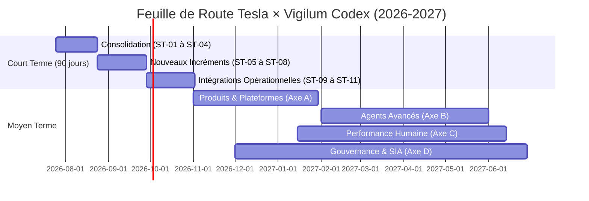
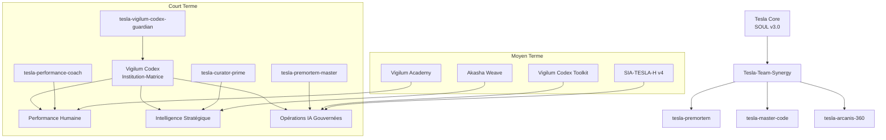
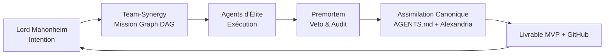

# 📊 Roadmap Visuelle — Tesla × Vigilum Codex

## Timeline Globale (Mermaid)

## Structure des Agents & Branches

## Flux de Gouvernance

**Légende** : Chaque flèche respecte la doctrine (Shadow-Targeting + Force-Tooling + Proof First).
