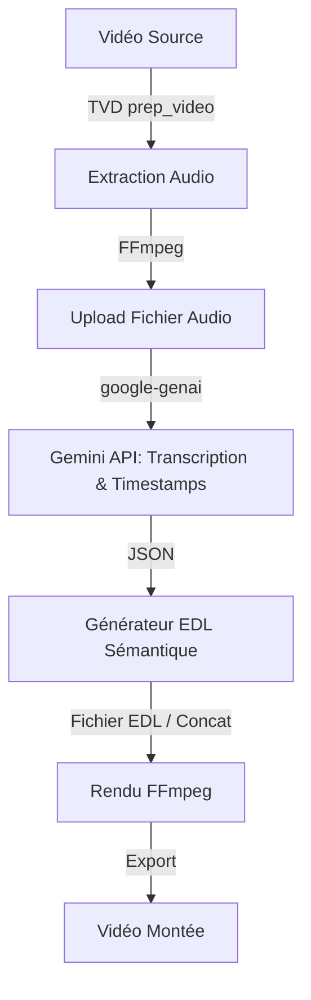

# Technical Architecture: TVD NextLevel - FreeCut Integration

   

## 1. Contexte et Objectifs

Suite à l'étude de faisabilité d'Arcanis (Chantier 020), la stratégie "Hybride FreeCut-Adapté" a été retenue. L'objectif est d'isoler la logique de génération d'Edit Decision List (EDL) inspirée de FreeCut (Text-Based Editing) tout en contournant totalement ses dépendances locales (WebGPU, Whisper). 
La doctrine MIDGARD impose une transcription 100% via l'API Gemini (`google-genai`), suivie d'un rendu `FFmpeg` orchesté par `tesla-video-director` (TVD).

## 2. Vue d'Ensemble du Flux de Données (Data Flow)

Le workflow `tesla-freecut-lab` s'insère dans la pipeline TVD existante sous la forme d'un adaptateur de montage sémantique automatisé.

## 3. Composants Architecturaux à Développer

Le module `tesla-freecut-lab` ne nécessitera pas d'interface utilisateur, il s'agira d'un ensemble de scripts CLI pur Python.

### 3.1. Extracteur Audio (Audio Extraction Node)
- **Rôle** : Séparer l'audio de la vidéo préparée par TVD pour minimiser la taille du payload envoyé à Gemini.
- **Techno** : `FFmpeg` via `subprocess`.
- **I/O** : `input.mp4` -> `audio_track.m4a` (ou `.mp3`).

### 3.2. Moteur de Transcription Sémantique (Gemini Transcription Node)
- **Rôle** : Remplacer "Whisper local". Utiliser l'API Gemini (via le SDK officiel `google-genai`) avec l'API File pour uploader l'audio.
- **Prompt Structure** : Demander un retour JSON strict (Structured Outputs) contenant le texte, le locuteur (diarisation) et les timecodes précis (début/fin).
- **I/O** : `audio_track.m4a` -> `transcript_timestamps.json`.

### 3.3. Générateur EDL (Edit Decision List Builder)
- **Rôle** : Traduire des requêtes de montage en langage naturel (ex: "Coupe tous les silences et les 'euh'") en appliquant des règles logiques sur le `transcript_timestamps.json`.
- **Mécanique** : 
  - Filtre les segments indésirables du JSON.
  - Calcule les nouveaux timecodes relatifs.
  - Génère un fichier de concaténation compréhensible par FFmpeg (ex: `ffconcat` ou un script de `filter_complex`).
- **I/O** : `transcript_timestamps.json` + `Edit Rules` -> `cuts.edl` (ou `ffconcat.txt`).

### 3.4. Rendu Final (FFmpeg Render Node)
- **Rôle** : Exécuter la découpe et l'assemblage exacts dictés par l'EDL sans ré-encoder toute la vidéo si possible (stream copy), ou avec un ré-encodage ciblé (H.264/AAC) en fonction des raccords.
- **I/O** : `input.mp4` + `cuts.edl` -> `final_edit.mp4`.

## 4. Intégration avec `tesla-video-director` (TVD)

Actuellement, TVD dispose de `transcribe.py` et de macros d'édition. L'intégration de FreeCut modifiera la pipeline de `SOCIAL_PACK` ou `INTERVIEW` de la façon suivante :

1. **TVD Inspect & Prep** : (Inchangé) Normalisation de la vidéo source.
2. **TVD Delegate to FreeCut Lab** : Au lieu d'un simple `transcribe.py`, TVD invoque le workflow de Text-Based Editing.
3. **TVD Validate** : TVD récupère l'EDL généré pour valider les durées (Level 1 QA) avant de lancer l'étape lourde de FFmpeg.
4. **TVD Export** : Application de l'auto-framing ou des sous-titres sur le résultat monté.

## 5. Stratégie de Dépendances & Sécurité (MIDGARD)

- **Modèles Locaux** : Aucun. Suppression totale de l'empreinte WebGPU et Whisper de FreeCut.
- **Réseau** : Appels limités strictement à `generativelanguage.googleapis.com` via `google-genai`.
- **Rendu** : Exécution locale `ffmpeg` avec timeout et isolation mémoire pour prévenir les OOM.
- **Dette Technique** : L'EDL générée doit utiliser un format standard (ou le format `ffconcat` natif de FFmpeg) pour garantir qu'aucune dépendance tierce complexe n'est nécessaire au rendu.

## 6. Prochaines Étapes (Next Actions)
- Création du PoC `freecut_gemini_transcriber.py` pour valider la précision des timecodes JSON renvoyés par Gemini.
- Création du `edl_to_ffmpeg.py` pour valider la traduction JSON -> FFmpeg cuts.
