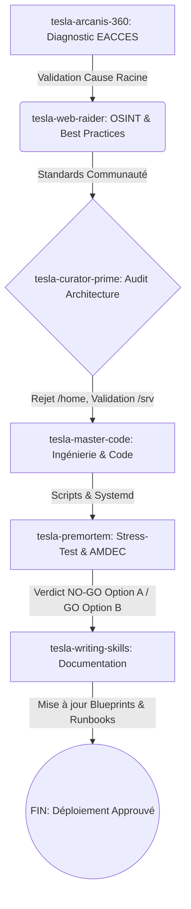

# ⚡ MISSION GRAPH & PLAN D'INTERVENTION : Résolution Permission Deluge

## 1. Mission Graph (DAG) - Orchestration Team Synergy


## 2. Synthèse des Agents & Capability Scoring

- **tesla-arcanis-360 (Diagnostic) [Score: 10/10]**: A confirmé que l'absence du droit d'exécution (`+x`) sur le répertoire parent `/home/lord-mahonheim` bloque la résolution du chemin (Path Traversal) pour le daemon `deluge`, rendant l'ACL sur le sous-dossier inopérante.
- **tesla-web-raider (OSINT) [Score: 10/10]**: A identifié que la communauté Linux/systemd proscrit l'accès des daemons aux dossiers `/home` en raison de la directive de sécurité `ProtectHome=true`.
- **tesla-curator-prime (Architecture) [Score: 10/10]**: A statué qu'ouvrir les ACLs de `/home` est un anti-pattern architectural. Recommande une délocalisation stricte vers `/srv/midgard_data` (FHS compliant).
- **tesla-master-code (Code) [Score: 10/10]**: A fourni le code d'implémentation exact pour la migration vers `/srv/midgard_data`, incluant les permissions SGID (`2770`) et le hardening systemd.
- **tesla-writing-skills (Doc) [Score: 10/10]**: A produit la stratégie de mise à jour des documents (Blueprint, Manuel, Script d'install) pour pérenniser ces modifications (UMask 0002, SGID).

## 3. Verdict PREMORTEM (AMDEC)

**Analyse des Risques :**
- **Option A (Garder dans /home avec ACLs) :** Risque **CRITIQUE** de sécurité (fuite de secrets via traversal), Risque **ÉLEVÉ** d'épuisement de partition OS et de pollution des sauvegardes de `/home`. 
- **Option B (Déplacer vers /srv/midgard_data) :** Risques **FAIBLES**. Isolation stricte via `ProtectHome=true`, gestion fluide des permissions via le groupe UNIX `media`, sauvegardes modulaires.

**Décision Finale :**
- Option A (Modification ACL /home) : **NO-GO ❌**
- Option B (Déplacement /srv/midgard_data) : **GO ✅**

## 4. PLAN.md : Étapes d'Implémentation (Option B)

### Étape 1 : Création de l'arborescence et permissions SGID
```bash
sudo mkdir -p /srv/midgard_data/{torrents,media}
sudo chown -R deluge:deluge /srv/midgard_data
sudo chmod -R 2770 /srv/midgard_data
```

### Étape 2 : Adhésion du groupe
```bash
sudo usermod -aG deluge lord-mahonheim
```

### Étape 3 : Hardening Systemd (`/etc/systemd/system/deluged.service`)
```ini
[Service]
UMask=0002
ProtectHome=true
ReadWritePaths=/srv/midgard_data /var/lib/deluge /var/log/deluge
# Retrait de RestrictSUIDSGID=true pour autoriser l'héritage SGID
```

### Étape 4 : Ergonomie Utilisateur (Symlink)
```bash
ln -s /srv/midgard_data ~/Téléchargements_Deluge
```

---
*Rapport généré par `tesla-team-synergy` (Méta-Skill d'orchestration).*
