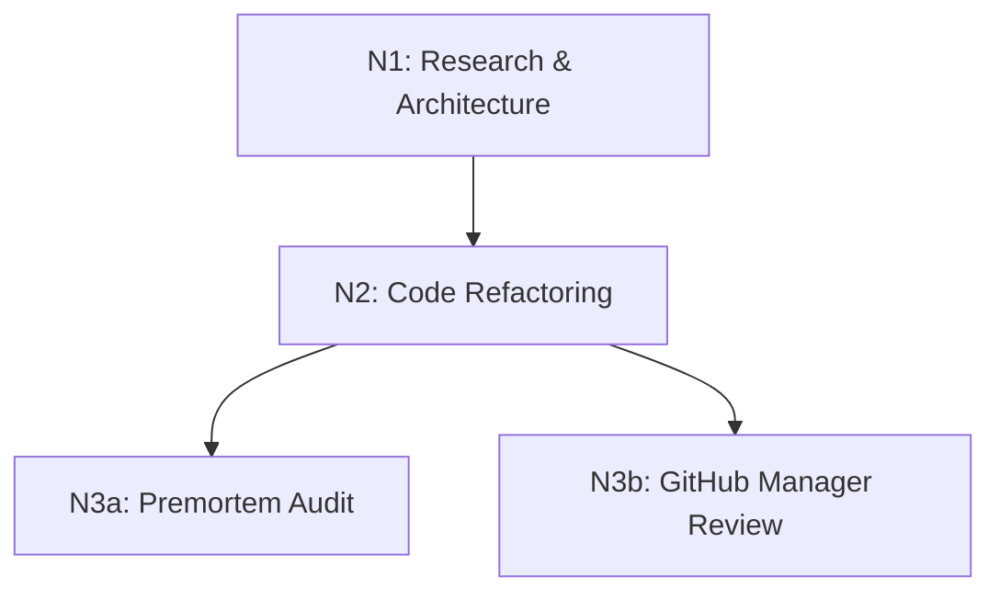

# Scheduler Plan - Test-Refactor-Auth

**Mode d'exécution : Série avec Parallélisme partiel en fin de chaîne**

- **N1** : Séquentiel. Attendre fin complète.
- **N2** : Séquentiel. Dépend de N1.
- **N3a / N3b** : Fan-out parallèle après N2. Fan-in avant de marquer le chantier DONE.
