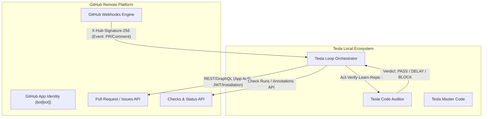
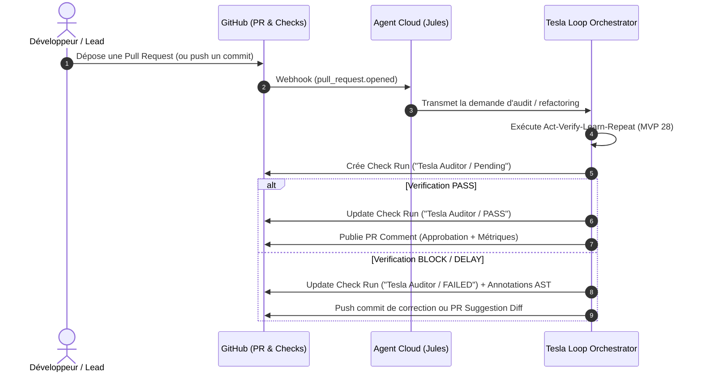

# 🌐 INTERFACES OFFICIELLES GITHUB & ARCHITECTURE DE COLLABORATION ASYNCHRONE CLOUD-AGENT (2026)

**Auteur** : `tesla-web-raider` (Agent d'Opérations Internet & Synchronisation Externe)  
**Destinataire** : Lord Mahonheim & Ordre de Tesla / Jules (Cloud Agent Integration)  
**Date** : 09 Août 2026  
**Document ID** : `OUTPUTS/WebRaider_Jules_Interfaces.md`  
**Statut** : 🟢 Document d'Autorité  

---

## 1. 🎯 Contexte & Philosophie d'Intégration Sans API Occulte

La collaboration asynchrone entre un agent IA hébergé dans le Cloud (ex. Agent Jules, Google Cloud Agent) et un dépôt de code local/délégué exige une **architecture d'interopérabilité transparente, sécurisée et standardisée**.

Afin d'éviter tout verrouillage propriétaire, dépendance envers des endpoints occultes ou failles de sécurité liées à des protocoles non documentés, l'architecture s'appuie exclusivement sur les **interfaces publiques officielles fournies par GitHub**.

Ce rapport définit l'état de l'art des interfaces GitHub permettant une collaboration totalement asynchrone, réactive et sécurisée avec l'écosystème **MVP 28 (Loop Engineering)**.



---

## 2. ⚡ 1. GitHub Webhooks — Composant d'Ingestion des Événements Asynchrones

Les **Webhooks GitHub** constituent la colonne vertébrale du déclenchement asynchrone Event-Driven. Ils informent l'agent distant en temps réel de chaque mutation sur le dépôt sans nécessiter de sondage (polling) inefficace.

### 2.1. Événements Majeurs Exploités pour la Collaboration Cloud-Agent

| Événement GitHub | Event Type (`X-GitHub-Event`) | Rôle & Action Cloud Agent |
|---|---|---|
| **Pull Request** | `pull_request` (`opened`, `synchronize`, `reopened`) | Déclenche l'analyse initiale ou incrémentale de la PR par l'agent auditeur. |
| **Commentaires PR/Issue** | `issue_comment` (`created`) | Intercepte les commandes utilisateur (ex: `/rebase`, `/audit`, `/approve`, `@jules-agent`). |
| **Workflow / CI Jobs** | `workflow_job` (`completed`, `failed`) | Récupère le résultat des pipelines GitHub Actions pour la boucle de vérification. |
| **Check Runs** | `check_run` (`completed`, `rerequested`) | Re-déclenche une boucle *Act-Verify-Learn-Repeat* si un audit est redemandé. |
| **Dépêche Dépôt** | `repository_dispatch` | Permet le déclenchement personnalisé d'actions par des systèmes tiers via payload JSON. |

### 2.2. Sécurité & Authentification des Payloads (Zero Trust Webhooks)
- **Signature HMAC SHA-256** : Chaque payload HTTP envoyé par GitHub inclut le header `X-Hub-Signature-256`.
- **Validation** : Le serveur récepteur calcule `HMAC-SHA256(secret_partagé, body)` et rejette immédiatement toute requête non signée ou altérée (code HTTP `401 Unauthorized`).
- **Idempotence & Replay Prevention** : Tracking du header `X-GitHub-Delivery` (GUID unique par événement) pour éviter l'exécution multiple d'un même événement.

---

## 3. 🔐 2. GitHub Apps — Architecture d'Identité & Sécurité Portée

Contrairement aux Personal Access Tokens (PAT) associés à un compte individuel, l'intégration officielle recommandée pour un agent cloud est une **GitHub App**.

### 3.1. Modèle d'Authentification à Double Niveau

1. **Authentification Niveau App (JWT)** :
   - L'agent génère un JSON Web Token (JWT) signé avec la clé privée RSA de l'App GitHub (valide 10 minutes maximum).
   - Utilisé uniquement pour interroger l'API `/app` et obtenir des jetons d'installation.

2. **Authentification Niveau Installation (Installation Access Token)** :
   - L'App demande un jeton temporaire scopé (`POST /app/installations/{installation_id}/access_tokens`).
   - Durée de vie : 1 heure maximum.
   - Accès strictement restreint aux dépôts autorisés par l'organisation.

### 3.2. Grille de Permissions Limite (Principle of Least Privilege)

| Ressource GitHub | Permission accordée | Justification |
|---|---|---|
| **Repository Contents** | `Read & Write` | Permet la création de branches et le push de commits de correctifs. |
| **Pull Requests** | `Read & Write` | Permet l'ouverture de PR, la publication de commentaires et le merge. |
| **Checks** | `Read & Write` | Permet la création et mise à jour des Check Runs et Annotations de code. |
| **Issues** | `Read & Write` | Permet la lecture des commandes dans les commentaires. |
| **Workflows** | `Read` | Consultation du statut des pipelines d'intégration. |

---

## 4. 🔀 3. Pull Requests & GitHub Actions Interoperability

Le mécanisme de **Pull Request** est le canal universel de collaboration asynchrone homme-agent et agent-agent.

### 4.1. Flux de Collaboration Asynchrone par PR



### 4.2. Command-Driven Interaction (Bot Commands via Comments)
L'agent cloud écoute les commentaires sur les PR via le webhook `issue_comment` :
- `/audit` : Déclenche un ré-audit complet par `tesla-code-auditor`.
- `/fix` : Autorise l'agent créateur `tesla-master-code` à appliquer un correctif automatique.
- `/rollback` : Déclenche l'annulation immédiate du dernier commit non conforme.

---

## 5. 🚦 4. GitHub Checks API & Status Annotations

L'API **Checks** est la méthode officielle permettant à l'agent de fournir une restitution visuelle et structurée directement dans l'interface de revue GitHub.

### 5.1. Structuration d'un Check Run
- **Check Suite** : Regroupe l'ensemble des validations exécutées sur un SHA de commit.
- **Check Run** : Représente une unité d'audit (ex: `Tesla-SemGrep-AST`, `Tesla-LSP-Typing`, `Tesla-Smoke-Test`).
- **Conclusions Formelles** : `success`, `failure`, `neutral`, `cancelled`, `timed_out`, `action_required`.

### 5.2. Annotations de Code In-Line (Code Highlighting)
L'API Checks permet à l'auditeur d'attacher des annotations directement sur les lignes de code problématiques :
```json
{
  "path": "core/security_gateway.py",
  "start_line": 42,
  "end_line": 42,
  "annotation_level": "failure",
  "message": "[Tesla-SemGrep] Utilisation interdite de eval() détectée. Violation de la politique TGG.",
  "title": "Faillite Critique de Sécurité AST"
}
```

---

## 6. 🌐 5. Interfaces REST v3 & GraphQL v4 Officielles

Toutes les interactions sont réalisées exclusivement via les spécifications publiques édictées par GitHub :

### 6.1. REST API v3 (Endpoints Standardisés)
- `GET /repos/{owner}/{repo}/pulls/{pull_number}/files` : Récupération des diffs de code.
- `POST /repos/{owner}/{repo}/check-runs` : Enregistrement d'un résultat d'audit.
- `POST /repos/{owner}/{repo}/pulls/{pull_number}/comments` : Insertion de commentaires de revue.

### 6.2. GraphQL API v4 (Requêtes Optimisées à Faible Latence)
Permet de récupérer en un seul appel réseau l'intégralité du fil de discussion, l'état des checks et l'arborescence des fichiers modifiés :
```graphql
query GetPullRequestAuditContext($owner: String!, $repo: String!, $prNumber: Int!) {
  repository(owner: $owner, name: $repo) {
    pullRequest(number: $prNumber) {
      id
      title
      headRefOid
      mergeable
      reviews(first: 10) {
        nodes {
          author { login }
          state
        }
      }
      commits(last: 1) {
        nodes {
          commit {
            statusCheckRollup {
              state
            }
          }
        }
      }
    }
  }
}
```

---

## 7. 🛡️ 6. Conformité avec le Modèle MVP 28 (Loop Engineering)

L'utilisation stricte de ces interfaces GitHub s'interface de manière native avec le cycle **Act-Verify-Learn-Repeat** du MVP 28 :

1. **Act** : L'agent externe (Jules) dépose ses modifications via une PR ou une branche dédiée.
2. **Verify** : `tesla-loop-orchestrator` intercepte l'événement GitHub, déclenche `tesla-code-auditor` (LSP + SemGrep + Smoke Test + TGG) et remonte les résultats via l'API Checks.
3. **Learn** : En cas de `DELAY` ou `BLOCK`, les annotations de code GitHub enrichissent le contexte de l'agent créateur avec la raison exacte du rejet.
4. **Repeat** : L'agent soumet une nouvelle itération jusqu'à l'obtention du verdict `PASS` et de la conclusion `success` sur le Check Run.

---

## 8. 🏁 Conclusion & Recommandations

L'écosystème officiel GitHub (Webhooks SHA-256 + GitHub Apps JWT/Installation + Checks API + REST/GraphQL) fournit **l'ensemble des primitives nécessaires** pour opérer une collaboration asynchrone de classe industrielle avec un agent Cloud distant, sans aucun recours à des API occultes ou propriétaires.

- **Intégrité Garantie** : Authentification fortifiée et non-répudiation des événements.
- **Transparence Totale** : Auditabilité complète des actions de l'agent dans l'UI GitHub.
- **Alignement MVP 28** : Boucle fermée *Act-Verify-Learn-Repeat* nativement synchronisée avec les Check Runs.

---
*Rapport d'ingénierie certifié conforme — `tesla-web-raider`.*
