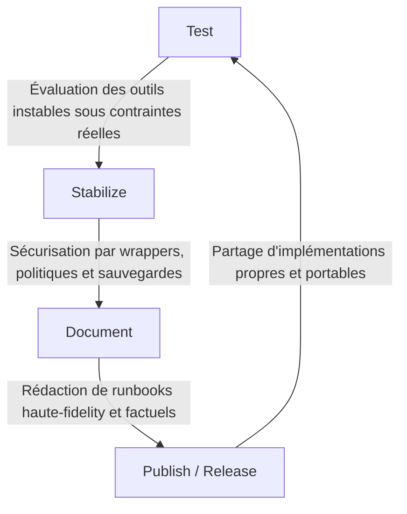

# ANALYSE ET SYNTHÈSE DE LA MÉTHODE DE TRAVAIL DE MAHONHEIM

## 1. Introduction & Objectif
Ce document synthétise les apprentissages tirés de l'audit et de l'analyse du dépôt de référence [Abdel-MOUHTAJ/ai-agent-field-notes](https://github.com/Abdel-MOUHTAJ/ai-agent-field-notes). L'objectif est de formaliser la méthode de travail d'Abdellah MOUHTAJ afin de l'enseigner au sous-agent `tesla-github-manager` pour la refonte complète de la documentation locale de `MVP-GITHUB/`.

---

## 2. Le Noyau Doctrinal : La Méthode de Travail

La méthode de travail d'Abdellah MOUHTAJ repose sur un cycle rigoureux d'ingénierie locale et de gouvernance de l'information :

### Principes Directeurs Doctrinaux

| Principe | Signification Opérationnelle | Impact sur la Documentation |
| :--- | :--- | :--- |
| **Local Authority** | Le système s'exécute localement (Windows/Linux) sans dépendance cloud opaque. | Aucun secret, chemin absolu, ou clé API en dur dans le dépôt. |
| **Human-in-the-Loop** | L'agent propose des changements isolés ; l'opérateur humain valide et applique. | La documentation met en avant les verrous d'approbation et l'interdiction d'automerge. |
| **Proof Over Flourish** | L'accent est mis sur les mécanismes réels, les architectures et les échecs réels. | Refus absolu du jargon marketing IA ("Hype") ; focus sur les faits bruts. |
| **Concision & Activité** | Phrases courtes, voix active, structure de données claire. | Aucun blabla ou paragraphe générique généré par IA. |

---

## 3. Charte Structurelle des READMEs (Les 15 Sections Canoniques)

Pour qu'un README de sous-projet soit jugé conforme à la méthode de travail de Mahonheim, il doit impérativement respecter la structure stricte suivante (rédigée en anglais) :

1. **Header Block :**
   - Titre principal du projet (`# Project...`).
   - Tagline doctrinale sous forme de citation (`> Tagline...`).
   - Informations sur l'auteur : **Abdellah MOUHTAJ**  
   - Titre professionnel : **Ops Consultant — AI Agents, CLI Workflows & Local Governance**.
   - Statut du document (ex: `Status: MVP field documentation — sanitized public version`).
2. **Tested Environment Table :**
   - Tableau listant la date de test, la machine, l'OS, le workspace local et les versions observées des composants.
3. **Important Security Notice :**
   - Mention claire spécifiant l'exclusion des tokens, credentials, clés, logs privés et chemins locaux.
4. **Table of Contents :**
   - Liens internes vers chaque section du README.
5. **Executive Summary :**
   - Résumé de 2 à 3 paragraphes expliquant le but du composant et la solution apportée.
6. **Problem Statement :**
   - Description précise du problème technique opérationnel ou de l'échec constaté en situation réelle.
7. **Product Promise :**
   - Définition stricte de ce que fait le produit et, surtout, de ce qu'il **ne fait pas** (limites explicites).
8. **Core Principles Table :**
   - Tableau à trois colonnes : `Principle`, `Meaning`, `Impact`.
9. **Architecture Diagram :**
   - Schéma Mermaid (flowchart) décrivant les relations techniques et les verrous de sécurité.
10. **Repository Layout :**
    - Arborescence textuelle ou Mermaid des fichiers du sous-projet.
11. **Workflow Sequence :**
    - Étapes chronologiques d'exécution (ex: 1. Init, 2. Validate, 3. Execute).
12. **Technical Stack :**
    - Versions précises des outils utilisés (ex: Python 3.12, SQLite FTS5, etc.).
13. **Security and Governance Rules :**
    - Rappel des garde-fous locaux (sauvegardes automatiques, isolation, pas de push réseau).
14. **Acceptance Criteria :**
    - Critères d'acceptation clairs (ex: Pyright diagnostic à 0 erreur).
15. **Final Verdict & Signature Sentence :**
    - Verdict opérationnel et signature doctrinale finale.

---

## 4. Instructions pour `tesla-github-manager`

Dans le cadre du déploiement physique local de `MVP-GITHUB/`, le sous-agent devra :
1. Bannir toute formulation commerciale ou jargon marketing.
2. Traduire et réécrire tous les READMEs en anglais selon la charte des 15 sections ci-dessus.
3. Pour chaque projet, extraire de sa mémoire ou des codes sources les **vrais échecs opérationnels** (ex: mauvaise résolution de répertoire, timeout de mot de passe sudo, dirty bit NTFS sur clé physique) pour alimenter la section `Problem Statement`.
4. Remplacer les READMEs génériques actuels par ces runbooks haute-fidélité.

---
*Rapport d'apprentissage doctrinal soumis pour validation.*

Signé / Fait par : Tesla sur Antigravity CLI  
Main rendue à Mahonheim
