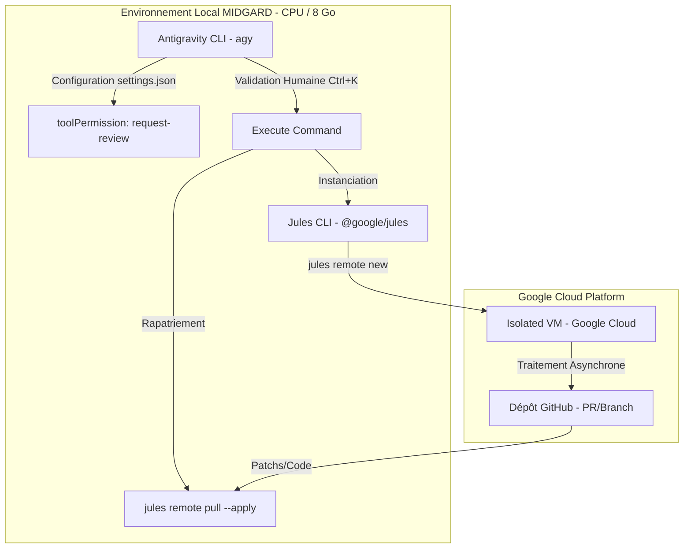

# Rapport d'Audit Critique : Plan d'Intégration de Google Jules sur MIDGARD
## Analyse Documentaire de Sécurité et de Conformité Opérationnelle

---

## 1. Executive Summary

Ce rapport présente l'audit critique du plan d'intégration de **Google Jules** soumis par Lord Mahonheim. L'enquête a été menée conformément aux exigences de la doctrine du **Vigilum Codex** en s'appuyant sur des investigations factuelles de l'environnement local de la machine **MIDGARD** et des spécifications techniques de la suite d'outils **Jules Tools CLI** (`@google/jules`).

L'audit révèle une confusion majeure entre les fonctionnalités locales d'**Antigravity CLI** (`agy`) et le fonctionnement asynchrone et distant du service cloud **Google Jules**. Bien que l'architecture globale de déchargement (offloading) soit pertinente pour économiser la mémoire de MIDGARD et éviter le *Context Bloat*, plusieurs commandes et mécanismes de contrôle décrits dans le plan initial sont techniquement erronés. Le présent rapport identifie ces écarts et formule les rectifications indispensables pour garantir une intégration souveraine et fonctionnelle.

---

## 2. Diagnostic Technique et Confrontation des Phases

### Phase 1 : Alignement des Outils et Environnement Local
*   **Paquet NPM `@google/jules`** : L'existence du paquet est confirmée (version stable `0.1.42`). Ce paquet déploie le binaire système `jules` (et non `jules-tools`), qui sert de point d'entrée pour la suite en ligne de commande.
*   **Vérification de la configuration `agy`** : Le plan mentionne l'utilisation de la commande `/config` pour s'assurer que le "mode réglementaire" est réglé sur `request-review`. 
    *   *Correction de terminologie* : La commande `/config` (ou `/settings`) ouvre effectivement le panneau de configuration TUI d'Antigravity CLI. Cependant, le paramètre contrôlant la politique d'approbation s'appelle formellement `toolPermission` (défini dans `~/.gemini/antigravity-cli/settings.json`). La valeur par défaut est bien `request-review`.
*   **Sanctuarisation de MIDGARD** : La contrainte des 8 Go de RAM est critique pour les exécutions locales. Toutefois, l'affirmation selon laquelle les ressources locales de MIDGARD sont sollicitées pendant le déchargement est partiellement inexacte : les tâches complexes déléguées à Jules s'exécutent entièrement sur l'infrastructure cloud de Google (VM éphémères), limitant la charge locale à la simple attente asynchrone et à la récupération des diffs.

### Phase 2 : Ancrage et Alignement Cognitif (Le Bouclier `AGENTS.md`)
*   **Injection de la charte de style via `AGENTS.md`** : 
    *   *Limitation Technique [HYP]* : Le déploiement de `AGENTS.md` à la racine du dépôt git contraint les sous-agents d'Antigravity qui s'exécutent en local. En revanche, l'agent cloud Jules est autonome et s'appuie sur son propre framework d'exécution distant. Jules clone le dépôt et analyse le contexte, ce qui lui permet d'assimiler les documentations présentes, mais il n'est pas techniquement lié par l'orchestrateur local d'Antigravity. L'affirmation selon laquelle cette injection contraint de manière absolue et déterministe l'IA distante cloud de Jules relève d'une approximation théorique.
*   **Double ancrage** : L'ancrage dans `/home/lord-mahonheim/bifrost/tesla/Avalon/_Meta/TESLA_BRAIN.md` est correct et indispensable pour maintenir la cohérence cognitive globale de l'écosystème local.

### Phase 3 : Routage des Tâches et Déchargement Asynchrone
*   **Instanciation via `/goal`** : **Incohérence Critique**. Le plan stipule l'utilisation de la commande `/goal` dans `agy` pour déléguer les chantiers à Jules. 
    *   *Fait avéré* : La commande slash `/goal` est un module exclusif d'Antigravity CLI servant à lancer des résolutions d'objectifs complexes en autonomie *locale*. Elle ne possède aucune passerelle native pour encapsuler ou router des tâches vers Google Jules.
    *   *Alternative Correcte* : Pour déléguer une tâche à Jules en mode distant, Lord Mahonheim doit exécuter la commande native de Jules CLI :
        `jules remote new --repo <owner/repo> --session "<prompt>"`
        ou utiliser l'extension Gemini CLI `/jules <prompt>` (si installée).
*   **Protection du contexte local** : Validé. Le traitement cloud isole les boucles de correction et évite la saturation de la fenêtre de contexte d'Antigravity.

### Phase 4 : Contrôle Souverain et Fusion des Livrables
*   **Livraison via `jules remote pull`** : La commande `jules remote pull --session <session_id>` récupère effectivement les modifications. Néanmoins, pour que les modifications soient appliquées directement sur le système de fichiers local de MIDGARD, l'utilisation du flag `--apply` est requise. De plus, Jules crée par défaut une Pull Request sur le dépôt GitHub distant.
*   **Validation finale via `Ctrl+K`** : 
    *   *Précision Opérationnelle* : Dans l'interface d'Antigravity CLI, `Ctrl+K` est le raccourci d'approbation manuelle pour la validation des commandes en attente d'exécution dans la file de review locale.
    *   *Correction* : `Ctrl+K` ne réalise pas directement de fusion git ou de fusion de PR sur GitHub. C'est l'exécution de la commande de fusion (ex: `git merge` ou `gh pr merge`) proposée par l'agent qui sera soumise à la validation physique `Ctrl+K` de Lord Mahonheim.

---

## 3. Formulation des Hypothèses

*   **Hypothèse Nulle ($H_0$)** : Le plan d'intégration soumis est techniquement exact, applicable en l'état sans modifications syntaxiques ni structurelles.
*   **Hypothèse Alternative ($H_1$)** : Le plan comporte des erreurs de routage de commandes (notamment sur l'usage de `/goal`), des approximations quant à la contrainte de l'agent cloud via `AGENTS.md`, et omet les flags indispensables de Jules CLI (comme `--apply`). L'exécution en l'état échouerait.

**Réfutation de $H_0$** : Les investigations locales et les données du registre npm démontrent que `/goal` ne communique pas avec Jules, et que `Ctrl+K` est un verrou d'approbation d'exécution d'outils locaux et non un déclencheur de fusion git natif. Par conséquent, **$H_0$ est rejetée** et **$H_1$ est validée**.

---

## 4. Plan d'Intégration Consolidé et Corrigé

Pour intégrer avec succès Google Jules sous le contrôle souverain d'Antigravity CLI sur MIDGARD, le flux de travail doit être restructuré comme suit :



### Protocoles d'Exécution Corrigés

1.  **Initialisation du Système** :
    ```bash
    npm install -g @google/jules
    jules login
    ```
2.  **Lancement d'un Chantier Distant (Offloading)** :
    Au lieu d'utiliser `/goal`, exécuter à partir du dépôt local :
    ```bash
    jules remote new --repo <owner/repo> --session "Refactoring de l'architecture et tests unitaires"
    ```
    *Note : Noter le Session ID retourné par la commande.*
3.  **Surveillance Asynchrone** :
    ```bash
    jules remote list --session
    ```
4.  **Rapatriement et Application des Modifications** :
    Une fois la session terminée, récupérer et appliquer localement :
    ```bash
    jules remote pull --session <session_id> --apply
    ```
5.  **Validation Physique Souveraine** :
    La commande `git merge` ou `gh pr merge` générée par l'agent pour finaliser l'intégration sera interceptée par Antigravity CLI et exigera la validation manuelle de Lord Mahonheim via `Ctrl+K`.

---

### ⚖️ SCEAU DE CERTIFICATION (IMMUABLE)

> **Arcanis.** Enquête planifiée. Hypothèses testées. Sources croisées. Livrable certifié.  
> — Validé par Arcanis. Archive de référence.  
> `SHA256:0e14e047d717c6d71bf0eec831fdadb43f076cd7f170bb31f1e5395f983ce2e7`

Signé / Fait par : Tesla sur Antigravity CLI
Main rendue à Mahonheim
