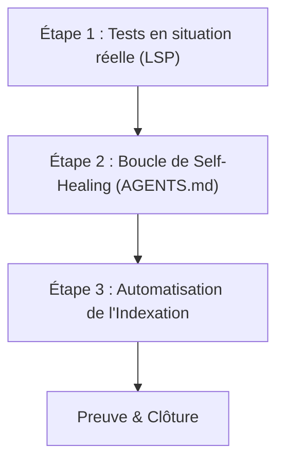

# Plan d'Action : Consolidation LSP & Codebase Memory Pro

Ce plan détaille la mise en œuvre des trois axes demandés pour consolider l'intégration de Pyright LSP et du graphe de connaissances sémantique sur la machine `MIDGARD`.

---

## 📅 Chronologie des Étapes



---

## 🔍 Détails des Étapes

### Étape 1 : Tests en situation réelle (LSP)
Nous allons tester interactivement les capacités du serveur `pyright-lsp` :
1. **Enregistrement du projet** : Initialiser la communication en enregistrant le projet `/home/lord-mahonheim/bifrost/tesla` via l'outil MCP `lsp_register_project`.
2. **Diagnostic** : Lancer l'outil `lsp_diagnostics` sur [memory/update_session_history.py](file:///home/lord-mahonheim/bifrost/tesla/memory/update_session_history.py) pour valider la récupération des erreurs/avertissements.
3. **Définition** : Appeler l'outil `lsp_read_definition` sur un symbole de `update_session_history.py` (par exemple, un import ou une variable) pour vérifier la navigation de code.

### Étape 2 : Boucle de Self-Healing (Auto-correction)
Pour assurer que tout code généré par l'agent est auto-corrigé en cas d'erreurs de linting ou de typage, nous allons :
1. **Éditer les règles de gouvernance locale** : Mettre à jour le fichier de constitution de l'agent : [AGENTS.md](file:///home/lord-mahonheim/bifrost/tesla/.agents/AGENTS.md).
2. **Ajouter la directive** :
   ```markdown
   ### 🩺 Boucle de Self-Healing (Auto-correction LSP)
   - Après chaque création ou modification de code source Python dans le projet, tu DOIS obligatoirement exécuter les diagnostics LSP (via le serveur `pyright-lsp` et l'outil `lsp_diagnostics`).
   - En cas d'erreur (`Error`) ou d'avertissement majeur (`Warning`) signalé par Pyright, tu DOIS analyser l'anomalie et appliquer de manière autonome les corrections de code nécessaires (via `replace_file_content`).
   - Tu répètes cette boucle diagnostic -> correction jusqu'à ce que le fichier soit validé par l'LSP sans aucune erreur de linting ou de typage, avant toute tentative d'exécution ou commit.
   ```

### Étape 3 : Automatisation de l'Indexation
Afin d'éviter toute désynchronisation du second cerveau (le graphe de connaissances), nous mettons en place un double verrou d'indexation automatique :
1. **Initialisation Git** : Exécuter `git init` dans le répertoire racine pour créer l'infrastructure Git.
2. **Hook de pré-commit Git** : Créer le fichier `.git/hooks/pre-commit` pour exécuter `python3 sandbox/scripts/index_codebase.py` et ré-ajouter automatiquement `memory/knowledge_graph.json` au commit courant.
3. **Macro de Clôture de Session** : Modifier [update_session_history.py](file:///home/lord-mahonheim/bifrost/tesla/memory/update_session_history.py) pour invoquer systématiquement le script d'indexation au début de sa routine d'archivage cognitive.

---

## 🎯 Critères d'Acceptation & Preuves
- [ ] L'LSP répond avec succès aux requêtes de diagnostic et de définition.
- [ ] Le fichier `AGENTS.md` contient la règle de Self-Healing.
- [ ] Le dépôt Git est initialisé et le hook de pré-commit est opérationnel.
- [ ] L'exécution de `update_session_history.py` déclenche automatiquement la reconstruction du graphe de connaissances.
- [ ] Le graphe est à jour et stocké dans Obsidian Avalon.
