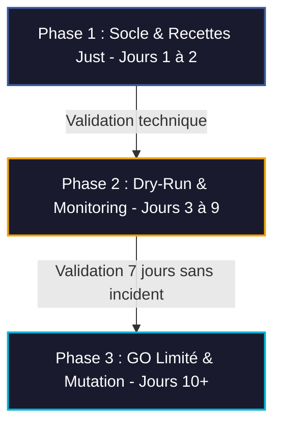

# Plan d'Action de Haut Niveau : Intégration Sécurisée de la Suite "MASTER CODING"

## 1. Diagnostic de Confrontation (Premortem vs Fiche de Décision)

Ce plan est établi à la suite de la confrontation directe entre le rapport d'audit `premortem_tesla_master_code_v1.md` (qui prévoit un effondrement systémique sous 3 mois dû à une dérive opérationnelle, des conflits d'outils et une faille d'isolation) et la fiche de décision `tesla-master-code_go_nogo_decision_v1.md` (qui impose un NO-GO pour le déploiement autonome mais un GO conditionnel pour un MVP en mode dry-run).

### A. Analyse des Conflits & Risques Majeurs identifiés
1. **Conflit de formatage physique** : Biome (indents par tabulations) et Ruff (indents par espaces pour le Python et certains JSON) risquent de provoquer des boucles infinies d'édition ou des altérations silencieuses de fichiers du Vault Obsidian et d'Alexandria.
2. **Saturation des ressources système (OOM/CPU)** : L'utilisation simultanée de Deno (moteur V8), Wasmtime (compilateur JIT Cranelift) et Tree-sitter (parsing AST récursif) sur MIDGARD sans limitation stricte de mémoire peut saturer les 8 Go de RAM, provoquant le crash du démon LSP `karellen-lsp-mcp` et de la base Alexandria (`alexandria_brain.db`).
3. **Élévation de privilèges** : Le risque de contournement de l'isolation par l'utilisation de drapeaux larges (`--allow-all`, `--allow-run` dans Deno) pour résoudre rapidement les bugs de code.
4. **Dérive cognitive (Amnésie du Shadow-Targeting)** : La dérive contextuelle des sous-agents `self` asynchrones à long terme, qui tendent à abandonner la suite standardisée "MASTER CODING" et à générer des scripts ad-hoc instables violant la doctrine Low-Code.

### B. Objectif Stratégique
Assurer la transition progressive du profil `tesla-master-code` d'un statut de **NO-GO Production** à un statut de **GO Contrôlé** sous 9 jours (7 jours de dry-run + 2 jours d'installation de socle), en s'appuyant uniquement sur des recettes `just` verrouillées et des gardiens de ressources strictes.

---

## 2. Structure Modulaire par Phases

### Phase 1 : Sécurisation du Socle & Standardisation (Jours 1 à 2)
L'objectif de cette phase est de déployer l'infrastructure défensive de la suite sans exécuter de mutations réelles.

*   **Action 1.1 : Modélisation du Profil de Conception & Alignment Style**
    *   Configurer le fichier `biome.json` et le fichier `ruff.toml` pour s'assurer qu'ils partagent le même standard d'indentation (utilisation exclusive d'espaces) pour éviter les conflits syntaxiques lors du linting mutuel.
    *   Créer une politique de formatage sec : exécution de `ruff check` et `biome check` sans mode `--fix` ou `--write` par défaut.
*   **Action 1.2 : Rédaction du Justfile Défensif**
    *   Créer et enregistrer un `justfile` encapsulant toutes les commandes d'outils. Les commandes directes de terminaux (ex: `deno run`, `wasmtime run`, `ruff`) sont bannies. L'agent doit appeler `just lint`, `just test`, `just parse`.
    *   Le `justfile` doit nativement inclure des contraintes d'exécution rigides :
        *   `deno` : forcer `--allow-read=<workspace>`, `--allow-write=/tmp/tesla-master-code`, `--allow-net=none` et `--v8-flags="--max-old-space-size=256"`.
        *   `wasmtime` : montage des fichiers hôtes en lecture seule (`--dir=.::ro`), désactivation de la compilation Cranelift JIT massive ou plafonnement.
*   **Action 1.3 : Configuration du Hook de Sûreté Git (Pré-vol)**
    *   Implémenter un script de pré-vol automatique dans le `justfile` qui vérifie `git status`. Si des modifications non validées sont présentes, l'exécution de toute recette de formatage ou d'écriture est bloquée.

#### Métriques de Validation de la Phase 1
- **Preuve technique** : Fichiers `justfile`, `biome.json` et `ruff.toml` validés syntaxiquement par `lsp_diagnostics`.
- **Zéro élevation** : Validation qu'aucun script n'invoque `--allow-all` ou `--allow-run`.

---

### Phase 2 : Phase de Dry-Run & Monitoring Actif (Jours 3 à 9)
Période probatoire obligatoire de 7 jours pour tester le comportement en situation réelle, mais sans aucune modification destructive du code ou des bases.

*   **Action 2.1 : Déploiement du Profil Sec (Dry-Run-Only)**
    *   Le profil `tesla-master-code` est activé uniquement avec des privilèges de lecture et de vérification.
    *   Les tâches d'écriture sont systématiquement interceptées et présentées sous forme de diffs Markdown à l'opérateur (Mahonheim) pour validation manuelle.
*   **Action 2.2 : Monitoring des Signaux Faibles**
    *   Surveiller le temps de cold start du sous-agent (alerte si > 1 sec).
    *   Tracer la consommation RAM globale sur MIDGARD lors de l'analyse (alerte si utilisation de la suite master-code > 1.5 Go RAM).
    *   Vérifier l'absence de tentatives d'exécution de scripts shell orphelins (en dehors du `justfile`).

#### Métriques de Validation de la Phase 2
- **Stabilité de la Mémoire** : Consommation de RAM stabilisée sous 512 Mo pour Deno.
- **Zéro Mutation Silencieuse** : 0 écriture sur le système de fichiers sans accord explicite et sauvegarde Git préalable.
- **Rapport de Fin de Période** : Audit des logs à J+7 validant l'absence totale de dérive cognitive ou de crash LSP.

---

### Phase 3 : Transition en GO Limité (Jours 10+)
Passage à une exécution mutatrice ciblée et sécurisée. L'autonomie complète reste proscrite.

*   **Action 3.1 : Activation Contrôlée des Modifications Physiques**
    *   Autoriser l'utilisation de `just format` (qui appelle `biome format --write` ou `ruff format` de façon contrôlée) uniquement sur le fichier actuellement modifié dans l'IDE, jamais sur des dossiers complets ou le vault Obsidian en bloc.
    *   Chaque commande mutatrice doit automatiquement créer un commit Git temporaire (ex: `git commit -am "pre-format backup"`) pour permettre un rollback instantané en cas de corruption syntaxique.
*   **Action 3.2 : Injection Cognitive Systématique**
    *   Intégrer dans les instructions initiales de chaque sous-agent `self` invoqué par Tesla le rappel strict de la doctrine Master-Coding (utilisation exclusive du `justfile`, soumission au Low-Code de Mahonheim, interdiction de scripts shell générés à la volée).

#### Métriques de Validation de la Phase 3
- **Taux de Succès des Tests** : 100% des tests passés sur les modules Deno / Wasmtime.
- **Intégrité de la Base** : Zéro corruption détectée sur `alexandria_brain.db` (validation d'intégrité SQLite).
- **Rollback instantané** : Capacité démontrée à restaurer l'état précédent du workspace en < 5 secondes via Git.

---

## 3. Matrice de Prévention et Garde-fous Opérationnels

| Composant | Risque Identifié | Garde-fou Technique | Seuil d'Alerte / Action |
| :--- | :--- | :--- | :--- |
| **Tree-sitter** | Saturation CPU/RAM par parsing de fichiers géants ou requêtes récursives. | Limite de taille et de complexité AST. | Fichiers > 200 Ko ou profondeur AST > 10 interdits. |
| **Deno** | Élévation de privilèges ou fuite réseau du code testé. | `--allow-net=none`, restriction d'écriture. | Bloquer tout démarrage Deno sans drapeaux restrictifs. |
| **Deno V8** | Fuite de mémoire (OOM) provoquant le crash de MIDGARD. | Flag V8 de taille maximale du tas. | `--max-old-space-size=256` obligatoire. |
| **Wasmtime** | Altération du système hôte par code WebAssembly. | Montage hôte restreint en lecture seule. | `--dir=.::ro` obligatoire. |
| **Ruff / Biome** | Boucle infinie d'édition ou formatage destructeur. | Dry-run obligatoire et commit Git préalable. | Exécution physique interdite sans `git status` clean. |
| **Sous-agent `self`** | Amnésie cognitive et contournement de la doctrine `just`. | Consolidation de l'identité cognitive à chaque tour. | Interdire `run_command` pour des scripts shell non listés dans le `justfile`. |

---

## 4. Preuve de Sûreté & Checklist Pré-vol

Avant toute utilisation du profil `tesla-master-code`, l'agent principal et l'opérateur doivent valider la checklist suivante :

- [ ] **Présence des Dépendances** : Les binaires `just`, `ruff`, `biome`, `tree-sitter`, `wasmtime` et `deno` sont installés et accessibles dans le PATH de MIDGARD.
- [ ] **Alignement de Style** : Les fichiers `biome.json` et `ruff.toml` sont configurés de manière identique (indentation par 4 espaces, fin de ligne LF).
- [ ] **Garde-fous Actifs** : La recette `just test` ou `just run` contient explicitement les drapeaux d'isolation de mémoire et de répertoire (`--max-old-space-size=256`, `--dir=.::ro`).
- [ ] **État de Git** : Le répertoire de travail est propre (`git status` ne renvoie aucun fichier modifié ou non suivi).
- [ ] **Dry-Run Activé** : Le commutateur global du profil est défini sur `DRY_RUN=true`.

---
*Rapport d'analyse stratégique établi et validé sur MIDGARD par Tesla Arcanis.*

### ⚖️ SCEAU DE CERTIFICATION (IMMUABLE)
> **Arcanis.** Enquête planifiée. Hypothèses testées. Sources croisées. Livrable certifié.  
> — Validé par Arcanis. Archive de référence.  
> `SHA256:a0ad23647e40aabc24df3f47f8dcf839149ccdf961130c149679fd24eb734c73`
