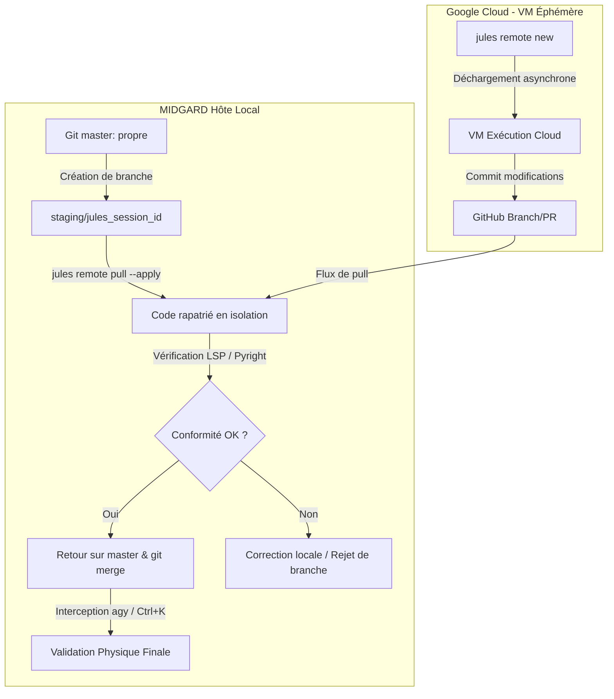

# PLAN D'INTÉGRATION CONSOLIDÉ & SÉCURISÉ DE GOOGLE JULES (v1)
**Date d'édition :** 2026-07-01  
**Auteur :** Tesla (sur Antigravity CLI)  
**Destinataire :** Lord Mahonheim (Abdellah MOUHTAJ)  
**Statut :** #statut/a-valider (Soumis à votre approbation Obsidian)

---

## 1. Architecture de Sécurité (Le Bouclier Staging)

Pour neutraliser les risques d'écrasement destructif mis en évidence par l'audit d'Arcanis et le diagnostic Premortem, ce plan rejette l'application directe des modifications de session cloud sur la branche de travail active. L'intégration de Google Jules est encapsulée au sein d'une **branche de staging isolée**, agissant comme une zone de quarantaine logicielle.



---

## 2. Protocole Opérationnel Étape par Étape

### Étape 1 : Alignement et Initialisation Locale
1.  **Vérification de la configuration `agy`** :
    Vérifier dans `~/.gemini/antigravity-cli/settings.json` que le paramètre `toolPermission` est configuré sur `request-review`.
2.  **Installation des dépendances** :
    Installer le paquet CLI de Jules en global :
    ```bash
    npm install -g @google/jules
    ```
3.  **Authentification** :
    ```bash
    jules login
    ```

### Étape 2 : Lancement d'un Chantier Distant (Offloading)
1.  **Vérification de propreté** :
    S'assurer que le répertoire de travail local est propre et sans modifications non validées :
    ```bash
    git status --porcelain
    ```
2.  **Délégation de tâche** :
    Lancer la session distante avec la commande de Jules CLI en spécifiant le dépôt de référence :
    ```bash
    jules remote new --repo <owner/repo> --session "Description de la tâche complexe (ex: Refactoring d'API)"
    ```
    *Note : Relever l'ID unique de la session (session_id) généré dans la réponse de la commande.*

### Étape 3 : Rapatriement de Quarantaine (Staging Isolation)
Une fois que Jules a terminé son exécution asynchrone dans le cloud :
1.  **Création de la branche d'accueil** :
    ```bash
    git checkout -b staging/jules_<session_id>
    ```
2.  **Pull destructif contrôlé** :
    Rapatrier et appliquer les modifications physiques dans cette branche isolée :
    ```bash
    jules remote pull --session <session_id> --apply
    ```

### Étape 4 : Validation Technique & LSP (Self-Healing)
1.  **Vérification syntaxique et typage** :
    Lancer Pyright sur la branche de staging pour intercepter les anomalies ou mocks invalides :
    ```bash
    .venv/bin/pyright
    ```
2.  **Validation de sécurité** :
    Inspecter visuellement le diff de la branche par rapport à master pour s'assurer de l'absence d'identifiants de test hardcodés ou de mocks abusifs de base de données.

### Étape 5 : Fusion Souveraine et Validation Physique (Ctrl+K)
1.  **Retour à la branche stable** :
    ```bash
    git checkout master
    ```
2.  **Lancement de la fusion** :
    ```bash
    git merge staging/jules_<session_id>
    ```
3.  **Couperet d'approbation** :
    La commande `git merge` lancée localement sera interceptée par Antigravity CLI. Lord Mahonheim valide la fusion physique en appuyant sur `Ctrl+K` dans son terminal.
4.  **Nettoyage** :
    Supprimer la branche de staging désormais intégrée :
    ```bash
    git branch -d staging/jules_<session_id>
    ```

---

## 3. Matrice de Prévention des Risques

| Risque Identifié | Condition de Déclenchement | Contre-Mesure Opérationnelle Obligatoire |
| :--- | :--- | :--- |
| **Écrasement du travail en cours (Drift)** | Fichiers non commités lors du lancement d'une session. | Interdiction de lancer `jules remote new` si `git status` n'est pas propre. |
| **Bypass de sécurité par mocks distants** | Pull final contenant des credentials factices. | Audit systématique du diff de staging avant de basculer sur `master`. |
| **Échec silencieux du code importé** | Erreurs d'importation suite aux modifications d'API. | Blocage de la fusion si le diagnostic `.venv/bin/pyright` renvoie des erreurs. |
| **Surcharge cognitive (Ctrl+K)** | Diff de fusion supérieur à 100 lignes. | Découpage préalable du chantier en sessions Jules plus courtes (< 3 fichiers modifiés). |

---
*Plan d'intégration consolidé et sécurisé rédigé pour Lord Mahonheim.*

Signé / Fait par : Tesla sur Antigravity CLI  
Main rendue à Mahonheim
