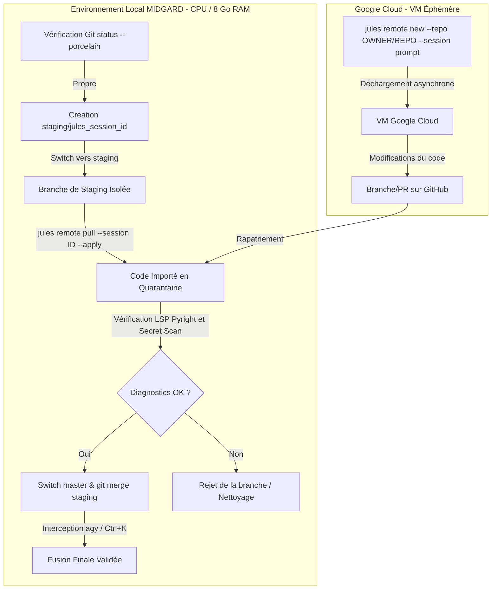

# PLAN D'INTÉGRATION CONSOLIDÉ & SÉCURISÉ DE GOOGLE JULES (v2)
**Date d'actualisation :** 2026-07-01  
**Auteur :** Tesla (sur Antigravity CLI)  
**Destinataire :** Lord Mahonheim (Abdellah MOUHTAJ)  
**Statut :** #statut/a-valider (Soumis à votre approbation Obsidian)

---

## 1. Synthèse de la Confrontation (Rapports de Terrain vs Plan v1)

La confrontation du plan initial [plan_integration_google_jules_v1.md](file:///home/lord-mahonheim/bifrost/tesla/OUTPUTS/plan_integration_google_jules_v1.md) avec les deux notes de terrain de Lord Mahonheim (MVP 1 et MVP 2) met en relief des exigences de gouvernance et de scripting de bas niveau indispensables au fonctionnement nominal :

1.  **Isolation des Clés & Authentification** : Le statut `Success` de `jules login` est insuffisant. La validation doit impérativement s'effectuer via la commande opérationnelle `jules remote list --repo`. La connexion Git locale doit utiliser `gh auth setup-git` pour éviter tout conflit de protocoles HTTPS.
2.  **Gestion de la Dérive Locale (Drift)** : L'analyse de propreté locale ne doit pas utiliser le format court standard de git status (qui inclut des lignes de tracking de branches), mais exclusivement le format machine `git status --porcelain --untracked-files=all`.
3.  **Ciblage Explicite du Dépôt** : Jules ne sait pas déduire implicitement le dépôt distant à partir du répertoire local. L'argument `--repo "OWNER/REPOSITORY"` doit être systématiquement fourni pour éviter les erreurs de résolution du type `unknown/Antigravity`.
4.  **Principe d'Auto-Reporting & Allowlist** : L'IA distante (Jules) doit rédiger son propre rapport de mission sous la section `JULES_RESPONSE_TO_TESLA` directement dans le livrable. De plus, pour contourner les filtres de sécurité restrictifs locaux tout en encadrant Jules, le prompt de mission doit s'appuyer sur des directives positives (allowlist) et non négatives.
5.  **Flux de Pull Non-Destructif** : Le rapatriement s'effectue sur une branche isolée sans écraser le répertoire de travail master de MIDGARD.

---

## 2. Architecture Globale de l'Intégration



---

## 3. Plan de Haut Niveau : Les 4 Phases Opérationnelles

### Phase 1 : Alignement des Couches d'Infrastructure (MVP 1)
L'objectif est d'établir les liaisons d'accès entre MIDGARD, GitHub et Jules sans déclencher d'exécution de code.
*   **Vérification de la permission locale** : Configurer la politique locale d'approbation manuelle dans `settings.json` :
    ```json
    "toolPermission": "request-review"
    ```
*   **Installation du package global** :
    ```bash
    npm install -g @google/jules
    ```
*   **Authentification et test de visibilité Jules** :
    ```bash
    jules login
    jules remote list --repo
    ```
*   **Authentification et configuration Git Helper via GitHub CLI** :
    ```bash
    gh auth login --hostname github.com --git-protocol https --web --scopes repo
    gh auth setup-git --hostname github.com
    ```
*   **Test d'accès au dépôt distant** :
    ```bash
    git ls-remote --symref origin HEAD
    ```

### Phase 2 : Scripting du Wrapper de Gouvernance (`tesla-jules`)
Concevoir un script local d'orchestration (`tesla-jules`) pour automatiser les barrières de sécurité et éviter les erreurs humaines.
*   **Contrôle strict du répertoire de travail** : Bloquer toute commande Jules si la commande `git status --porcelain --untracked-files=all` n'est pas strictement vide.
*   **Résolution explicite du dépôt** : Extraire automatiquement le couple `OWNER/REPOSITORY` depuis `git remote get-url origin` et l'injecter dynamiquement dans les appels CLI `jules remote new --repo "OWNER/REPOSITORY"`.
*   **Filtrage par Allowlist Positive** : Intégrer un template de prompt incitant Jules à n'opérer que sur les fichiers déclarés.

### Phase 3 : Cycle de Vie des Sessions et Déchargement Asynchrone (MVP 2)
Exécuter les chantiers complexes à distance et gérer les retours sans polluer MIDGARD.
*   **Lancement de la tâche** : Invoquer la session distante en transmettant la directive de travail :
    ```bash
    tesla-jules mission "bounded prompt"
    ```
*   **Création de la branche de quarantaine** :
    ```bash
    git checkout -b staging/jules_<session_id>
    ```
*   **Rapatriement read-only** :
    ```bash
    jules remote pull --session <session_id> --apply
    ```
*   **Lecture du rapport d'agent** : Extraire et afficher dans la console locale la section `JULES_RESPONSE_TO_TESLA` du livrable pour vérifier les modifications déclarées.

### Phase 4 : Contrôle et Fusion Physique (Self-Healing & Ctrl+K)
*   **Diagnostic LSP** : Lancer la validation automatique de typage et de syntaxe sur la branche de quarantaine :
    ```bash
    .venv/bin/pyright
    ```
*   **Merge et Coupe-circuit de sécurité** :
    *   Repasser sur master : `git checkout master`
    *   Exécuter : `git merge staging/jules_<session_id>`
    *   Valider manuellement l'exécution de la commande de fusion interceptée par Antigravity CLI via `Ctrl+K`.

---

## 4. Ravitaillement & Critères d'Acceptation de l'Intégration

L'intégration sera déclarée opérationnelle et validée sous les critères suivants :
*   [ ] Binaire `jules` installé globalement et accessible.
*   [ ] Test `jules remote list --repo` validant le code d'accès HTTPS.
*   [ ] Script wrapper `tesla-jules` codé à la racine du projet et valide LSP.
*   [ ] Création d'une branche de staging à chaque pull de session.
*   [ ] Réindexation automatique de la base Alexandria suite à l'intégration.

---
*Plan de haut niveau soumis à l'arbitrage et la validation de Lord Mahonheim.*

Signé / Fait par : Tesla sur Antigravity CLI  
Main rendue à Mahonheim
