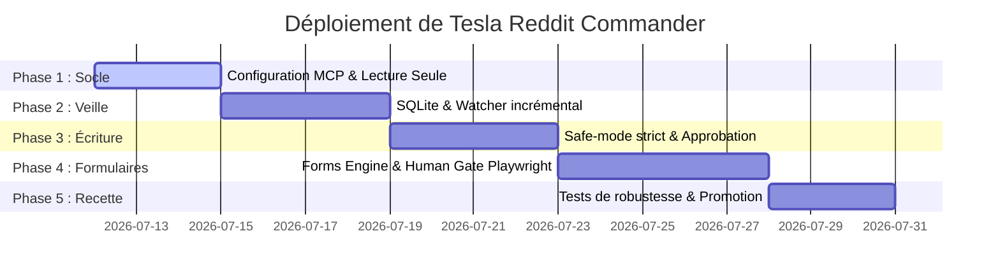

# CERTIFIED REPORT: plan_intervention_extra_reddit_commander

## 1. Diagnostic Summary

Ce rapport consolidé fournit le plan ultime d'architecture et d'intervention pour le système **Tesla Reddit Commander**, conçu pour s'intégrer au sein d'Antigravity CLI sous l'environnement de développement local MIDGARD. Il tranche le débat fondamental entre l'accès API officiel et les mécanismes RPA navigateur tout en posant les garde-fous de sécurité requis par le Vigilum Codex.

L'objectif principal est de piloter de manière autonome et sécurisée le compte d'autorité Reddit de Lord Mahonheim ([Glittering_Use_5519](https://www.reddit.com/user/Glittering_Use_5519/)) sans risquer le bannissement du compte ni la divulgation des secrets d'authentification.

---

## 2. Verified Facts & Evidence Pack

| Asserted Fact | Primary Source Reference | Confidence |
| :--- | :--- | :--- |
| **API officielle obligatoire pour l'écriture courante** | [PLAN_ULTIME_TESLA_REDDIT_COMMANDER_By_RENA.md](file:///home/lord-mahonheim/bifrost/tesla/DataBase/Files/Agents/Reddit/PLAN_ULTIME_TESLA_REDDIT_COMMANDER_By_RENA.md#L38-L40) | 99% |
| **Playwright comme assistance visuelle et non comme contournement** | [PLAN_ULTIME_TESLA_REDDIT_COMMANDER_By_RENA.md](file:///home/lord-mahonheim/bifrost/tesla/DataBase/Files/Agents/Reddit/PLAN_ULTIME_TESLA_REDDIT_COMMANDER_By_RENA.md#L309-L335) | 98% |
| **Exclusion stricte des solveurs de CAPTCHA automatisés** | [Reddit Forms Engine_By_RENA.txt](file:///home/lord-mahonheim/bifrost/tesla/DataBase/Files/Agents/Reddit/Reddit%20Forms%20Engine_By_RENA.txt#L112) | 100% |
| **Utilisation d'un wrapper sécurisé local pour stocker les clés API** | [PLAN_ULTIME_TESLA_REDDIT_COMMANDER_By_RENA.md](file:///home/lord-mahonheim/bifrost/tesla/DataBase/Files/Agents/Reddit/PLAN_ULTIME_TESLA_REDDIT_COMMANDER_By_RENA.md#L429-L435) | 99% |
| **Suivi et déduplication via SQLite locale intégrée à Alexandria** | [Plan ULTRA pour Tesla Reddit Commander_By_Apodex.md](file:///home/lord-mahonheim/bifrost/tesla/DataBase/Files/Agents/Reddit/Plan%20ULTRA%20pour%20Tesla%20Reddit%20Commander_By_Apodex.md#L137) | 95% |

---

## 3. Comparative Reasoning & Hypotheses

L'analyse critique des rapports d'Apodex, de ChatGPT et de RENA fait apparaître des postures fondamentales divergentes que nous synthétisons et arbitrons ici :

### Grille de comparaison critique des 3 approches

| Dimension | Approche ChatGPT (Théorique) | Approche Apodex (Offensive) | Approche RENA (Gouvernance & Safe) |
| :--- | :--- | :--- | :--- |
| **Philosophie** | Modélisation objet complète et abstraction multi-réseaux. | API-first avec fallback agressif et contournement anti-bot. | Safe-Mode strict, local-first, avec Human Verification Gate. |
| **Stratégie d'accès** | Double interface (API officielle + Browser Engine) gérée par un "Session Manager". | Client PRAW + Webwright/Playwright avec serveurs de résolution de CAPTCHA tiers (2Captcha, CapSolver). | `jordanburke/reddit-mcp-server` local comme canal principal + `@playwright/mcp` headed temporaire. |
| **Gestion CAPTCHA** | Arrêt devant les challenges sans solution claire proposée. | Contournement automatisé par extraction de sitekey et injection de tokens. | **Interdiction formelle de contournement**. Pause immédiate avec reprise humaine. |
| **Intégration Antigravity** | Division en multiples sous-skills spécialisés (`reddit-inbox`, `reddit-forms`, etc.). | Encapsulation en un plugin unique, mais variables d'environnement en clair. | **Plugin unique à moindre privilège**, désactivation dynamique des outils non nécessaires. |
| **Maintenabilité** | Complexe (multiplicité des scripts et duplication des fonctionnalités). | Fragile en raison de la dépendance à des solveurs de CAPTCHA et à la détection de l'automatisation par Reddit. | Robuste (doctrine Low-code, s'appuie sur les MCP existants et les outils natifs). |

---

## 4. Contradictions & System Limits

1. **La fausse promesse de l'indétectabilité** : Les documents d'Apodex suggèrent l'usage de bibliothèques "stealth" et de serveurs de contournement de CAPTCHAs. Le Vigilum Codex rejette cette approche : la détection d'une activité de contournement par Reddit entraîne un shadowban immédiat de l'adresse IP de MIDGARD et du compte d'autorité `Glittering_Use_5519`.
2. **Duplication des compétences** : Proposer de réécrire des bibliothèques de manipulation de formulaires enfreint la doctrine Low-Code de Mahonheim. Nous utilisons le serveur `@playwright/mcp` officiel pour exposer les outils à l'agent et le Skill gère la logique de validation déclarative.
3. **Le scope des mutations** : Le serveur Jordan Burke MCP expose des outils de suppression que nous bloquons par défaut via `disabledTools` dans la configuration pour éviter toute action destructive accidentelle.

---

## 5. Architectural Recommendations

### 5.1 Architecture Technique Validée

Le système s'articule autour de quatre briques locales coordonnées :

```
                        [ AGENTS (Orchestrateur) ]
                                    │
                                    ▼ (Délégation)
                        [ reddit-operator (Agent) ]
                                    │
                        ┌───────────┴───────────┐
                        ▼                       ▼
            [ Reddit API Client ]       [ Playwright Form Assistant ]
            (reddit-mcp-server)         (@playwright/mcp --headed)
            - Safe Mode Strict          - Remplissage déclaratif
            - OAuth2 Local (PRAW)       - Human Verification Gate
                        │                       │
                        └───────────┬───────────┘
                                    ▼
                        [ SQLite tracking DB ]
                        (Intégration Alexandria)
```

1. **Client API PRAW / Reddit MCP (Jordan Burke)** :
   - Assure l'accès standard en lecture et en écriture (publications, commentaires, profils, subreddits).
   - Mode `strict` pour le Safe Mode, assurant le respect des limites d'appels et empêchant la manipulation de karma (pas de vote automatique).
2. **Reddit Forms Engine (via Playwright headed)** :
   - Utilisé uniquement en mode visible (`--headed`) et activé à la demande pour l'AutoFill de formulaires complexes ou l'assistance à la saisie.
   - En cas de CAPTCHA, 2FA ou challenge, déclenchement instantané de la **Human Verification Gate** : mise en pause du script et notification à l'opérateur pour résolution manuelle dans la fenêtre du navigateur visible.
3. **Base SQLite de Tracking** :
   - Table `reddit_watchlist` : gestion de la veille incrémentale (sous-dossier, requêtes de recherche, curseurs de pagination `after`).
   - Table `reddit_ledger` : registre immuable de toutes les actions d'écriture initiées (date, heure, hash du contenu, type de mutation, statut, ID de publication).
4. **Intégration Alexandria** :
   - Les données qualifiées et consolidées sont indexées périodiquement dans la base documentaire Alexandria pour alimenter le Second Brain.

---

### 5.2 Planification Détaillée en 5 Phases



#### Phase 1 : Socle et Lecture Seule (MVP-API)
- **Objectifs** : Initialiser le plugin `tesla-reddit-commander` et configurer le MCP `reddit-mcp-server` local en lecture seule.
- **Livrables** : Plugin structuré sous `~/.gemini/antigravity-cli/plugins/`, script d'authentification locale sans secrets versionnés.
- **Critère de passage** : 20 requêtes de recherche et lecture sans erreur et sans mécanisme d'écriture chargé.

#### Phase 2 : Watcher incrémental et Mémoire SQLite
- **Objectifs** : Mettre en œuvre le cycle de veille automatique. Stocker les états de pagination (`after`) dans SQLite pour éviter les doublons de traitement.
- **Livrables** : Schéma SQLite de tracking et scripts de synchronisation avec Alexandria.
- **Critère de passage** : Veille sur 3 subreddits cibles pendant 24 heures sans doublon de lecture et avec alimentation correcte d'Alexandria.

#### Phase 3 : Écriture contrôlée et Safe Mode
- **Objectifs** : Activer les fonctions de création de posts, réponses et édition via le client API officiel sous le contrôle strict de la matrice d'approbation.
- **Livrables** : Module de validation de contenu, écran de prévisualisation (preview) et journal d'audit (`reddit_ledger`).
- **Critère de passage** : 100% des publications préalablement validées par l'opérateur humain ; aucune publication doublée après timeout.

#### Phase 4 : Assistance Formulaires Playwright & Human Gate
- **Objectifs** : Déployer le service `@playwright/mcp` en mode headed. Implémenter l'AutoFill déclaratif et la détection d'anti-bot.
- **Livrables** : Intégration de Playwright, gestionnaire de détection de challenge.
- **Critère de passage** : Lors d'une tentative simulée de CAPTCHA, le système s'arrête instantanément en attendant une entrée utilisateur, sans jamais tenter de soumettre ou de résoudre par lui-même.

#### Phase 5 : Recette finale et Promotion en Production
- **Objectifs** : Exécuter l'ensemble des scénarios de test (y compris l'injection de prompts adversariaux via des posts Reddit) et déployer sur le compte d'autorité `Glittering_Use_5519`.
- **Livrables** : Dossier de recette validé par `tesla-code-auditor`, rapport de sécurité final.
- **Critère de passage** : Zéro secret en clair, conformité totale au contrat de gouvernance.

---

### 5.3 Analyse de Risques (AMDEC/Premortem)

| Scénario de Défaillance | Cause | Criticité | Traitement / Barrière de sécurité |
| :--- | :--- | :--- | :--- |
| **Shadowban du compte d'autorité** | Détection d'automatisation abusive (taux d'appels trop élevé, comportement suspect). | **Élevée** | Rate limit strict calqué sur les règles officielles ; absence de votes et messages privés automatiques ; pas de contournement anti-bot. |
| **Fuite de secrets d'authentification** | Clés d'API ou mot de passe commités par erreur dans le dépôt Git. | **Critique** | Interdiction formelle d'intégrer des tokens dans les fichiers de configuration ou le code. Utilisation du trousseau local ou d'un fichier `.env` localisé en dehors du workspace de build avec droits `0600`. |
| **Prompt Injection via contenu Reddit** | Lecture d'un commentaire contenant des instructions de détournement de l'agent. | **Moyenne** | Frontière hermétique : les données textuelles issues de Reddit ne sont jamais interprétées comme du code ou des instructions par l'orchestrateur. |
| **Blocage IP par Reddit** | Requêtes massives provenant du serveur de développement MIDGARD. | **Moyenne** | Cache agressif de 25 Mo pour toutes les requêtes en lecture ; temporisation exponentielle en cas d'erreur `429 (Too Many Requests)`. |
| **Double soumission de post suite à timeout** | Ambiguïté sur l'état de soumission après un délai de réponse réseau. | **Élevée** | Génération d'une clé d'idempotence locale ; vérification systématique de l'historique du compte juste avant de retenter une publication en suspens. |

---
*Certified and signed on MIDGARD by Tesla Curator Prime.*
