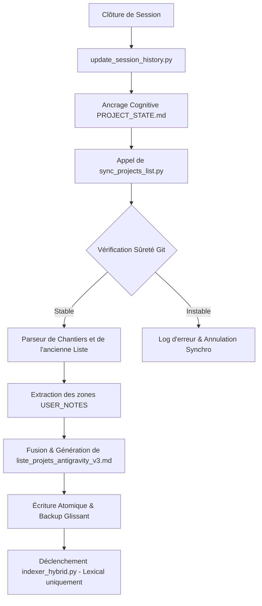

# PLAN D'INTERVENTION TECHNIQUE CONSOLIDÉ : SYNCHRONISATION AUTOMATIQUE DE LA LISTE DES PROJETS (V3)
**Date de rédaction :** 2026-07-03  
**Auteur :** tesla-arcanis (Sous-Agent d'Élite Tesla)  
**Destinataire :** Lord Mahonheim (Abdellah MOUHTAJ)  

---

## 1. Objectif & Périmètre Opérationnel
L'objectif de ce plan est d'automatiser et de sécuriser la mise à jour de la liste consolidée des projets sous [`liste_projets_antigravity_v3.md`](file:///home/lord-mahonheim/bifrost/tesla/OUTPUTS/liste_projets_antigravity_v3.md). Cette automatisation s'appuiera sur un script Python dédié [`sync_projects_list.py`](file:///home/lord-mahonheim/bifrost/tesla/memory/sync_projects_list.py), déclenché en fin de session par le script d'ancrage [`update_session_history.py`](file:///home/lord-mahonheim/bifrost/tesla/memory/update_session_history.py). 

Les données sources proviennent de l'[`INDEX.md`](file:///home/lord-mahonheim/bifrost/tesla/Gestion-de-Chantiers/INDEX.md) du Système de Gestion de Chantiers (SGC), des fiches individuelles de chantiers actifs et archivés, et de la base de données SQLite [`alexandria_brain.db`](file:///home/lord-mahonheim/bifrost/tesla/database/alexandria_brain.db).

---

## 2. Architecture Technique & Mapping Sémantique

### Flux de Contrôle


### Extraction & Mapping Sémantique
Le script extrait de chaque fiche de chantier les champs structurés suivants :
1.  **En-tête YAML :** Statut (`statut`), Version (`version`), Dates (`date_ouverture`, `date_derniere_maj`).
2.  **Section 2 - Description du Chantier :** Extraite pour alimenter la rubrique "Objectif & Usage". En cas d'absence, le script génère un fallback basé sur le premier paragraphe ou les tags.
3.  **Section 7 - Avancement & Réalisations :** Extraite pour alimenter la rubrique "Réalisations techniques".

---

## 3. Implémentation des Contre-Mesures de Résilience (Premortem)

### RSK-01 : Algorithme de Préservation des Notes Utilisateurs (Merge Bidirectionnel)
Le script ne doit jamais écraser le travail de l'opérateur. La fusion s'opère comme suit :
1.  **Lecture Préalable :** Avant toute écriture, le script lit l'ancien fichier [`liste_projets_antigravity_v3.md`](file:///home/lord-mahonheim/bifrost/tesla/OUTPUTS/liste_projets_antigravity_v3.md) s'il existe.
2.  **Extraction des Blocs Manuels :** Utilisation d'une regex robuste pour capturer les textes compris entre les balises HTML de délimitation :
    ```markdown
    <!-- USER_NOTES_START [ID] -->
    Notes de cadrage manuelles de Lord Mahonheim...
    <!-- USER_NOTES_END [ID] -->
    ```
3.  **Réinjection :** Lors de la construction du nouveau Markdown, si le chantier traité possède une clé correspondante dans le dictionnaire de blocs extraits, les notes manuelles sont restaurées mot pour mot dans la section correspondante.
4.  **Préservation des Fondateurs :** Les projets fondateurs (1 à 9) n'ayant pas de fiches dans le SGC, leurs descriptions complètes sont considérées comme statiques et lues de la version précédente pour être intégralement recopiées.

### RSK-02 : Optimisation des Performances d'Indexation RAG (Anti-Boucle CPU)
1.  **Exclusion Vectorielle :** L'[`indexer_hybrid.py`](file:///home/lord-mahonheim/bifrost/tesla/indexer_hybrid.py) est modifié pour ignorer le fichier [`liste_projets_antigravity_v3.md`](file:///home/lord-mahonheim/bifrost/tesla/OUTPUTS/liste_projets_antigravity_v3.md) lors du processus d'indexation vectorielle ChromaDB. Seul l'index lexical SQLite FTS5 indexera le fichier pour une recherche rapide.
2.  **Verrou de Signature (Hash) :** Le script calcule le hash SHA-256 de la liste générée (hors date de mise à jour sémantique). Si le hash est identique à la version précédente, le fichier n'est pas réécrit physiquement pour économiser les cycles disque.

### RSK-03 : Alignement de Sécurité Git & Anonymisation
1.  **Anonymisation des Fichiers :** Nettoyage automatique de tous les chemins absolus locaux (ex. remplacement de `/home/lord-mahonheim/bifrost/tesla/` par des variables relatives) dans la liste destinée au dépôt public.
2.  **Vérification de Sûreté Git :** Interdiction de commit si la commande `git status --porcelain` renvoie des conflits non résolus.

---

## 4. Plan de Travail par Phases

### Phase 1 : Scaffolding & Conception du Script (T+1 Jour)
*   Créer le script [`sync_projects_list.py`](file:///home/lord-mahonheim/bifrost/tesla/memory/sync_projects_list.py) dans le répertoire `memory/`.
*   Mettre en place la structure de backup automatique avec rotation sur 10 versions dans `memory/backup/`.
*   Écrire les fonctions de lecture et d'extraction de regex pour les balises `USER_NOTES`.

### Phase 2 : Parsing & Injection (T+2 Jours)
*   Implémenter le parseur de fichiers Markdown pour extraire les objectifs et réalisations des fiches chantiers de `Gestion-de-Chantiers/` et `Gestion-de-Chantiers/Archivage-de-Chantiers/`.
*   Valider la logique de fusion pour s'assurer que les notes manuelles sont préservées intactes.

### Phase 3 : Intégration dans le flux d'Ancrage (T+3 Jours)
*   Modifier [`update_session_history.py`](file:///home/lord-mahonheim/bifrost/tesla/memory/update_session_history.py) pour ajouter l'appel système de [`sync_projects_list.py`](file:///home/lord-mahonheim/bifrost/tesla/memory/sync_projects_list.py) en fin de traitement.
*   Modifier [`indexer_hybrid.py`](file:///home/lord-mahonheim/bifrost/tesla/indexer_hybrid.py) pour exclure [`liste_projets_antigravity_v3.md`](file:///home/lord-mahonheim/bifrost/tesla/OUTPUTS/liste_projets_antigravity_v3.md) du traitement vectoriel.

### Phase 4 : Tests de Validation (T+4 Jours)
*   Simuler des modifications manuelles et vérifier que le script les conserve après synchronisation.
*   Mesurer l'impact CPU/RAM lors de la fin de session pour attester de l'absence de saturation sur MIDGARD.

---

## 5. Protocole de Rollback
En cas d'échec d'écriture ou de corruption de fichier :
1.  Stopper le script parent.
2.  Identifier le dernier backup valide dans [`memory/backup/liste_projets_antigravity_v3.md.bak`](file:///home/lord-mahonheim/bifrost/tesla/memory/backup/).
3.  Restaurer le fichier via :
    ```bash
    cp memory/backup/liste_projets_antigravity_v3.md.bak.0 OUTPUTS/liste_projets_antigravity_v3.md
    ```

---
*Plan d'intervention certifié factuel par l'analyste Arcanis.*

SHA256:0e1d93440e22cd4e21d70da29db3ef30c6f1ca65f022f8cb02c887ee37eac1ba
