# PLAN DE TRAVAIL FINAL : DÉPLOIEMENT LOCAL DU MVP GITHUB - UPDATED

## 1. Diagnostic de Sécurité & Connectivité

### A. Audit d'Accès SSH vers GitHub
Dans le cadre de l'évaluation pré-déploiement de notre infrastructure de gouvernance, un test de connexion SSH a été exécuté à froid vers la plateforme GitHub :
```bash
ssh -T git@github.com
```

Le résultat de la tentative a été capturé avec succès dans nos journaux locaux :
```text
Warning: Permanently added 'github.com' (ED25519) to the list of known hosts.
git@github.com: Permission denied (publickey).
```

> [!IMPORTANT]
> **Diagnostic Factuel :** La connexion TCP avec `github.com` est pleinement opérationnelle, et l'empreinte de l'hôte a été ajoutée à notre trousseau de confiance (`known_hosts`). Cependant, l'accès SSH est rejeté avec l'erreur `Permission denied (publickey)`. Cela démontre que la clé publique de l'environnement n'est pas encore associée aux droits d'écriture sur le dépôt distant `lordmahonheim-bot/Tesla-Antigravity-CLI`.
> **Contre-mesure :** Aucune tentative de push ne sera exécutée. Tout le travail s'effectuera localement sous `MVP-GITHUB/` en attendant l'ajout de la clé par Lord Mahonheim.

### B. Cartographie des Risques & Contre-mesures Appliquées
En application directe du rapport Premortem, les contre-mesures suivantes ont été implémentées dans nos modèles de code :
1. **Zéro Secrets & Chemins en Dur :** Tous les scripts ont été réécrits pour s'affranchir des chemins statiques pointant vers `/home/lord-mahonheim/bifrost/tesla`. Ils utilisent désormais le module `os.path` pour calculer les localisations relatives et exploitent des variables d'environnement (`TESLA_WORKSPACE`, `GEMINI_APP_DATA_DIR`, etc.) avec fallbacks dynamiques.
2. **Exclusion des Bases Physiques et Logs :** Le `.gitignore` de la racine est verrouillé pour bloquer toutes les extensions `.db`, `.sqlite`, les répertoires de cache vectoriel `.chroma_vectors` et l'historique privé `SESSION_TRANSCRIPTS.md`.
3. **Langue des Publications (Directive Canonique) :** Conformément à la section 14 de la charte institutionnelle [MY_COMPANY.md](file:///home/lord-mahonheim/bifrost/tesla/memory/MY_COMPANY.md), tout code et documentation publiés sur GitHub doivent être rédigés **exclusivement en anglais**. Les 9 READMEs des projets seront donc rédigés en anglais.
4. **Intégration de la Fiche Institutionnelle :** Le fichier de référence [MY_COMPANY.md](file:///home/lord-mahonheim/bifrost/tesla/memory/MY_COMPANY.md) décrivant l'organisation et la doctrine de Vigilum Codex sera copié à la racine de `MVP-GITHUB/` sous le nom de `MY_COMPANY.md` pour servir de référentiel doctrinale au dépôt.

---

## 2. Arborescence Cible de `MVP-GITHUB/`

Voici l'arborescence structurelle complète qui sera déployée localement sous `/home/lord-mahonheim/bifrost/tesla/MVP-GITHUB/` :

```mermaid
graph TD
    R[MVP-GITHUB/ Racine] --> GI[.gitignore]
    R --> RM[README.md]
    R --> MC[MY_COMPANY.md]
    R --> CC[CODE_OF_CONDUCT.md]
    R --> CT[CONTRIBUTING.md]
    R --> LI[LICENSE]
    R --> SE[SECURITY.md]
    R --> SU[SUPPORT.md]
    
    R --> P1[01-LSP-Self-Healing]
    P1 --> P1_RM[README.md]
    P1 --> P1_EX[examples/test_lsp.py]
    
    R --> P2[02-Alexandria-Database]
    P2 --> P2_RM[README.md]
    P2 --> P2_IDX[indexer_hybrid.py]
    P2 --> P2_RTR[search_router.py]
    
    R --> P3[03-Memory-MLT]
    P3 --> P3_RM[README.md]
    P3 --> P3_UPD[update_session_history.py]
    
    R --> P4[04-Web-Raider]
    P4 --> P4_RM[README.md]
    P4 --> P4_EX[examples/scrape_demo.py]
    
    R --> P5[05-USB-Resilience]
    P5 --> P5_RM[README.md]
    P5 --> P5_EX[examples/repair_mount_usb.sh]
    
    R --> P6[06-Sudo-Askpass]
    P6 --> P6_RM[README.md]
    P6 --> P6_SC[scripts/sudo-askpass-zenity]
    P6 --> P6_GUI[scripts/sudogui]
    
    R --> P7[07-Strategic-Armement]
    P7 --> P7_RM[README.md]
    P7 --> P7_PLN[plan_armement_pluridisciplinaire_tesla.md]
    
    R --> P8[08-Premortem-Diagnostic]
    P8 --> P8_RM[README.md]
    P8 --> P8_TMP[templates/premortem_template.md]
    
    R --> P9[09-Github-Governance]
    P9 --> P9_RM[README.md]
    P9 --> P9_GH[.github/]
    P9_GH --> P9_CO[CODEOWNERS]
    P9_GH --> P9_DEP[dependabot.yml]
```



---

## 3. Spécifications & Structures des READMEs des 9 Projets (Rédigés en Anglais)

Chacun des 9 sous-projets accueillera un `README.md` rédigé en anglais. Voici la structure normalisée de chaque fichier pour assurer une documentation claire et homogène :

| Projet | Structure Requise du README.md (Anglais) | Objectif principal & Livrable attendu |
| :--- | :--- | :--- |
| **01-LSP-Self-Healing** | # LSP Project & Self-Healing<br>- Description & Objectives<br>- LSP Loop Flowchart<br>- Installation guide for `pyright-lsp`<br>- How to run `test_lsp.py` | Stabiliser le code source Python localement en interrogeant à la volée le démon LSP avant toute validation. |
| **02-Alexandria-Database** | # Alexandria Universal Library<br>- Hybrid Architecture (SQL + Vectors)<br>- SQLite Schema & FTS5 Virtual Table<br>- Semantic Incremental Indexer<br>- Running the RRF Search Router | Indexer, stocker et interroger les connaissances textuelles et multimédias sans aucune hallucination. |
| **03-Memory-MLT** | # Long-Term Semantic Memory (LTM)<br>- Cognitive Persistence Architecture<br>- Consolidating Interaction History<br>- Idempotent Update Script Usage | Assurer une persistance et une capitalisation cognitive des sessions d'interventions de Tesla. |
| **04-Web-Raider** | # Autonomous Web Raider Doctrine<br>- Sovereign Scraper Principles (No API Keys)<br>- Playwright Local Orchestration<br>- Multimodal Result Validation | Naviguer, automatiser et extraire de l'information sémantique web de manière 100 % souveraine. |
| **05-USB-Resilience** | # USB Resilience & Physical Intervention<br>- Inconsistency Diagnostics (Dirty NTFS Bit)<br>- Local `ntfs3` Driver Mount Command<br>- Automated repair and mount script | Garantir la résilience et le montage sécurisé en lecture-écriture des supports physiques externes. |
| **06-Sudo-Askpass** | # Secure Graphical Sudo Authentication<br>- TTY Risks & NOPASSWD Mitigation<br>- Persistent Sudo Configuration<br>- Graphical Askpass Loop with Zenity | Saisir son mot de passe sudo de façon sécurisée à l'écran sans exposition dans les logs ou le shell. |
| **07-Strategic-Armement** | # Strategic Armament Planning<br>- Context within Vigilum Codex<br>- Engineering projects alignment<br>- Project Roadmaps | Documenter la planification pluridisciplinaire globale de Tesla et les priorités de développement. |
| **08-Premortem-Diagnostic** | # Predictive Failure Diagnosis (Premortem)<br>- Concept & Gary Klein's Methodology<br>- Stress-testing architectures<br>- Audit report template | Anticiper de manière structurée les défaillances techniques et organisationnelles d'un projet. |
| **09-Github-Governance** | # Repository Governance (Vigilum Codex)<br>- Tesla's Greetings & Nominal Guidelines<br>- Project Maintenance standards<br>- dependabot & CODEOWNERS rules | Assurer la conformité, la sécurité et la traçabilité des commits selon le standard des Conventional Commits. |

---

## 4. Scripts de Code Sources Nettoyés & Anonymisés

### Projet 01 — `01-LSP-Self-Healing/examples/test_lsp.py`
```python
#!/usr/bin/env python3
# -*- coding: utf-8 -*-
"""
01-LSP-Self-Healing: LSP Server Diagnostics Client
Checks local Python scripts health using karellen-lsp-mcp daemon
"""
import asyncio
import sys
import os
import json

# Dynamic local import resolution
sys.path.insert(0, os.path.dirname(os.path.dirname(os.path.dirname(os.path.abspath(__file__)))))

try:
    from karellen_lsp_mcp.daemon_client import DaemonClient
except ImportError:
    print("[-] Error: karellen_lsp_mcp not available in current environment.")
    sys.exit(1)

async def main():
    print("[*] Connecting to karellen-lsp-mcp daemon...")
    client = DaemonClient()
    await client.connect()
    print("[+] Successfully connected!")
    
    # Dynamic workspace resolution
    project_path = os.environ.get("TESLA_WORKSPACE", os.path.dirname(os.path.dirname(os.path.dirname(os.path.abspath(__file__)))))
    print(f"[*] Registering project under: {project_path}")
    reg_result = await client.send_request("register_project", {
        "project_path": project_path,
        "language": "python",
        "timeout": 120
    })
    project_id = reg_result["project_id"]
    print(f"[+] Project registered. Project ID: {project_id}")
    
    # Dynamic target file
    file_path = os.path.join(project_path, "03-Memory-MLT", "update_session_history.py")
    if not os.path.exists(file_path):
        # Fallback to local test script
        file_path = os.path.abspath(__file__)
        
    print(f"[*] Querying LSP diagnostics on: {file_path}")
    diag_result = await client.send_request("lsp_diagnostics", {
        "project_id": project_id,
        "file_path": file_path,
        "timeout": 120
    })
    print("[+] LSP Diagnostics received:")
    print(json.dumps(diag_result, indent=2))
    
    await client.close()

if __name__ == "__main__":
    asyncio.run(main())
```

### Projet 02 — `02-Alexandria-Database/indexer_hybrid.py`
```python
#!/usr/bin/env python3
"""
02-Alexandria-Database: Incremental Hybrid Indexer
Indexes documentation using lexical SQLite FTS5 and semantic ChromaDB
"""
import os
import sqlite3
import hashlib
from typing import List, Any
import sys

# Conditional load of heavy dependencies
try:
    import chromadb
    from sentence_transformers import SentenceTransformer
except ImportError:
    print("[-] Missing dependencies (chromadb / sentence-transformers).")
    print("[*] Please install them: pip install chromadb sentence-transformers")
    sys.exit(1)

# Dynamic directories configuration
BASE_DIR = os.path.dirname(os.path.abspath(__file__))
WORKSPACE = os.environ.get("TESLA_WORKSPACE", os.path.dirname(BASE_DIR))

DB_PATH = os.environ.get("ALEXANDRIA_DB_PATH", os.path.join(WORKSPACE, "database", "alexandria_brain.db"))
CHROMA_DIR = os.environ.get("ALEXANDRIA_CHROMA_DIR", os.path.join(WORKSPACE, "database", ".chroma_vectors"))
VAULT_DIR = os.environ.get("ALEXANDRIA_VAULT_DIR", os.path.join(WORKSPACE, "vault"))
MODEL_NAME = os.environ.get("ALEXANDRIA_MODEL", "all-MiniLM-L6-v2")

CHUNK_SIZE = 500
CHUNK_OVERLAP = 100

def init_infrastructure() -> None:
    """Initializes sqlite database and vault folders."""
    os.makedirs(os.path.dirname(DB_PATH), exist_ok=True)
    os.makedirs(CHROMA_DIR, exist_ok=True)
    os.makedirs(VAULT_DIR, exist_ok=True)

    conn = sqlite3.connect(DB_PATH)
    cursor = conn.cursor()
    cursor.execute("""
        CREATE TABLE IF NOT EXISTS file_registry (
            filepath TEXT PRIMARY KEY,
            last_modified REAL NOT NULL
        )
    """)
    try:
        cursor.execute("""
            CREATE VIRTUAL TABLE fts_vault_index USING fts5(
                chunk_id,
                filepath,
                content
            )
        """)
    except sqlite3.OperationalError:
        pass
    conn.commit()
    conn.close()

def generate_deterministic_id(filepath: str, chunk_index: int) -> str:
    key = f"{filepath}#chunk_{chunk_index}"
    return hashlib.sha256(key.encode("utf-8")).hexdigest()

def chunk_text(text: str, size: int = CHUNK_SIZE, overlap: int = CHUNK_OVERLAP) -> List[str]:
    chunks = []
    start = 0
    if len(text) <= size:
        return [text] if text.strip() else []
    while start < len(text):
        end = start + size
        chunk = text[start:end]
        if chunk.strip():
            chunks.append(chunk)
        start += size - overlap
    return chunks

def purge_file_index(filepath: str, chroma_collection: Any) -> None:
    conn = sqlite3.connect(DB_PATH)
    cursor = conn.cursor()
    cursor.execute("DELETE FROM fts_vault_index WHERE filepath = ?", (filepath,))
    conn.commit()
    conn.close()
    try:
        chroma_collection.delete(where={"filepath": filepath})
    except Exception:
        pass

def index_file(filepath: str, chroma_collection: Any, encoder: SentenceTransformer) -> None:
    with open(filepath, "r", encoding="utf-8", errors="ignore") as f:
        content = f.read()

    rel_path = os.path.relpath(filepath, WORKSPACE)
    chunks = chunk_text(content)
    if not chunks:
        return

    conn = sqlite3.connect(DB_PATH)
    cursor = conn.cursor()
    chroma_ids = []
    chroma_texts = []
    chroma_metadatas = []

    for idx, chunk in enumerate(chunks):
        chunk_id = generate_deterministic_id(rel_path, idx)
        cursor.execute(
            "INSERT INTO fts_vault_index (chunk_id, filepath, content) VALUES (?, ?, ?)",
            (chunk_id, rel_path, chunk)
        )
        chroma_ids.append(chunk_id)
        chroma_texts.append(chunk)
        chroma_metadatas.append({"filepath": rel_path, "chunk_index": idx})

    embeddings = encoder.encode(chroma_texts, show_progress_bar=False).tolist()
    chroma_collection.add(
        embeddings=embeddings,
        documents=chunks,
        metadatas=chroma_metadatas,
        ids=chroma_ids
    )

    mtime = os.path.getmtime(filepath)
    cursor.execute(
        "INSERT OR REPLACE INTO file_registry (filepath, last_modified) VALUES (?, ?)",
        (rel_path, mtime)
    )
    conn.commit()
    conn.close()

def run_hybrid_indexation() -> None:
    print("[*] Initializing Alexandria Database structures...")
    init_infrastructure()
    chroma_client = chromadb.PersistentClient(path=CHROMA_DIR)
    chroma_collection = chroma_client.get_or_create_collection(name="alexandria_vault")

    print(f"[*] Loading local semantic model ({MODEL_NAME})...")
    encoder = SentenceTransformer(MODEL_NAME, device="cpu")

    conn = sqlite3.connect(DB_PATH)
    cursor = conn.cursor()
    cursor.execute("SELECT filepath, last_modified FROM file_registry")
    registry = dict(cursor.fetchall())
    conn.close()

    indexed_count = 0
    purged_count = 0
    seen_files = set()

    print(f"[*] Scanning vault path: {VAULT_DIR}")
    for root, _, files in os.walk(VAULT_DIR):
        for file in files:
            if file.endswith(".md") or file.endswith(".txt"):
                full_path = os.path.join(root, file)
                rel_path = os.path.relpath(full_path, WORKSPACE)
                current_mtime = os.path.getmtime(full_path)
                seen_files.add(rel_path)

                if rel_path not in registry or current_mtime != registry[rel_path]:
                    print(f"[+] Change detected on file: {rel_path}")
                    purge_file_index(rel_path, chroma_collection)
                    index_file(full_path, chroma_collection, encoder)
                    indexed_count += 1

    orphan_files = set(registry.keys()) - seen_files
    if orphan_files:
        conn = sqlite3.connect(DB_PATH)
        cursor = conn.cursor()
        for orphan_path in orphan_files:
            print(f"[-] Removing deleted file from index: {orphan_path}")
            purge_file_index(orphan_path, chroma_collection)
            cursor.execute("DELETE FROM file_registry WHERE filepath = ?", (orphan_path,))
            purged_count += 1
        conn.commit()
        conn.close()

    env_name = os.environ.get("ENVIRONMENT_NAME", "local production")
    print(" ────── ")
    print(f"[✓] Hybrid scan completed on environment: {env_name}")
    print(f"    - Updated / Added files  : {indexed_count}")
    print(f"    - Orphaned files purged   : {purged_count}")
    print(" ────── ")

if __name__ == "__main__":
    run_hybrid_indexation()
```

### Projet 02 — `02-Alexandria-Database/search_router.py`
```python
#!/usr/bin/env python3
"""
02-Alexandria-Database: Hybrid Search Router (RRF)
Fuses SQLite FTS5 lexical ranking and ChromaDB semantic search using RRF
"""
import os
import sqlite3
import re
import sys
from typing import List, Dict, Any, Tuple

try:
    import chromadb
    from sentence_transformers import SentenceTransformer
except ImportError:
    print("[-] Missing dependencies (chromadb / sentence-transformers).")
    sys.exit(1)

BASE_DIR = os.path.dirname(os.path.abspath(__file__))
WORKSPACE = os.environ.get("TESLA_WORKSPACE", os.path.dirname(BASE_DIR))

DB_PATH = os.environ.get("ALEXANDRIA_DB_PATH", os.path.join(WORKSPACE, "database", "alexandria_brain.db"))
CHROMA_DIR = os.environ.get("ALEXANDRIA_CHROMA_DIR", os.path.join(WORKSPACE, "database", ".chroma_vectors"))
MODEL_NAME = os.environ.get("ALEXANDRIA_MODEL", "all-MiniLM-L6-v2")

RRF_K = 60
TOP_N_RESULTS = 5

def execute_lexical_search(query: str, limit: int = 20) -> List[Tuple[str, str, str]]:
    if not os.path.exists(DB_PATH):
        return []
    conn = sqlite3.connect(DB_PATH)
    cursor = conn.cursor()
    query_clean = query.replace("'", " ")
    results = []
    try:
        cursor.execute("""
            SELECT chunk_id, filepath, content 
            FROM fts_vault_index 
            WHERE fts_vault_index MATCH ? 
            ORDER BY rank 
            LIMIT ?
        """, (query_clean, limit))
        results = cursor.fetchall()
    except sqlite3.OperationalError:
        query_fallback = " ".join(re.findall(r"\w+", query_clean))
        if query_fallback.strip():
            try:
                cursor.execute("""
                    SELECT chunk_id, filepath, content 
                    FROM fts_vault_index 
                    WHERE fts_vault_index MATCH ? 
                    ORDER BY rank 
                    LIMIT ?
                """, (query_fallback, limit))
                results = cursor.fetchall()
            except sqlite3.OperationalError:
                results = []
    conn.close()
    return results

def execute_semantic_search(query: str, chroma_collection: Any, encoder: SentenceTransformer, limit: int = 20) -> Dict[str, Any]:
    query_embedding = encoder.encode(query, show_progress_bar=False).tolist()
    return chroma_collection.query(query_embeddings=[query_embedding], n_results=limit)

def compute_rrf(lexical_results: List[Tuple[str, str, str]], semantic_results: Dict[str, Any]) -> List[Dict[str, Any]]:
    rrf_scores: Dict[str, Dict[str, Any]] = {}
    for rank, (chunk_id, filepath, content) in enumerate(lexical_results, start=1):
        if chunk_id not in rrf_scores:
            rrf_scores[chunk_id] = {"filepath": filepath, "content": content, "score": 0.0}
        rrf_scores[chunk_id]["score"] += 1.0 / (RRF_K + rank)

    if semantic_results and "ids" in semantic_results and semantic_results["ids"] and len(semantic_results["ids"]) > 0:
        ids = semantic_results["ids"][0]
        documents = semantic_results.get("documents", [[]])[0]
        metadatas = semantic_results.get("metadatas", [[]])[0]
        for rank, chunk_id in enumerate(ids, start=1):
            idx = rank - 1
            if chunk_id not in rrf_scores:
                filepath = metadatas[idx]["filepath"] if idx < len(metadatas) and metadatas[idx] else "unknown"
                content = documents[idx] if idx < len(documents) else ""
                rrf_scores[chunk_id] = {"filepath": filepath, "content": content, "score": 0.0}
            rrf_scores[chunk_id]["score"] += 1.0 / (RRF_K + rank)

    sorted_chunks = sorted(rrf_scores.values(), key=lambda x: x["score"], reverse=True)
    return sorted_chunks[:TOP_N_RESULTS]

def hybrid_query(query_text: str) -> None:
    if not os.path.exists(CHROMA_DIR):
        print(f"[-] Semantic index missing ({CHROMA_DIR}). Running lexical fallback...")
        lexical_hits = execute_lexical_search(query_text, limit=20)
        print(" ────── ")
        for idx, (_, filepath, content) in enumerate(lexical_hits, start=1):
            print(f"\n[{idx}] SOURCE: {filepath}\n{content.strip()}")
        print(" ────── ")
        return

    chroma_client = chromadb.PersistentClient(path=CHROMA_DIR)
    try:
        chroma_collection = chroma_client.get_collection(name="alexandria_vault")
    except Exception as e:
        print(f"[-] ChromaDB Error: {e}. Running lexical fallback...")
        lexical_hits = execute_lexical_search(query_text, limit=20)
        return

    encoder = SentenceTransformer(MODEL_NAME, device="cpu")
    lexical_hits = execute_lexical_search(query_text, limit=20)
    semantic_hits = execute_semantic_search(query_text, chroma_collection, encoder, limit=20)
    final_context = compute_rrf(lexical_hits, semantic_hits)

    print(" ────── ")
    for idx, chunk in enumerate(final_context, start=1):
        print(f"\n[{idx}] SOURCE: {chunk['filepath']} (RRF Score: {chunk['score']:.5f})")
        print(f"--- CONTENT ---\n{chunk['content'].strip()}\n---------------")
    print(" ────── ")

if __name__ == "__main__":
    if len(sys.argv) > 1:
        hybrid_query(" ".join(sys.argv[1:]))
    else:
        print("[!] Empty query. Usage: python search_router.py 'your query'")
```

### Projet 03 — `03-Memory-MLT/update_session_history.py`
```python
#!/usr/bin/env python3
"""
03-Memory-MLT: Idempotent Cognitive Session Memory Updater
Parses Antigravity transcript logs and builds session summaries in LTM
"""
import os
import json
import re
import sys
import subprocess
from datetime import datetime

# Resolution of workspace paths
BASE_DIR = os.path.dirname(os.path.abspath(__file__))
WORKSPACE = os.environ.get("TESLA_WORKSPACE", os.path.dirname(BASE_DIR))
MEMORY_DIR = os.environ.get("TESLA_MEMORY_DIR", os.path.join(WORKSPACE, "memory"))
HISTORY_FILE = os.path.join(MEMORY_DIR, "SESSION_TRANSCRIPTS.md")

conversation_id = os.environ.get("ANTIGRAVITY_CONVERSATION_ID")
if not conversation_id:
    print("[-] Error: ANTIGRAVITY_CONVERSATION_ID not set.")
    sys.exit(1)

# Automatically triggers local indexing script if present
print("[*] Automatically triggering codebase semantic indexing...")
try:
    index_script = os.path.join(WORKSPACE, "02-Alexandria-Database", "indexer_hybrid.py")
    if os.path.exists(index_script):
        subprocess.run([sys.executable, index_script], check=True)
    else:
        print(f"[*] Indexer script not found at {index_script}. Skipping.")
except Exception as e:
    print(f"[-] Semantic index update failed: {e}")

# Locates app data directory path
APP_DATA_DIR = os.environ.get("GEMINI_APP_DATA_DIR", os.path.expanduser("~/.gemini/antigravity-cli"))
transcript_path = os.path.join(APP_DATA_DIR, "brain", conversation_id, ".system_generated", "logs", "transcript.jsonl")

if not os.path.exists(transcript_path):
    print(f"[-] Error: Transcript file missing under {transcript_path}")
    sys.exit(1)

interactions = []
current_user_msg = None

with open(transcript_path, "r", encoding="utf-8", errors="ignore") as f:
    for line in f:
        if not line.strip():
            continue
        try:
            entry = json.loads(line)
        except Exception:
            continue
        
        if entry.get("type") == "USER_INPUT":
            content = entry.get("content", "")
            match = re.search(r"<USER_REQUEST>(.*?)</USER_REQUEST>", content, re.DOTALL)
            user_text = match.group(1).strip() if match else content.strip()
            current_user_msg = user_text
        elif entry.get("type") == "PLANNER_RESPONSE":
            content = entry.get("content", "")
            if content and current_user_msg:
                interactions.append({
                    "user": current_user_msg,
                    "model": content.strip()
                })
                current_user_msg = None

if not interactions:
    print("[*] No interactions detected to save.")
    sys.exit(0)

date_str = datetime.now().strftime("%Y-%m-%d %H:%M:%S")
theme = interactions[0]["user"].split("\n")[0][:80].replace("|", "\\|").strip()

synthesis_blocks = []
for idx, interaction in enumerate(interactions, 1):
    model_text = interaction["model"]
    diag_match = re.search(r"### Diagnostic(.*?)(### Action|### Preuve|$)", model_text, re.DOTALL)
    act_match = re.search(r"### Action(.*?)(### Preuve|### Diagnostic|$)", model_text, re.DOTALL)
    
    diag = diag_match.group(1).strip() if diag_match else "N/A"
    act = act_match.group(1).strip() if act_match else "N/A"
    
    diag_short = (diag[:200] + "...") if len(diag) > 200 else diag
    act_short = (act[:200] + "...") if len(act) > 200 else act
    
    user_summary = interaction['user'].split('\n')[0][:60]
    synthesis_blocks.append(
        f"**Interaction {idx}: {user_summary}**\n"
        f"- **Diagnostic**: {diag_short}\n"
        f"- **Action**: {act_short}"
    )

synthesis_text = "\n\n".join(synthesis_blocks)

transcript_blocks = []
for idx, interaction in enumerate(interactions, 1):
    transcript_blocks.append(
        f"#### Interaction {idx}\n\n"
        f"**Opérateur :**\n> {interaction['user']}\n\n"
        f"**Tesla :**\n{interaction['model']}\n"
    )
transcript_details = "\n---\n".join(transcript_blocks)

existing_content = ""
if os.path.exists(HISTORY_FILE):
    with open(HISTORY_FILE, "r", encoding="utf-8") as f:
        existing_content = f.read()

session_block = (
    f"<!-- SESSION: {conversation_id} -->\n"
    f"### 📅 Session du {date_str} (ID: {conversation_id})\n"
    f"- **Thème principal** : {theme}\n\n"
    f"#### 🧠 Synthèse Cognitive\n{synthesis_text}\n\n"
    f"<details>\n<summary>📝 Transcription détaillée (cliquez pour dérouler)</summary>\n\n"
    f"{transcript_details}\n"
    f"</details>\n"
    f"<!-- END_SESSION: {conversation_id} -->"
)

session_pattern = rf"<!-- SESSION: {conversation_id} -->.*?<!-- END_SESSION: {conversation_id} -->"
if re.search(session_pattern, existing_content, re.DOTALL):
    new_sessions_content = re.sub(session_pattern, lambda m: session_block, existing_content, flags=re.DOTALL)
else:
    if "<!-- SESSIONS_LIST_START -->" in existing_content:
        parts = existing_content.split("<!-- SESSIONS_LIST_START -->")
        header_and_index = parts[0]
        sessions_part = parts[1].replace("<!-- SESSIONS_LIST_END -->", "").strip()
        new_sessions_content = header_and_index + "<!-- SESSIONS_LIST_START -->\n\n" + sessions_part + "\n\n" + session_block + "\n\n<!-- SESSIONS_LIST_END -->"
    else:
        new_sessions_content = (
            "# Historique des Sessions d'Interaction\n\n"
            "<!-- INDEX_START -->\n"
            "<!-- INDEX_END -->\n\n"
            "<!-- SESSIONS_LIST_START -->\n\n" + session_block + "\n\n<!-- SESSIONS_LIST_END -->"
        )

sessions_found = re.findall(
    r"<!-- SESSION: (.*?) -->\s*\r?\n### 📅 Session du (.*?)\s*\(ID: .*?\)\s*\r?\n-\s*\*\*Thème principal\*\*\s*:\s*(.*?)\r?\n",
    new_sessions_content,
    re.DOTALL
)

index_lines = ["| Date & Heure | ID Session | Thème Principal |", "| :--- | :--- | :--- |"]
for sid, sdate, stheme in sessions_found:
    index_lines.append(f"| {sdate} | `{sid[:8]}...` | {stheme} |")
index_table = "\n".join(index_lines)

index_pattern = r"<!-- INDEX_START -->.*?<!-- INDEX_END -->"
final_content = re.sub(
    index_pattern,
    lambda m: f"<!-- INDEX_START -->\n## 🗂️ Sommaire Global des Sessions\n\n{index_table}\n<!-- INDEX_END -->",
    new_sessions_content,
    flags=re.DOTALL
)

os.makedirs(os.path.dirname(HISTORY_FILE), exist_ok=True)
with open(HISTORY_FILE, "w", encoding="utf-8") as f:
    f.write(final_content)

print(f"[+] Cognitive LTM updated in {HISTORY_FILE}")
```

### Projet 04 — `04-Web-Raider/examples/scrape_demo.py`
```python
#!/usr/bin/env python3
"""
04-Web-Raider: Playwright Automation Demo
Autonomous semantic scraping demonstration without third-party API keys
"""
import asyncio
import os
import sys

try:
    from playwright.async_api import async_playwright
except ImportError:
    print("[-] Playwright not installed. Run: pip install playwright")
    sys.exit(1)

async def main():
    print("[*] Running autonomous crawler...")
    async with async_playwright() as p:
        browser = await p.chromium.launch(headless=True)
        page = await browser.new_page()
        
        url = "https://example.com"
        print(f"[*] Navigating to: {url}")
        await page.goto(url)
        
        title = await page.title()
        print(f"[+] Page title detected: {title}")
        
        content = await page.locator("body").inner_text()
        print("--- EXTRACTED CONTENT ---")
        print(content.strip())
        print("-------------------------")
        
        screenshot_path = os.environ.get("RAIDER_SCREENSHOT_PATH", "screenshot_demo.png")
        await page.screenshot(path=screenshot_path)
        print(f"[✓] Validation screenshot saved to: {screenshot_path}")
        
        await browser.close()

if __name__ == "__main__":
    asyncio.run(main())
```

### Projet 05 — `05-USB-Resilience/examples/repair_mount_usb.sh`
```bash
#!/bin/bash
# 05-USB-Resilience: Repair and Mount NTFS Partition
# Safely clears dirty NTFS bits and mounts partition using local ntfs3
set -euo pipefail

DEVICE=${1:-"/dev/sdb1"}
MOUNT_POINT=${2:-"/media/$USER/DISK"}

echo "=== [⚙️] Starting NTFS Resilience mount script for $DEVICE ==="

# 1. Checks device existence
if [ ! -b "$DEVICE" ]; then
    echo "[-] Error: Device $DEVICE is not available or is not a block device."
    exit 1
fi

# 2. Clears NTFS dirty bit
echo "[*] Fixing filesystem inconsistencies using ntfsfix..."
if ! sudo ntfsfix "$DEVICE"; then
    echo "[!] Warning: ntfsfix exited with warnings, proceeding anyway."
fi

# 3. Creates mount directory
echo "[*] Creating mount point: $MOUNT_POINT"
sudo mkdir -p "$MOUNT_POINT"

# 4. Mounts partition using ntfs3 with forced write option
echo "[*] Mounting device using ntfs3 driver (forced rw)..."
if sudo mount -t ntfs3 -o force "$DEVICE" "$MOUNT_POINT"; then
    echo "[✓] Mount successful! Write access granted under $MOUNT_POINT"
else
    echo "[-] Forced rw mount failed. Retrying read-only (ro)..."
    if sudo mount -t ntfs3 -o ro "$DEVICE" "$MOUNT_POINT"; then
        echo "[✓] Read-only mount successful under $MOUNT_POINT"
    else
        echo "[-] Critical Error: Unable to mount partition $DEVICE."
        exit 1
    fi
fi
```

### Projet 06 — `06-Sudo-Askpass/scripts/sudo-askpass-zenity`
```sh
#!/bin/sh
# 06-Sudo-Askpass: Sudo Graphic Askpass Dialog
# Zenity-based graphical dialog for secure sudo password prompt
exec /usr/bin/zenity \
  --password \
  --title="Authentication required" \
  --text="Privileged authorization (sudo) is required.\n\nPlease enter your password to continue." \
  --width=460
```

### Projet 06 — `06-Sudo-Askpass/scripts/sudogui`
```sh
#!/bin/sh
# 06-Sudo-Askpass: Secure Graphic Sudo Wrapper
# Executes sudo commands using Zenity graphical askpass wrapper
set -e

LOCAL_BIN="$HOME/.local/bin"
ASKPASS_BIN="$LOCAL_BIN/sudo-askpass-zenity"

if [ ! -f "$ASKPASS_BIN" ]; then
    SCRIPT_DIR=$(dirname "$(readlink -f "$0")")
    if [ -f "$SCRIPT_DIR/sudo-askpass-zenity" ]; then
        ASKPASS_BIN="$SCRIPT_DIR/sudo-askpass-zenity"
    fi
fi

export SUDO_ASKPASS="$ASKPASS_BIN"

if [ -z "${DISPLAY:-}" ]; then
  export DISPLAY=":0"
fi

if [ -z "${XDG_RUNTIME_DIR:-}" ]; then
  export XDG_RUNTIME_DIR="/run/user/$(id -u)"
fi

exec sudo -A "$@"
```

### Projet 08 — `08-Premortem-Diagnostic/templates/premortem_template.md`
```markdown
# PREMORTEM AUDIT REPORT: [PROJECT NAME]

## 1. Virtual Failure Postulate (T+3 Months)
> [!WARNING]
> Today is **[VIRTUAL FAILURE DATE]**.
> The project **[PROJECT NAME]** was deployed. It is today a **critical failure**.
> [Describe vividly and realistically the symptoms of the failure and the observed impacts].

## 2. Chronological Disaster Reconstruction
[Describe the timeline of events leading up to the breaking point].

## 3. Gary Klein's Tripartite Risk Analysis

### A. Devil's Advocate (Technical & Fact-Based Causes)
* [ ] **Factor 1:** [Description]
* [ ] **Factor 2:** [Description]

### B. Blindspot Inspector (Unverified Assumptions)
* **Assumption 1:** [Description]
* **Assumption 2:** [Description]

### C. Weak Signals Sentinel (Early Precursor Indicators)
1. **Signal 1:** [Description]
2. **Signal 2:** [Description]

## 4. Resilience Plan & Prevention Checklist

| Identified Risk | Mandatory Preventive Measure | Trigger Threshold |
| :--- | :--- | :--- |
| **[Risk 1]** | [Mitigation action] | [Threshold or time of action] |
| **[Risk 2]** | [Mitigation action] | [Threshold or time of action] |

---
*Report generated using the Premortem Methodology.*
```

---

## 5. Fichiers de Gouvernance Globaux (Racine)

### Fichier `.gitignore` de la racine
```gitignore
# 09-Github-Governance: Exclusion Strict (Doctrine Vigilum Codex)

# Virtual environments
.venv/
venv/
ENV/
env/

# Python bytecode caches
**/__pycache__/
**/*.pyc
**/*.pyo
**/*.pyd

# Physical database files (strict exclusion)
**/*.db
**/*.db-journal
**/*.db-wal
**/*.db-shm
**/*.sqlite
**/*.sqlite3

# Vector embeddings caches
**/.chroma_vectors/
**/.agy_cache/

# Execution logs and temporary reports
**/*.log
**/logs/
**/.pytest_cache/
**/.mypy_cache/
**/.pyrightpy/

# Environment configurations containing secrets
.env
.env.*
!.env.example

# Interaction transcripts containing private queries
**/SESSION_TRANSCRIPTS.md
**/SESSION_LOG.md

# Operating system and IDE local settings
.DS_Store
Thumbs.db
.idea/
.vscode/
*.swp
*.swo
```

---

## 6. Plan d'Exécution & Scaffolding Local (Étape suivante)

Une fois ce Plan de Travail validé par Lord Mahonheim, la séquence d'exécution locale suivante sera déroulée de façon automatisée sous `MVP-GITHUB/` :

1. **Création de la Structure Physique :**
   ```bash
   mkdir -p MVP-GITHUB/01-LSP-Self-Healing/examples
   mkdir -p MVP-GITHUB/02-Alexandria-Database
   mkdir -p MVP-GITHUB/03-Memory-MLT
   mkdir -p MVP-GITHUB/04-Web-Raider/examples
   mkdir -p MVP-GITHUB/05-USB-Resilience/examples
   mkdir -p MVP-GITHUB/06-Sudo-Askpass/scripts
   mkdir -p MVP-GITHUB/07-Strategic-Armement
   mkdir -p MVP-GITHUB/08-Premortem-Diagnostic/templates
   mkdir -p MVP-GITHUB/09-Github-Governance/.github
   ```

2. **Écriture des READMEs (en anglais) et des Fichiers de Code :**
   Déploiement des 9 READMEs en anglais détaillant le rôle de chaque répertoire, et écriture des scripts de codes anonymisés. Copie également de la charte institutionnelle de Vigilum Codex [MY_COMPANY.md](file:///home/lord-mahonheim/bifrost/tesla/memory/MY_COMPANY.md) à la racine de `MVP-GITHUB/`.

3. **Initialisation Git Locale Pure :**
   ```bash
   cd MVP-GITHUB/
   git init
   git checkout -b feature/scaffolding-mvp
   git add .
   git commit -m "feat(scaffolding): deploy local MVP structure and anonymized scripts"
   ```

> [!CAUTION]
> **Aucune interaction réseau** (pas de `git remote add` ni de `git push`) ne sera effectuée sans l'autorisation écrite et explicite de Lord Mahonheim, conformément à la consigne d'isolement stricte.

---
*Plan de travail final mis à jour et soumis pour relecture.*

Signé / Fait par : Tesla sur Antigravity CLI  
Main rendue à Mahonheim
