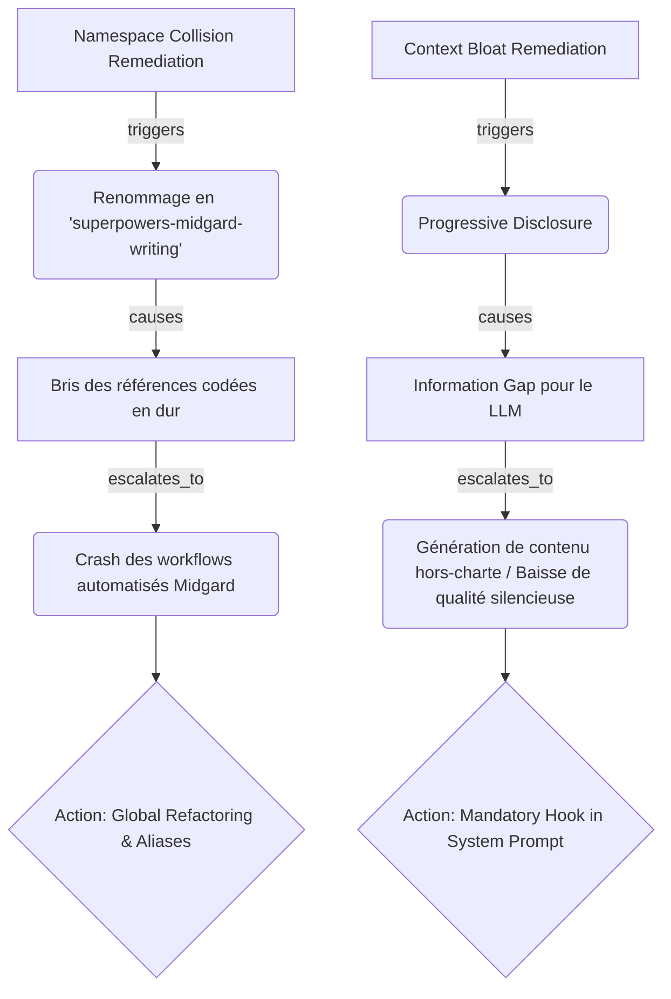

# PREMORTEM CERTIFICATION REPORT: N4 CURATOR-PRIME AUDIT

## 1. Executive Summary & Scoring Table
L'audit prédictif a évalué les recommandations du nœud N4 (Curator-Prime) concernant la remédiation du Context Bloat (Progressive Disclosure) et du Namespace Collision (Renommage explicite). Le score de résilience initial de ces propositions est estimé à 75%. Des risques majeurs de "Silent Failure" (oubli du LLM) et de bris de dépendances ont été identifiés. Un statut `WARNING_ISSUED` est déclaré, conditionnant le GO à l'application stricte des mitigations.

## 2. Verifications & Assumption Matrix
| Assumption | Verification Status | Confidence |
| :--- | :--- | :--- |
| Le renommage n'affectera que la compétence locale ciblée | UNVERIFIED | LOW |
| Le LLM saura quand invoquer les règles masquées par la divulgation différée | REFUTED | HIGH |
| La base de code/prompts peut être mise à jour de façon atomique | UNVERIFIED | MEDIUM |

## 3. Failure Scenarios (FMEA Matrix)
| Identified Failure Mode | Probability | Severity | Detectability | RPN | Mitigation |
| :--- | :---: | :---: | :---: | :---: | :--- |
| **Bris de dépendances (Renommage)** : Les agents/prompts existants appellent l'ancien nom de la compétence, causant un crash `SkillNotFound`. | 4 | 4 | 2 | **32** | Maintenir un alias/symlink de l'ancien nom, ou exécuter un refactoring global (`grep`) avant le commit. |
| **Omission Silencieuse (Progressive Disclosure)** : Le LLM ignore l'existence des règles détaillées car elles ne sont pas dans son contexte initial, générant un contenu hors-norme. | 5 | 4 | 4 | **80** | Insérer un "Hook" (déclencheur) déterministe et impératif dans le prompt principal (ex: "MANDATORY: CALL tool X before writing"). |
| **Friction d'Invocation (Renommage)** : Lord Mahonheim utilise l'ancien nom par habitude, dégradant l'UX. | 3 | 2 | 1 | **6** | Communication explicite et mise à jour de la documentation d'invocation (`--help`). |
| **Boucle Infinie / Hallucination de contexte** : Le LLM boucle en essayant de deviner les règles au lieu de les chercher via l'outil de divulgation différée. | 3 | 3 | 3 | **27** | Le hook doit expliciter le nom exact de l'outil ou du fichier à lire. |

## 4. Signal Analysis & Drift Indicators
- **Indicateur de dérive (Renommage)** : Augmentation des erreurs `ToolExecutionError` ou `AgentInitializationError` dans les logs d'orchestration. (Seuil : > 0).
- **Indicateur de dérive (Divulgation différée)** : Génération de texte "générique" par le LLM sans appel préalable à l'outil de récupération de contexte. (Seuil : Tout output final généré sans trace de l'outil d'accès au savoir).

## 5. Risk Knowledge Graph Cascades

## 6. Avis Formel & Garde-fous (Verdict: GO CONDITIONNEL)
**Verdict** : GO CONDITIONNEL (WARNING_ISSUED)

**Clauses obligatoires (Garde-fous) :**
1. **Clause d'Alias (Sur le renommage)** : Tout renommage DOIT s'accompagner d'une phase de transition (Alias/Symlink) le temps que tous les scripts et sous-agents soient mis à jour, ou d'une recherche exhaustive certifiant qu'aucune dépendance n'est brisée.
2. **Clause du Déclencheur Déterministe (Sur la divulgation différée)** : Le "Progressive Disclosure" est mortel pour un LLM s'il est passif. Il DOIT être couplé à un ancrage fort (Hook) dans le système de base du type : `MANDATORY: Execute tool [X] FIRST for all writing tasks to fetch rules. Do NOT skip.`

---
*Signed and certified on MIDGARD by Tesla Premortem.*
