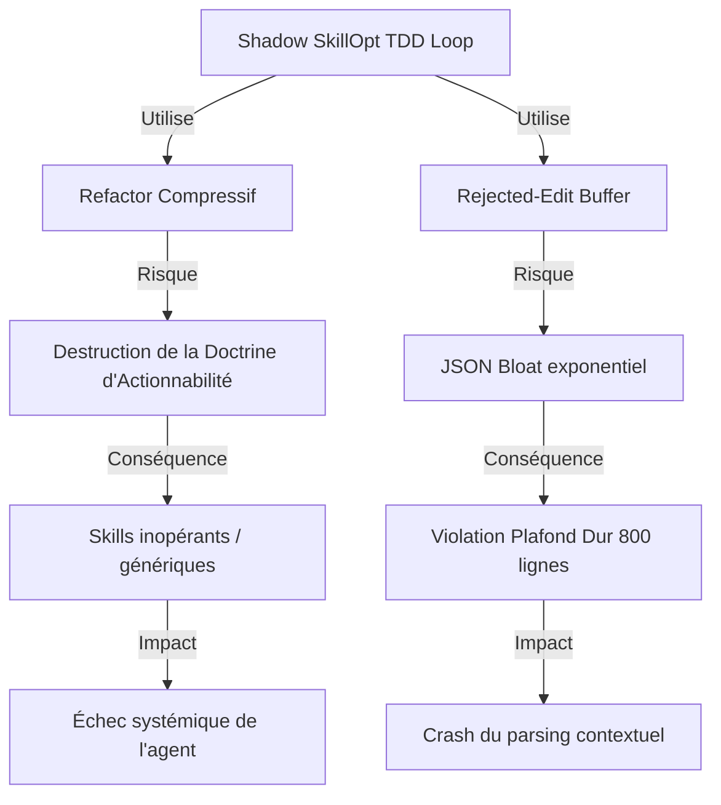

# PREMORTEM CERTIFICATION REPORT: SHADOW SKILLOPT TDD LOOP

## 1. Executive Summary & Scoring Table
Le Nœud 5 (Tesla Premortem) a audité la recommandation du Nœud 4 (Curator-Prime) concernant l'implantation de l'architecture "Shadow SkillOpt TDD Loop" au sein de `superpowers:writing-skills`. 
Bien que l'intention de contrer l'Overfitting et le Context Bloat soit valide, cette architecture introduit deux risques critiques (SPOF cognitifs) par rapport à la doctrine fondamentale Tesla :
1. **Risque de violation de la Doctrine d'Actionnabilité (Règle 14)** par le *Refactor Compressif*.
2. **Risque de violation du Plafond Dur des 800 lignes** par le *Rejected-Edit Buffer*.

L'implémentation est **conditionnée** par l'application absolue des garde-fous décrits dans ce rapport.

**Score Global de Résilience : 72%** (Avant mitigation).

## 2. Verifications & Assumption Matrix
| Assumption | Verification Status | Confidence |
| :--- | :--- | :--- |
| Le Juge séparé possédera assez de contexte pour évaluer le TDD. | UNVERIFIED | Moyenne |
| Le Refactor Compressif saura distinguer l'overhead procédural du bruit. | REFUTED | Faible (l'IA a un biais natif vers l'abstraction sémantique). |
| 3 essais (Circuit Breaker) suffisent pour converger. | VALIDATED | Haute |
| Le dossier `.shadow/` restera strictement éphémère. | UNVERIFIED | Moyenne (risque de fuite sans `.gitignore`). |

## 3. Failure Scenarios (FMEA Matrix)
| Identified Failure Mode | Probability | Severity | Detectability | RPN | Mitigation |
| :--- | :---: | :---: | :---: | :---: | :--- |
| **Compression Abstraite (Règle 14)** : Le Refactor Compressif résume et détruit les instructions procédurales critiques. | 4 | 5 | 3 | **60** | **Contrainte Anti-Abstraction** : Le refactor ne doit cibler QUE le bruit conversationnel et les répétitions. Les chemins de fichiers, commandes, et logiques d'erreur sont intouchables. |
| **Dépassement Plafond 800 (JSON Bloat)** : L'empilement des 3 essais dans `.shadow/rejected_buffer.json` dépasse les 800 lignes. | 5 | 4 | 1 | **20** | **Truncation Active** : Le buffer ne doit stocker que le `reason`, `lint_id` et les n° de lignes concernés, SANS les diffs complets. |
| **Circuit Breaker Aveugle** : Les 3 essais s'épuisent sur la même erreur en boucle (Hallucination persistante). | 3 | 4 | 2 | **24** | **Validation Différentielle** : Le Juge doit rejeter d'office tout essai dont le hash/diff est identique à l'essai précédent. |
| **Fuite de l'Éphémère** : `.shadow/` est commité ou intégré à la base de connaissances. | 2 | 3 | 1 | **6** | **Exclusion Forcée** : Ajouter `.shadow/` dans `.gitignore` ou le purger post-validation. |

## 4. Signal Analysis & Drift Indicators
*   **Signal de Dérive 1** : Ratio de réduction du *Refactor Compressif* supérieur à 40%. Si le code est compressé de plus de 40%, il y a une destruction probable de logique procédurale.
*   **Signal de Dérive 2** : Fichier `rejected_buffer.json` dépassant les 500 lignes à l'essai n°2, indiquant un JSON bloat imminent.
*   **Signal de Dérive 3** : Le Juge séparé émet la même critique lors de deux cycles successifs (preuve que l'Agent Codeur est sourd au feedback).

## 5. Risk Knowledge Graph Cascades

---
*Signed and certified on MIDGARD by Tesla Premortem.*
