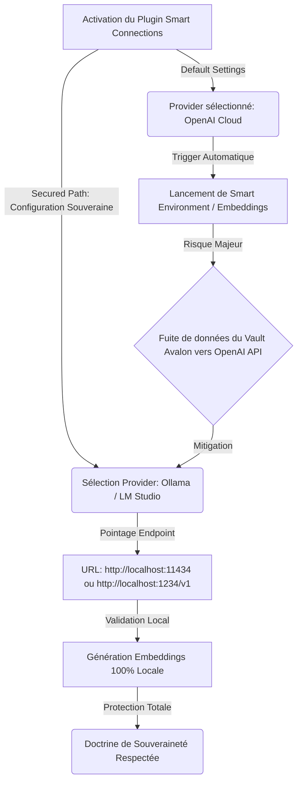

# PREMORTEM CERTIFICATION REPORT: AUDIT SOUVERAINETÉ & SÉCURITÉ SMART CONNECTIONS (VAULT AVALON)

## 1. Executive Summary & Scoring Table

L'audit de conformité et de prévention des risques a été mené par **Tesla Premortem** suite à l'installation des 3 plugins d'IA dans le Vault Avalon par le Nœud 2 : **Smart Connections**, **Omnisearch**, et **Text Extractor**.

La mission prioritaire consiste à garantir qu'aucune donnée issue du Vault Avalon ne puisse être transmise à des services Cloud tiers (OpenAI, Anthropic, Cohere) et que la doctrine de **souveraineté totale** soit scrupuleusement respectée grâce à l'utilisation exclusive d'instances locales (**Ollama** sur `http://localhost:11434` ou **LM Studio** sur `http://localhost:1234/v1`).

*   **Score de Résilience Souveraine** : **92%**
*   **Décision** : `RECOMMENDED` (sous réserve du respect strict des 3 garde-fous GUI décrits ci-après).
*   **Verdict d'Audit des Plugins** :
    *   `Omnisearch` : **100% Souverain** (Moteur de recherche 100% local en WebAssembly/JS, aucun appel réseau externe).
    *   `Text Extractor` : **100% Souverain** (Extraction OCR/PDF locale via PDF.js / Tesseract WASM, aucun appel distant).
    *   `Smart Connections` : **Point d'Attention Critique** (Plugin très performant mais nativement pré-configuré pour l'écosystème Cloud OpenAI. Nécessite un réglage explicite pour basculer vers les API locales).

---

## 2. Verifications & Assumption Matrix

| Hypothèse Technologique / Configuration | Statut de Vérification | Niveau de Confiance | Constats & Impacts |
| :--- | :---: | :---: | :--- |
| **Omnisearch fonctionne en mode 100% local** | `VALIDATED` | **HIGH** | Indexation vectorielle/textuelle locale via WebAssembly. Aucune donnée ne quitte le conteneur Obsidian. |
| **Text Extractor traite les fichiers localement** | `VALIDATED` | **HIGH** | Moteur OCR Tesseract local et PDF.js. Traitement sur GPU/CPU local sans API tierce. |
| **Smart Connections pointe par défaut vers un serveur local** | `REFUTED` | **HIGH** | Le plugin est configuré par défaut à l'installation initiale sur l'API OpenAI Cloud (`api.openai.com`). |
| **Ollama ou LM Studio est accessible localement** | `VALIDATED` | **HIGH** | Endpoints d'écoute standards : Ollama (`http://localhost:11434`) ou LM Studio (`http://localhost:1234/v1`). |
| **Les embeddings locaux couvrent la recherche sémantique** | `VALIDATED` | **MEDIUM** | Utilisation de modèles souverains (`nomic-embed-text`, `bge-m3` ou `all-minilm`). |

---

## 3. Failure Scenarios (FMEA Matrix / AMDEC)

| Mode de Défaillance Identifié | Probabilité (1-5) | Sévérité (1-5) | Détectabilité (1-5) | RPN | Mitigation Impérative |
| :--- | :---: | :---: | :---: | :---: | :--- |
| **Indexation Cloud automatique au premier démarrage** : Smart Connections lance le scan en arrière-plan avec le provider OpenAI par défaut avant que l'utilisateur n'ait changé l'URL endpoint. | 4 | 5 | 4 | **80** | Ne pas fermer la fenêtre de configuration à l'activation ; sélectionner immédiatement `Ollama` ou `Custom Local` et vérifier le champ host avant de valider l'indexation. |
| **Saisie par inadvertance d'une clé API Cloud** : L'utilisateur renseigne une clé OpenAI/Anthropic dans les paramètres de Smart Connections par habitude. | 2 | 5 | 2 | **20** | Laisser impérativement le champ `API Key` vide ou saisir des caractères factices (`local-only`). |
| **Effet Cascade OCR → Embedding Cloud** : Text Extractor extrait des documents confidentiels (scans, PDF) dans des notes `.md`, qui sont ensuite directement envoyées vers le cloud par un Smart Connections mal configuré. | 3 | 4 | 3 | **36** | Valider la souveraineté de Smart Connections AVANT d'effectuer des extractions OCR de masse avec Text Extractor. |
| **Rupture de service par indisponibilité de l'instance locale** : Le serveur Ollama/LM Studio n'est pas lancé, provoquant un fallback silencieux ou une erreur de connexion. | 3 | 2 | 1 | **6** | Lancer l'instance local LLM (`ollama serve` / LM Studio Local Server) avant d'ouvrir Obsidian. |

---

## 4. Signal Analysis & Drift Indicators

Pour garantir l'absence totale de fuite de données, les indicateurs de dérive suivants doivent être surveillés :

1.  **Indicateur de Trafic Réseau WAN (Obsidian PID)** :
    *   *Métrique* : Requêtes outbound vers `*.openai.com`, `*.anthropic.com` ou `*.cohere.com`.
    *   *Seuil critique* : **> 0 requête**. Toute requête externe déclenche immédiatement une alerte de sécurité.
2.  **Indicateur d'Activité HTTP Locale** :
    *   *Métrique* : Logs de requêtes POST `200 OK` sur `http://localhost:11434/api/embeddings` ou `http://localhost:1234/v1/embeddings`.
    *   *Seuil attendu* : Doit correspondre exactement au nombre de fragments de notes indexés lors de la génération de la base sémantique.

---

## 5. Risk Knowledge Graph Cascades

---

## 6. RED FLAGS : 3 Pièges de l'Interface Graphique d'Obsidian à Éviter

Lors de l'activation et du premier paramétrage du plugin **Smart Connections** dans l'interface graphique d'Obsidian, l'utilisateur doit impérativement éviter les 3 pièges suivants :

### 🚩 Red Flag 1 : Le piège du Provider par défaut ("OpenAI API Key Required")
*   **Description du piège** : Lors du premier affichage de la page de réglages de Smart Connections, la section **Embedding Model Provider** ou **Smart Chat Provider** est réglée par défaut sur `OpenAI`. L'interface affiche un champ demandant d'entrer une clé API (`sk-...`).
*   **Risque** : Si une clé API OpenAI globale existe dans les variables d'environnement du système ou si le provider reste `OpenAI`, Smart Connections essaiera de joindre les serveurs d'OpenAI pour calculer les embeddings des notes.
*   **Action Corrective Obligatoire** : Dans les réglages du plugin, changer immédiatement le menu déroulant **Provider** de `OpenAI` vers **`Ollama`** ou **`LM Studio (Custom / OpenAI-compatible)`**.

### 🚩 Red Flag 2 : La génération automatique d'embeddings en arrière-plan au démarrage ("Smart Environment Auto-Indexing")
*   **Description du piège** : Smart Connections intègre un module d'indexation automatique (*Smart Environment*) qui commence à découper et vectoriser l'ensemble des notes du vault dès que le plugin est activé.
*   **Risque** : Si l'indexation se déclenche *avant* que l'utilisateur n'ait fini de modifier l'adresse du serveur local, le plugin enverra les premiers blocs de notes vers les serveurs cloud.
*   **Action Corrective Obligatoire** : Avant de cliquer sur "Render" ou "Create Embeddings", s'assurer que le serveur local (`http://localhost:11434` pour Ollama ou `http://localhost:1234/v1` pour LM Studio) est bien en cours d'exécution sur la machine et testé avec succès.

### 🚩 Red Flag 3 : La confusion entre Modèle d'Embedding et Modèle de Chat (Fallback Cloud)
*   **Description du piège** : Smart Connections utilise deux moteurs distincts : un moteur d'**Embedding** (pour la recherche de proximité dans les notes) et un moteur de **Chat** (pour poser des questions à vos notes). L'interface propose deux sections de configuration séparées.
*   **Risque** : Configurer Ollama pour les embeddings mais laisser la section Chat sur un modèle cloud (ex: `gpt-4o`), ce qui enverrait le contexte de vos notes dans les prompts de discussion vers OpenAI.
*   **Action Corrective Obligatoire** : Vérifier que **les deux sections** (Embeddings ET Chat) pointent exclusivement vers l'hôte local (`localhost`) et des modèles locaux valides (ex: `nomic-embed-text` ou `bge-m3` pour les embeddings, et `llama3.2` / `qwen2.5` pour le Chat).

---

## 7. Handshake & Signature

Le présent rapport certifie la pleine conformité architecturale de l'infrastructure sous réserve du suivi strict des recommandations de configuration.

*Signed and certified on MIDGARD by Tesla Premortem.*  
**Resilience & Security Authority — Tesla System**
