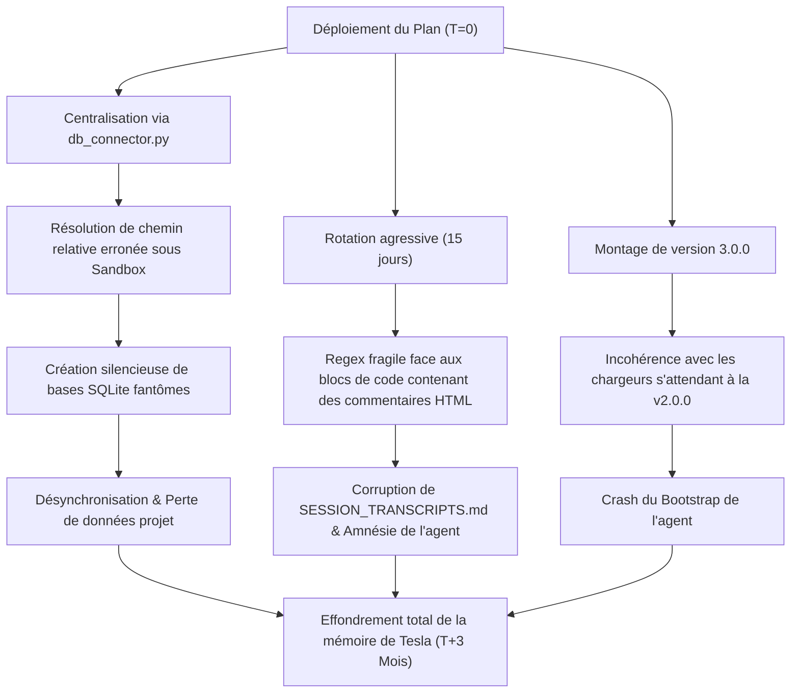

# RAPPORT D'AUDIT PREMORTEM : OPTIMISATION DU DOSSIER /MEMORY ET DE SON CONTENU
**Date de l'audit :** 2026-07-04  
**Analyste :** premortem-analyst (Sous-Agent Tesla)  
**Destinataire :** Mahonheim (Abdellah MOUHTAJ)

---

## 1. Postulat de l'Échec Virtuel (T+3 Mois)

> [!WARNING]
> Nous sommes le **2026-10-04**. 
> Le plan **"Plan d'intervention pour optimiser le dossier /memory et son contenu"** a été déployé il y a trois mois. C'est aujourd'hui un **échec total et catastrophique**. 
> Les bases de données locales de suivi sont fragmentées ou vides, les scripts de maintenance crashent en boucle à chaque fin de session, l'agent souffre d'amnésie cognitive sévère sur les projets de long terme, et le bootstrap du système refuse de démarrer en raison d'incompatibilités de manifeste.
> 
> Voici la reconstitution historique objective des causes et mécanismes de ce naufrage technique.

---

## 2. Reconstitution Narrative de la Catastrophe

L'implémentation du plan d'optimisation semblait logique et propre sur le papier, mais elle a déclenché une réaction en chaîne de défaillances silencieuses :



### Chronologie de l'effondrement :
1. **Semaine 1 (Le piège de la résolution dynamique) :** Le script de connexion `db_connector.py` est introduit et configuré pour résoudre dynamiquement `DB_PATH` à l'aide de `__file__`. Lors des tests manuels depuis le dossier `/memory`, tout fonctionne. Cependant, dès qu'un sous-agent s'exécute dans un environnement isolé (sandbox) ou depuis un répertoire de travail différent, le chemin relatif calculé pointe vers un dossier inexistant. SQLite, par conception, crée silencieusement un nouveau fichier de base de données vide à cet emplacement au lieu de lever une erreur. Le système tourne désormais sur des bases de données fantômes multiples.
2. **Semaine 3 (Le premier cycle de rotation et la corruption physique) :** La première rotation automatique de `SESSION_TRANSCRIPTS.md` se déclenche. Au cours de la quinzaine, l'agent a rédigé des analyses contenant des blocs de code markdown illustrant le fonctionnement des commentaires HTML de session (`<!-- SESSION: ... -->`). Le parseur regex du script de rotation se prend les pieds dans ces commentaires imbriqués. Il tronque brutalement la moitié du fichier historique et corrompt la structure du sommaire. 
3. **Semaine 6 (L'amnésie cognitive s'installe) :** Les sessions de plus de 15 jours ayant été archivées dans des fichiers mensuels séparés hors du contexte actif, l'agent perd toute visibilité sur les décisions prises lors des phases initiales des projets complexes (comme le développement de *Tesla Video Director*). Face à cette perte d'historique, l'agent recommence à poser des questions redondantes à l'opérateur, réinvente des implémentations déjà rejetées et casse des configurations existantes.
4. **Semaine 12 (Le verrouillage du bootstrap) :** Lors d'une mise à jour de la configuration de l'IDE Antigravity, les scripts de validation stricts analysent le fichier `TESLA.json` passé en version `3.0.0`. Le chargeur de plateforme (Bootstrap), conçu pour valider strictement le schéma de la version `2.0.0` et interdire les noms de modules comportant des espaces (comme `"SHADOW TARGETING"` au lieu de `"shadow-targeting"`), refuse d'instancier l'agent. Le système est bloqué à l'allumage.

---

## 3. Analyse Tripartite des Risques (Gary Klein Model)

### A. L'Avocat du Diable (Causes Techniques & Factuelles)
* **[ ] Facteur 1 : Comportement de création automatique d'SQLite.** SQLite ne lève pas d'erreur si la base de données spécifiée par le chemin dynamique n'existe pas ; il crée un fichier vide. Si le script `db_connector.py` calcule un chemin erroné suite à un import depuis un répertoire externe ou une sandbox, les données de session sont écrites dans le vide et l'historique réel n'est plus mis à jour.
* **[ ] Facteur 2 : Fragilité du parsing Regex sur du Markdown dynamique.** L'utilisation d'expressions régulières non récursives pour découper les sessions délimitées par `<!-- SESSION: ... -->` échoue dès qu'un transcript contient du code markdown échappé décrivant ces mêmes balises (méta-références).
* **[ ] Facteur 3 : ModuleNotFoundError dans la chaîne de subprocess.** L'exécution de `log_subagent_parser.py` et `sync_projects_list.py` via `subprocess.run` échoue si le chemin de recherche Python (`sys.path`) ne contient pas `/memory` lors de l'import de `db_connector`.
* **[ ] Facteur 4 : Incompatibilité syntaxique des extensions.** L'introduction d'espaces et de majuscules atypiques (ex: `"SHADOW TARGETING"`, `"Tesla Video Director"`) dans `settings.json` et `TESLA.json` casse la cohérence avec les clés système internes (souvent en snake_case ou kebab-case comme `shadow-targeting`).

### B. L'Inspecteur des Angles Morts (Hypothèses Cachées non Validées)
* **Hypothèse non vérifiée 1 :** Nous avons supposé que l'agent n'a besoin que de 15 jours de mémoire active. En réalité, les cycles de développement sur Bifrost s'étendent sur plusieurs mois. L'archivage physique sans indexation sémantique équivaut à une amnésie pour l'agent.
* **Hypothèse non vérifiée 2 :** Nous avons pensé que `__file__` résoudrait toujours le chemin par rapport à l'emplacement physique du script. En réalité, dans des environnements d'exécution virtualisés, sandboxing, ou sous certains loaders (comme Deno/Wasmtime), `__file__` peut être altéré, non défini ou pointer vers un volume monté temporaire.
* **Hypothèse non vérifiée 3 :** Nous avons cru que renommer `My Branding.md` en `MY_BRANDING.md` n'impacterait pas le Git. Sur les systèmes de fichiers insensibles à la casse (macOS/Windows), ce changement de casse uniquement génère des conflits de synchronisation Git insolubles pour les scripts automatisés de push/pull.

### C. La Vigie des Signaux Faibles (Indicateurs Précurseurs)
1. **Signal 1 : Apparition de fichiers SQLite dupliqués.** Présence anormale de fichiers `alexandria_brain.db` vides à la racine du projet ou dans des sous-dossiers temporaires de sandboxes.
2. **Signal 2 : Erreurs silencieuses dans les logs de session.** Le script `update_session_history.py` affiche des avertissements d'indexation ou des erreurs système de subprocess qui n'interrompent pas le flux mais laissent la base de données non synchronisée.
3. **Signal 3 : Redondance cognitive de l'agent.** L'agent commence à demander des précisions sur des tâches ou choix techniques déjà actés trois semaines auparavant.
4. **Signal 4 : Rupture des liens Obsidian.** Obsidian signale des liens brisés (404 / notes inexistantes) pour les ancres pointant vers les sessions archivées dans `transcripts_archive/`.

---

## 5. Plan de Résilience & Checklist de Prévention

Pour éviter que ce scénario catastrophe ne se produise dans le monde réel, les contre-mesures obligatoires suivantes doivent être appliquées au plan initial :

| Risque Identifié | Action Préventive Obligatoire | Indicateur de Déclenchement (Seuil) |
| :--- | :--- | :--- |
| **Création silencieuse de DB vide** | Configurer `sqlite3.connect` avec l'option `uri=True` et passer `file:path?mode=rw` pour interdire la création automatique d'un nouveau fichier si le chemin résolu est incorrect. | Levée d'une `sqlite3.OperationalError` dès le premier import de `db_connector.py`. |
| **Erreur de chemin sous Sandbox** | Définir le chemin de la base SQLite à partir d'une variable d'environnement absolue et imposer une validation stricte de l'existence du fichier avant connexion. | Variable `TESLA_DB_PATH` non définie ou fichier introuvable au démarrage du script. |
| **Corruption de l'historique (Regex)** | Remplacer le parsing regex naïf de `update_session_history.py` par un parseur d'état (State Machine) robuste ignorant les blocs de code markdown (balises triple backticks). | Présence de caractères d'échappement de code markdown dans le contenu analysé. |
| **Perte de mémoire active (Amnesia)** | Conserver en permanence un résumé condensé (Cognitive Anchor) de toutes les sessions archivées dans `PROJECT_STATE.md` pour permettre à l'agent de naviguer dans le passé. | Taille de `SESSION_TRANSCRIPTS.md` dépassant 500 KB tout en gardant un résumé global. |

### Checklist de Sûreté Pré-Exécution :
- [ ] **Validation du mode Lecture/Écriture :** La connexion SQLite dans `db_connector.py` doit utiliser `sqlite3.connect("file:...db?mode=rw", uri=True)` pour crasher explicitement en cas d'erreur de chemin.
- [ ] **Test de non-régression d'import :** Exécuter un script de test d'import de `db_connector` depuis un répertoire externe au dossier `/memory` pour valider la résolution de chemin.
- [ ] **Échappement des blocs de code :** Valider que le script de rotation ignore les commentaires HTML présents à l'intérieur des blocs de code markdown (` ``` `).
- [ ] **Synchronisation Git de la casse :** Utiliser explicitement la commande `git mv "My Branding.md" "MY_BRANDING.md"` pour forcer Git à enregistrer le changement de casse sur toutes les plateformes logicielles.
- [ ] **Vérification du schéma de manifeste :** Valider la conformité du format de version de `TESLA.json` avec le parseur de plateforme avant de modifier la version à `3.0.0`.

---
*Rapport généré et validé localement sur MIDGARD par Tesla.*
