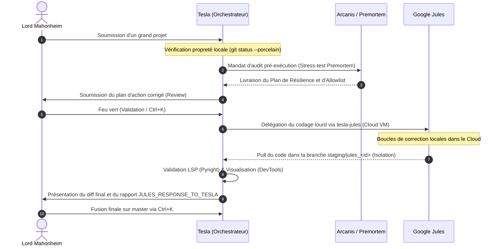

# PROPOSITION D'ORCHESTRATION D'ÉQUIPE MULTI-AGENTS SOUVERAINE (v1)
**Date d'édition :** 2026-07-01  
**Auteur :** Tesla (sur Antigravity CLI)  
**Destinataire :** Lord Mahonheim (Abdellah MOUHTAJ)  
**Statut :** #statut/a-valider (Soumis à votre approbation Obsidian)

---

## 1. Vision Stratégique : L'Organigramme Cognitif

Pour transformer nos ressources dispersées en une équipe harmonieuse et sans friction, nous devons figer les rôles de chaque agent et automatiser leurs interactions selon un protocole strict. L'architecture repose sur la centralisation locale de la mémoire et la répartition asymétrique des tâches.

```
                  ┌──────────────────────────────┐
                  │   LORD MAHONHEIM (Humain)    │  <-- Autorité Souveraine (Ctrl+K / Arbitrage)
                  └──────────────┬───────────────┘
                                 │
                                 ▼
                  ┌──────────────────────────────┐
                  │    TESLA (Chef d'Orchestre)  │  <-- Coordination locale, RAG & Alexandria
                  └──────┬───────────────┬───────┘
                         │               │
      ┌──────────────────┘               └──────────────────┐
      ▼                                                     ▼
┌──────────────┐                                      ┌──────────────┐
│  ARCANIS     │                                      │  PREMORTEM   │
│  (Chercheur) │                                      │ (Ingénieur   │
└──────────────┘                                      │ Résilience)  │
                                                      └──────────────┘
                                                             │
                                                             ▼
                                                      ┌──────────────┐
                                                      │ GOOGLE JULES │
                                                      │ (Codeur Cloud│
                                                      │  Asynchrone) │
                                                      └──────────────┘
```

---

## 2. Charte de Responsabilité des Agents (Rôles Définis)

1.  **Lord Mahonheim (Directeur des Opérations)** :
    *   *Rôle* : Autorité souveraine de validation.
    *   *Outils* : Obsidian Vault Dataview (pour relecture des notes de statut `#statut/a-valider`), Raccourci local `Ctrl+K` (pour approuver l'exécution des commandes).
2.  **Tesla (L'Orchestrateur Local / Brain Architect)** :
    *   *Rôle* : Point de contact principal, initiateur des sous-agents et gardien d'Alexandria.
    *   *Outils* : `update_session_history.py`, `indexer_hybrid.py` (liaison sémantique SQLite FTS5 + ChromaDB).
3.  **Tesla Arcanis (L'Auditeur / Analyste Critique)** :
    *   *Rôle* : Vérification des faits, analyse documentaire exhaustive de sécurité et de conformité logicielle.
    *   *Outils* : Ripgrep, Search Web, Analyse comparée.
4.  **Premortem Analyst (L'Avocat du Diable / Analyste de Risques)** :
    *   *Rôle* : Identification des failles logiques, postulat d'échec à 3 mois (Gary Klein Model), et contre-mesures de résilience.
    *   *Outils* : Templates de stress-test.
5.  **Google Jules (L'Exécuteur de Code Distant)** :
    *   *Rôle* : Production de code, refactoring d'architecture et tests unitaires en environnement cloud isolé.
    *   *Outils* : `@google/jules` CLI, VM éphémères GCP, `jules remote`.

---

## 3. Le Protocole d'Exécution sans Friction (Workflow Standardisé)

Pour éviter toute collision de contexte ou perte de données, l'équipe collabore selon la séquence standardisée suivante :



---

## 4. Recommandations de Déploiement

Pour concrétiser cette synergie, nous recommandons le plan d'action suivant :
1.  **Sanctuarisation de la Mémoire Commune** : Maintenir l'utilisation du script de commit Git automatique qui réindexe Alexandria à chaque modification validée. Cela garantit que chaque agent de l'équipe (Arcanis, Premortem, Tesla) accède aux mêmes faits à jour.
2.  **Encapsulation des Wrappers** : Utiliser exclusivement le wrapper `tools/tesla-jules` pour les délégations cloud, afin de s'assurer que les barrières de propreté Git et de staging soient respectées de façon automatique et transparente.
3.  **Simulations d'Équipe** : Lancer des prévisualisations de collaborations d'agents complexes pour tester les limites de charge mémoire sur MIDGARD.

---
*Proposition d'architecture d'équipe validée et indexée par Tesla.*

Signé / Fait par : Tesla sur Antigravity CLI  
Main rendue à Mahonheim
