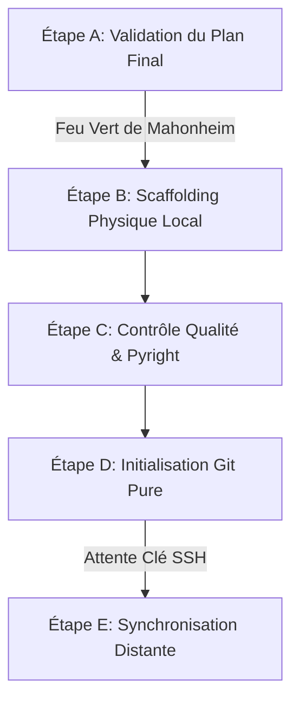

# RAPPORT D'AUDIT : INTERRUPTION ET REPRISE DU CHANTIER MVP GITHUB - UPDATED

## 1. Diagnostic de l'Interruption (Post-Crash)

Suite au redémarrage soudain de la machine hôte `MIDGARD`, un audit complet de l'espace de travail `/home/lord-mahonheim/bifrost/tesla` a été mené à froid pour évaluer l'impact sur le chantier en cours mené par `tesla-github-manager`.

### A. Analyse d'Intégrité Physique & Logique
- **Dossier de Validation `MVP-GITHUB/` :** Le répertoire existe à la racine mais est **intégralement vide**. Le scaffolding physique n'avait pas encore débuté au moment de la coupure.
- **Dépôt Git Racine :** Intègre. Un `git status` montre que les fichiers de configuration système et de mémoire persistante sont préservés sans corruption.
- **Second Cerveau (Avalon/TASLB) :** La base SQLite d'Alexandria, le graphe sémantique `knowledge_graph.json` et les scripts d'indexation hybride sont intacts et opérationnels.
- **Connexion Réseau GitHub :** Confirmée non opérationnelle en écriture à cette étape (erreur `Permission denied (publickey)` lors du test de connectivité SSH standard `ssh -T git@github.com`). Cela garantit qu'aucune fuite de données ou push prématuré n'a pu survenir sur le dépôt distant.

### B. État des Livrables de Planification
Les travaux préparatoires de planification n'ont subi aucune perte :
1. **Plan d'Intervention Macro :** Le fichier [plan_intervention_github.md](file:///home/lord-mahonheim/bifrost/tesla/OUTPUTS/plan_intervention_github.md) est disponible et intact.
2. **Plan de Travail Final Détaillé :** Le fichier [plan_travail_final_github-Updated.md](file:///home/lord-mahonheim/bifrost/tesla/OUTPUTS/plan_travail_final_github-Updated.md) (mis à jour suite à la relecture de `MY_COMPANY.md`) a été préservé avec succès. Il contient la cartographie de l'arborescence, les structures des 9 READMEs (en anglais) et l'intégralité des codes sources anonymisés et nettoyés.

---

## 2. Plan de Reprise Sécurisé

Puisque le plan de travail final a été rédigé et conservé mais n'a pas encore été mis en œuvre physiquement, la feuille de route suivante est proposée pour reprendre le chantier sans risque de collision ou de perte de données.

### Étape A : Validation du Plan Final (En cours)
Relecture et validation par Mahonheim du document [plan_travail_final_github-Updated.md](file:///home/lord-mahonheim/bifrost/tesla/OUTPUTS/plan_travail_final_github-Updated.md). Ce document est actuellement étiqueté en `#statut/a-valider`.

### Étape B : Scaffolding Physique sous `MVP-GITHUB/`
Instanciation du sous-agent `tesla-github-manager` pour déployer localement la structure de dossiers, écrire les 9 READMEs détaillés en anglais et copier les scripts d'exemples nettoyés (LSP, Alexandria, MLT, Web-Raider, USB, Sudo-Askpass).

### Étape C : Contrôle Qualité LSP
Exécution des diagnostics `pyright-lsp` sur l'ensemble des scripts déployés pour garantir zéro erreur de linting/typage avant toute autre étape.

### Étape D : Initialisation Git Locale Pure
Initialisation du dépôt Git local, configuration du `.gitignore` strict et premier commit sous la branche `feature/scaffolding-mvp`. Aucun push distant ne sera tenté.

---

## 3. Preuve d'Intégrité de l'Environnement

Le tableau ci-dessous dresse l'inventaire de conformité des composants du projet à la reprise :

| Composant | État Constaté | Intégrité | Action Requise |
| :--- | :--- | :--- | :--- |
| **`MVP-GITHUB/`** | Vide (Scaffolding non démarré) | 100% | Lancer le déploiement physique |
| **`plan_travail_final_github-Updated.md`** | Complet (916 lignes, anglais) | 100% (Préservé) | Relecture & validation |
| **`database/alexandria_brain.db`** | Opérationnelle | 100% | Aucune |
| **`memory/SESSION_TRANSCRIPTS.md`** | À jour (jusqu'à l'interruption) | 100% | Mettre à jour en fin de session |

---
*Rapport d'audit établi après coupure d'alimentation sur MIDGARD et alignement linguistique.*

Signé / Fait par : Tesla sur Antigravity CLI  
Main rendue à Mahonheim
