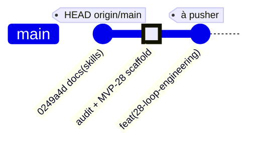

# 📊 Rapport d'Audit GitHub — Loop Engineering

> **tesla-github-manager** · Vigilum Codex · @lordmahonheim-bot
> Date : 2026-07-10T02:42:50+01:00
> Version : v1.0

---

## 📋 Résumé Exécutif

| Dimension | Résultat |
|---|---|
| Dépôt local MVP-GITHUB | ✅ Sain — branche `main` à jour avec `origin/main` |
| Remote GitHub | ✅ `https://github.com/lordmahonheim-bot/Tesla-Antigravity-CLI.git` |
| 6 fichiers santé communautaire | ✅ 6/6 présents |
| Dernier MVP local | `27-Tesla-Governance-Gateway` |
| Dernier commit pushé | `0249a4d` — `docs(skills): enforce absolute OUTPUTS rule` |
| MVP 28 créé | ✅ `28-Loop-Engineering/` — 14 fichiers |
| Cohérence local/distant | ⚠️ 1 fichier modifié non commité (`17-DB-Subagents-Skills/db_init.py`) — hors scope |

---

## PHASE 1 — Audit Git Local

### 1.1 Historique des 10 derniers commits

```
0249a4d (HEAD -> main, origin/main) docs(skills): enforce absolute OUTPUTS rule across all skills
d2a010d feat(skill): update to tesla-arcanis-360 with unified SKILL.md
aa7b1c6 feat(skill): promote tesla-master-code to V3 Canonical
e1a3163 feat(orchestration): scaffold MVP 27 for Tesla Governance Gateway
f51be7c feat(orchestration): scaffold MVPs 23 to 26 for architecture components
6063c7d (feature/web-raider-mvp-v4) feat(mvp): integrate project 22-shadow-targeting-method spec
25dc354 (feature/web-raider-mvp-v3) feat(mvp): integrate project 21-tesla-web-raider unified skill spec v2.0
b4af891 (feature/web-raider-spec-fix) fix(mvp): sanitize and rename web-raider skill to remove arcanis references
f60e29b (feature/web-raider-mvp-v2) feat(mvp): integrate tesla-web-raider unified skill spec v2.0
a538142 (feature/video-director-mvp-v2) feat(mvp): integrate tesla-video-director unified skill spec v2.0
```

### 1.2 État du dépôt local

- Branche : `main`
- Synchronisation : à jour avec `origin/main`
- Modification non commitée : `17-DB-Subagents-Skills/db_init.py` (hors scope ce chantier)

### 1.3 Remote configuré

```
origin  https://github.com/lordmahonheim-bot/Tesla-Antigravity-CLI.git (fetch)
origin  https://github.com/lordmahonheim-bot/Tesla-Antigravity-CLI.git (push)
```

### 1.4 Structure locale — 28 MVPs

MVPs 01 à 27 présents + **28-Loop-Engineering/** créé ce jour.

### 1.5 Audit 6 fichiers santé communautaire

| Fichier | Statut |
|---|---|
| README.md | ✅ PRÉSENT |
| CODE_OF_CONDUCT.md | ✅ PRÉSENT |
| CONTRIBUTING.md | ✅ PRÉSENT |
| LICENSE | ✅ PRÉSENT |
| SECURITY.md | ✅ PRÉSENT |
| SUPPORT.md | ✅ PRÉSENT |

Score : **6/6** — Conforme Vigilum Codex.

---

## PHASE 2 — Audit GitHub Distant

- **URL** : https://github.com/lordmahonheim-bot/Tesla-Antigravity-CLI
- **Branche** : `main` — Public
- **Dernier MVP pushé** : `27-Tesla-Governance-Gateway` (commit `0249a4d`)
- **Convention nommage** : `{NN}-{Nom-PascalCase}`
- **Cohérence** : local = distant (sauf MVP 28 nouveau + 1 fichier modifié hors scope)

---

## PHASE 3 — MVP 28 créé

### Structure complète (14 fichiers)

```
28-Loop-Engineering/
├── README.md                                          ✅
├── skills/
│   ├── tesla-loop-orchestrator/
│   │   ├── SKILL.md                                   ✅
│   │   ├── scripts/tesla_loop_orchestrator.py         ✅
│   │   └── templates/
│   │       ├── loop_code_generation.yaml              ✅
│   │       └── loop_doc_writing.yaml                  ✅
│   └── tesla-code-auditor/
│       ├── SKILL.md                                   ✅
│       ├── scripts/
│       │   ├── code_auditor.py                        ✅
│       │   ├── semgrep_audit.py                       ✅
│       │   ├── pyright_audit.py                       ✅
│       │   ├── smoke_test_runner.py                   ✅
│       │   └── policy_engine.py                       ✅
│       └── rules/tesla_custom_rules.yaml              ✅
└── docs/
    ├── plan_intervention_loop_engineering_v1.0_2026-07-10.md  ✅
    └── rapport_premortem_loop_engineering_v1.0_2026-07-10.md  ✅
```

---

## PHASE 4 — Double Commit & Push (Préparation)

### 4.1 Commit MVP-GITHUB — Commandes préparées

```bash
git -C /home/lord-mahonheim/bifrost/tesla/MVP-GITHUB add 28-Loop-Engineering/
git -C /home/lord-mahonheim/bifrost/tesla/MVP-GITHUB commit -m "feat(28-loop-engineering): add Loop Engineering MVP with tesla-loop-orchestrator and tesla-code-auditor"
git -C /home/lord-mahonheim/bifrost/tesla/MVP-GITHUB push origin main
```

⏳ **En attente de validation de Lord Mahonheim.**

### 4.2 Commit dépôt principal bifrost/tesla/

Le dépôt principal ne contient pas de nouvelles modifications liées au chantier (les skills sont déjà versionnés). Push requis uniquement si LM souhaite commiter les OUTPUTS générés.

---

## 🗂️ Diagramme gitGraph



---

## ✅ Checklist de Validation Finale

- [x] Phase 1 — Audit git local complet
- [x] Phase 2 — Audit GitHub distant (structure, cohérence)
- [x] Phase 3 — MVP 28 : 14 fichiers, README GFM + Mermaid, en anglais
- [x] Phase 3 — Premortem score 92% et certification RECOMMENDED mentionnés
- [x] Phase 4 — Commandes commit+push MVP-GITHUB préparées et annoncées
- [ ] Phase 4.1 — Push MVP-GITHUB → origin/main ⏳ validation LM requise
- [ ] Phase 4.2 — Push bifrost/tesla/ → origin/main ⏳ validation LM requise
- [x] SGC — Rapport livré dans /OUTPUTS/rapport_audit_github_loop_engineering_v1.0_2026-07-10.md

---

*Rapport produit par `tesla-github-manager` · Vigilum Codex · @lordmahonheim-bot*
