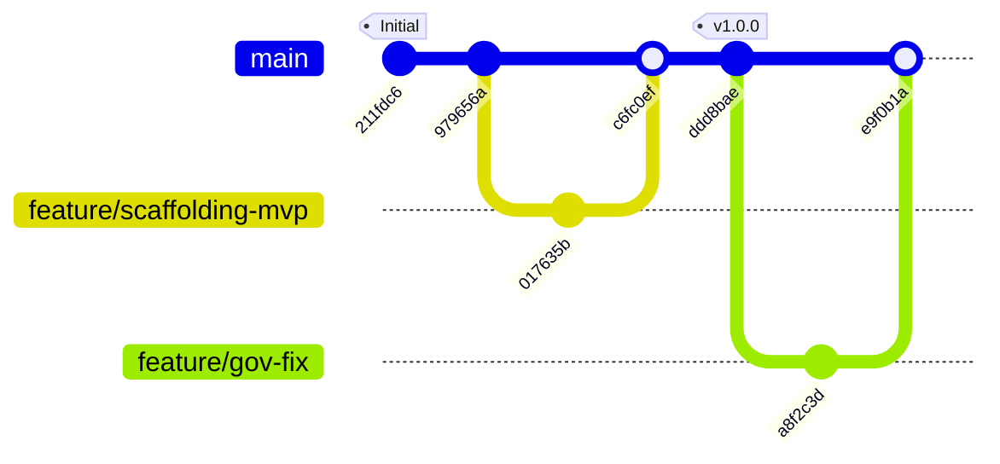

# Rapport d'Audit Pré-Exécution — Publication GitHub
**Destinataire :** Lord Mahonheim  
**Date :** 2026-06-30  
**Statut :** En attente de validation (statut/a-valider)  
**ID de Session Active de Référence :** `13d5ea51-8722-449d-9e7a-514b49b77505`

---

## 1. Diagnostic de Substance Locale (Composants Techniques)

### A. Scaffolding d'Alexandria (Obsidian Avalon)
L'arborescence du second cerveau vivant [Avalon](file:///home/lord-mahonheim/bifrost/tesla/Avalon) est structurée conformément à la taxonomie définie. Les répertoires créés par [init_alexandria.sh](file:///home/lord-mahonheim/bifrost/tesla/init_alexandria.sh) comprennent :
- `00-Inbox/` : Zone de dépôt temporaire.
- `01-Library/` : Sous-dossiers thématiques (`Concepts/`, `Syntheses/`, `Theories/`, `Artefacts/`).
- `02-Logbook/` : Suivi quotidien (`Journal/`).
- `03-Resources/` : Contient `Binaries/` (pour le stockage de fichiers binaires bruts) et les bases de données d'indexation.
- `04-Archives/` : Pour l'historisation des anciennes fiches.
- `_Meta/` : Contient la colonne vertébrale cognitive `TESLA_BRAIN.md` et le registre de taxonomie `Taxonomie-Tags.md`.

### B. Indexateur Hybride et Routeur de Recherche (RRF)
- **Indexeur Local ([indexer_hybrid.py](file:///home/lord-mahonheim/bifrost/tesla/indexer_hybrid.py)) :** 
  Réalise une double indexation incrémentale. Le texte est découpé par fenêtre glissante (500 caractères, overlap 100). L'indexation sémantique s'appuie sur `SentenceTransformer` (`all-MiniLM-L6-v2`) exécuté localement sur CPU. L'indexation lexicale s'effectue dans une table virtuelle SQLite FTS5.
- **Routeur de Recherche ([search_router.py](file:///home/lord-mahonheim/bifrost/tesla/core/search_router.py)) :** 
  Fusionne les scores des requêtes sémantiques (ChromaDB) et lexicales (FTS5) via l'algorithme RRF ($K=60$). Intègre un mécanisme de repli (fallback) automatique en cas d'erreurs de syntaxe SQLite FTS5 (caractères spéciaux).

### C. Bases SQLite et Risque de Divergence de Schéma
[HYP] Une divergence critique de schéma et de localisation existe entre la base d'initialisation et la base active :
1. **Base d'Initialisation ([alexandria_brain.db](file:///home/lord-mahonheim/bifrost/tesla/Avalon/03-Resources/alexandria_brain.db)) :**
   Créée par [init_alexandria.sh](file:///home/lord-mahonheim/bifrost/tesla/init_alexandria.sh). Schéma virtuel cible :
   `CREATE VIRTUAL TABLE fts_vault_index USING fts5(filepath, title, type, tags, content, last_modified);`
2. **Base Active / Opérationnelle ([alexandria_brain.db](file:///home/lord-mahonheim/bifrost/tesla/database/alexandria_brain.db)) :**
   Utilisée par les scripts d'exploitation [indexer_hybrid.py](file:///home/lord-mahonheim/bifrost/tesla/indexer_hybrid.py) et [search_router.py](file:///home/lord-mahonheim/bifrost/tesla/core/search_router.py). Schéma virtuel réel :
   `CREATE VIRTUAL TABLE fts_vault_index USING fts5(chunk_id, filepath, content);`

Cette asymétrie entre les deux bases (l'une gérant les fichiers complets à des fins de consultation directe Obsidian, l'autre gérant des fragments de texte pour le moteur RRF de l'agent) doit être documentée ou résolue avant toute automatisation avancée.

### D. Livrables de Résilience
Le dossier [OUTPUTS/](file:///home/lord-mahonheim/bifrost/tesla/OUTPUTS) abrite les rapports critiques démontrant la résilience système :
- Des rapports de diagnostic d'interruption post-crash ([rapport_audit_chantier_github-Updated.md](file:///home/lord-mahonheim/bifrost/tesla/OUTPUTS/rapport_audit_chantier_github-Updated.md)).
- Des audits de sécurité de privilèges locaux et d'ergonomie askpass ([audit_comparatif_authentification_sudo-Updated.md](file:///home/lord-mahonheim/bifrost/tesla/OUTPUTS/audit_comparatif_authentification_sudo-Updated.md)).
- Des analyses d'intervention sur clé matérielle NTFS ([rapport_intervention_usb.md](file:///home/lord-mahonheim/bifrost/tesla/OUTPUTS/rapport_intervention_usb.md)).

---

## 2. Diagnostic de Configuration Git Locale & Droits d'Accès

### A. Paramètres d'Identité Git
Les configurations locales de courriels et de noms d'auteurs sont segmentées pour séparer le développement local et la publication :
- **Espace de Travail Principal (`/home/lord-mahonheim/bifrost/tesla`) :**
  - `user.name` = `Tesla`
  - `user.email` = `tesla@bifrost.local`
  - Branche active = `master` (locale non poussée)
- **Répertoire MVP Staging ([MVP-GITHUB/](file:///home/lord-mahonheim/bifrost/tesla/MVP-GITHUB)) :**
  - `user.name` = `lordmahonheim-bot`
  - `user.email` = `bot@lordmahonheim.org`
  - Branche active = `main`

### B. Contrôle d'Accès Réseau et Authentification
- L'outil de ligne de commande `gh` est authentifié sur l'hôte avec le compte `@lordmahonheim-bot` (Token : `gho_***` persistant en keyring locale) doté des permissions `'gist'`, `'read:org'`, `'repo'`, `'workflow'`.
- La politique de sécurité du Vigilum Codex interdit toute configuration permanente d'URL distante (`remote origin`) dans les fichiers `.git/config` locaux afin d'éliminer le risque de poussée (`git push`) accidentelle ou automatique d'éléments sensibles.
- [HYP] Certaines interactions avec l'API GitHub via `gh` ou SSH peuvent être restreintes ou requérir une validation manuelle sous Antigravity CLI en raison des politiques de confinement.

---

## 3. Plan d'Armement Communautaire (Fichiers de Santé)

### A. Présence des 6 Fichiers Fondamentaux
La conformité aux exigences communautaires a été vérifiée au sein du répertoire [MVP-GITHUB/](file:///home/lord-mahonheim/bifrost/tesla/MVP-GITHUB) :
- [x] **README.md** : Présent et structuré selon les 15 sections types (Tableau d'environnement, notice de sécurité, Mermaid architecture, principes).
- [x] **CODE_OF_CONDUCT.md** : Présent (modèle Contributor Covenant standardisé).
- [x] **CONTRIBUTING.md** : Présent (guidelines de contribution, branches `feature/*` et style Conventional Commits).
- [x] **LICENSE** : Présent (licence MIT canonique libellée au nom de Lord Mahonheim).
- [x] **SECURITY.md** : Présent (politique de divulgation privée des vulnérabilités).
- [x] **SUPPORT.md** : Présent (guide d'assistance technique).

### B. Intégration dans le Creuset
Le Creuset ([sandboxes/creuset/](file:///home/lord-mahonheim/bifrost/tesla/sandboxes/creuset)) a été réinitialisé et synchronisé avec succès. Les 6 fichiers fondamentaux y sont présents au sein du sous-dossier `MVP-GITHUB/`.

### C. Risque d'Emplacement des Fichiers de Gouvernance GitHub
[IMPORTANT]
Les fichiers de gouvernance de la plateforme GitHub se situent actuellement à l'adresse suivante :
`MVP-GITHUB/09-Github-Governance/.github/CODEOWNERS`
`MVP-GITHUB/09-Github-Governance/.github/dependabot.yml`

*Problème :* GitHub ne prend en compte les fichiers `CODEOWNERS` et `dependabot.yml` **que s'ils résident à la racine absolue du dépôt** (dans un dossier `.github/` au premier niveau, ex: `MVP-GITHUB/.github/`).
*Action corrective requise :* Copier le répertoire `.github` à la racine absolue de `MVP-GITHUB/` avant le push final.

---

## 4. Stratégie de Publication et de Versionnement

Le schéma de publication s'appuie sur des branches thématiques éphémères et des commits respectant le standard des *Conventional Commits*.

---

## 5. Tableau de Synthèse des Risques

| ID | Description du Risque | Gravité | Action d'Atténuation Proposée | Statut |
| :--- | :--- | :--- | :--- | :--- |
| **RSK-01** | **CODEOWNERS non actif** Le fichier est stocké dans un sous-dossier et sera ignoré par GitHub. | 🔴 Haute | Copier le répertoire `.github/` contenant `CODEOWNERS` et `dependabot.yml` à la racine absolue de `MVP-GITHUB/`. | En attente de validation |
| **RSK-02** | **Divergence de schéma SQLite** La base de données active `database/alexandria_brain.db` ne respecte pas le schéma `filepath, title...` attendu par Obsidian Avalon. | 🟡 Moyenne | Maintenir la base `database/` exclusivement pour l'agent (RRF par fragments) et la base `Avalon/03-Resources/` pour Obsidian. | Documenté |
| **RSK-03** | **Faux positifs du secret scanner** Le script de scan local échoue dans le Creuset à cause du terme "token" dans les fichiers sources de `whisper.cpp`. | 🟡 Moyenne | Affiner le script `scan-secrets.sh` pour ignorer les répertoires tiers ou adapter le motif d'exclusion. | Documenté |
| **RSK-04** | **Absence de remote par défaut** Risque d'échec ou de friction lors des commandes de publication manuelles de l'agent. | 🟢 Faible | Fournir à l'agent une commande temporaire configurant le remote uniquement pendant la transaction de push. | Conforme (Vigilum Codex) |

---

## 6. Actions Recommandées pour Publication

1. **Correction Structurelle (RSK-01) :** Executer la copie des répertoires de gouvernance :
   `cp -r MVP-GITHUB/09-Github-Governance/.github MVP-GITHUB/`
2. **Audit Pré-Merge final :** Lancer un audit du Creuset ciblé uniquement sur le répertoire `MVP-GITHUB` pour s'assurer qu'aucun secret n'a été inséré pendant la manipulation.
3. **Publication sous contrôle :** Configurer temporairement l'URL distante et exécuter le push de la branche `main` vers la cible `lordmahonheim-bot/Tesla-Antigravity-CLI`.

---
Signé / Fait par : Tesla sur Antigravity CLI  
Main rendue à Mahonheim
