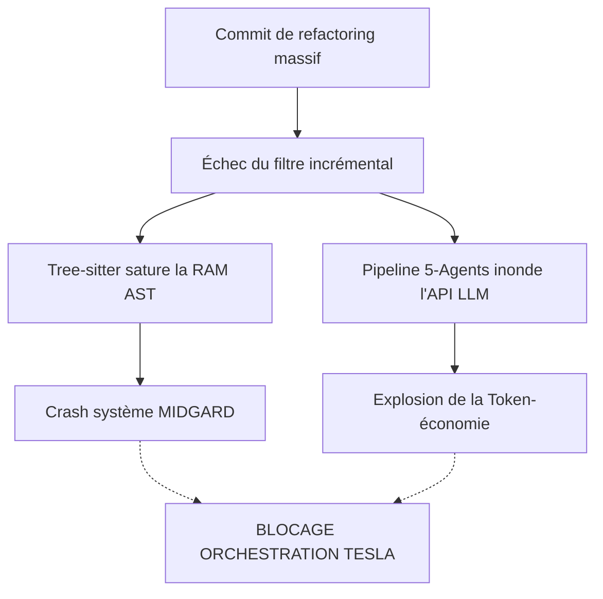

# PREMORTEM CERTIFICATION REPORT: Intégration de Understand-Anything

## 1. Executive Summary & Scoring Table
L'outil **Understand-Anything** propose de mapper sémantiquement les bases de code via une architecture hybride (Tree-sitter + LLM). Si le gain en lisibilité et en onboarding est indéniable, l'audit Premortem révèle deux vecteurs de défaillance systémiques majeurs pour l'écosystème Tesla : la **Token-économie (coût et limites de contexte LLM)** et la **Performance système (OOM et latence Tree-sitter sur de gros graphes AST)**.

La décision est **WARNING_ISSUED**. L'intégration ne peut être certifiée qu'après implémentation stricte des mitigations listées.

## 2. Verifications & Assumption Matrix
| Assumption | Verification Status | Confidence |
| :--- | :--- | :--- |
| L'analyse incrémentale est fiable et réduit drastiquement les coûts LLM. | Non vérifié (dépend de la granularité du diff). | Faible |
| Tree-sitter peut parser l'intégralité d'un grand projet sans OOM sur MIDGARD. | Partiellement vérifié (gros monolithes risqués). | Moyenne |
| La Token-économie de Tesla peut absorber les requêtes des 5 agents spécialisés. | Non vérifié (risque de burst). | Faible |
| Le graphe JSON reste léger et versionnable. | Vérifié (mais risque d'enflure sémantique). | Haute |

## 3. Failure Scenarios (FMEA Matrix)
| Identified Failure Mode | Probability (1-5) | Severity (1-5) | Detectability (1-5) | RPN | Mitigation |
| :--- | :---: | :---: | :---: | :---: | :--- |
| **Explosion Token-Économique** (Un commit massif de refactoring déclenche une réanalyse complète par les 5 agents, grillant le budget LLM du mois en 10 minutes) | 4 | 5 | 2 | **40** | Implémenter un *Circuit Breaker* budgétaire (hard limit tokens/jour) et forcer l'approbation manuelle pour tout diff > 500 lignes. |
| **OOM Tree-sitter sur Monolithe** (Analyse d'un fichier généré ou legacy > 10k lignes provoquant un crash mémoire lors de la génération de l'AST) | 3 | 4 | 3 | **36** | Ignorer statiquement les fichiers > 2000 lignes ou minifiés via une whitelist/blacklist stricte. |
| **Hallucination Sémantique en Chaîne** (Un agent LLM interprète mal un composant central, contaminant le graphe de connaissances complet) | 3 | 3 | 1 | **9** | Aucune décision d'architecture ne doit être déléguée à Understand-Anything sans vérification par `tesla-master-code`. |

*Note: RPN (Risk Priority Number) = Probability * Severity * Detectability. Tout RPN >= 27 exige une mitigation stricte.*

## 4. Signal Analysis & Drift Indicators
- **Dérive des Coûts (Token Drift)** : Surveiller le ratio `Tokens consommés / Lignes de code modifiées`. Une augmentation de ce ratio signale une défaillance de l'analyse incrémentale.
- **Dérive Mémoire (OOM Drift)** : Alerte système si le processus d'analyse dépasse 2GB de RAM sur MIDGARD.
- **Dérive JSON (Graph Bloat)** : Alerte si la taille du graphe JSON généré augmente de plus de 10% sur un seul commit mineur.

## 5. Risk Knowledge Graph Cascades

---
*Signed and certified on MIDGARD by Tesla Premortem.*
